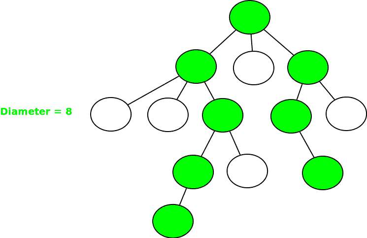
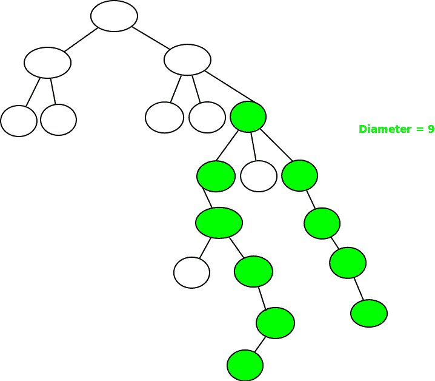

# N 元树的直径

> 原文:[https://www.geeksforgeeks.org/diameter-n-ary-tree/](https://www.geeksforgeeks.org/diameter-n-ary-tree/)

N 元树的直径是树的任意两个节点之间存在的最长路径。这两个节点必须是两个叶节点。以下示例将最长路径[直径]着色。

**例 1:**



**例 2:**



先决条件:[二叉树的直径](https://www.geeksforgeeks.org/diameter-of-a-binary-tree/)。

路径可以从其中一个节点开始，向上到达这些节点的一个 LCA，然后再次向下到达某个其他子树的最深节点**，或者**可以作为当前节点的一个子节点的直径存在。
解将存在于以下任意一个中:
I]当前节点的一个子节点的直径
II]最高的两个子树的高度之和+ 1

## C++

```
// C++ program to find the height of an N-ary
// tree
#include <bits/stdc++.h>
using namespace std;

// Structure of a node of an n-ary tree
struct Node
{
    char key;
    vector<Node *> child;
};

// Utility function to create a new tree node
Node *newNode(int key)
{
    Node *temp = new Node;
    temp->key = key;
    return temp;
}

// Utility function that will return the depth
// of the tree
int depthOfTree(struct Node *ptr)
{
    // Base case
    if (!ptr)
        return 0;

    int maxdepth = 0;

    // Check for all children and find
    // the maximum depth
    for (vector<Node*>::iterator it = ptr->child.begin();
                           it != ptr->child.end(); it++)

        maxdepth = max(maxdepth , depthOfTree(*it));

    return maxdepth + 1;
}

// Function to calculate the diameter
// of the tree
int diameter(struct Node *ptr)
{
    // Base case
    if (!ptr)
        return 0;

    // Find top two highest children
    int max1 = 0, max2 = 0;
    for (vector<Node*>::iterator it = ptr->child.begin();
                          it != ptr->child.end(); it++)
    {
        int h = depthOfTree(*it);
        if (h > max1)
           max2 = max1, max1 = h;
        else if (h > max2)
           max2 = h;
    }

    // Iterate over each child for diameter
    int maxChildDia = 0;
    for (vector<Node*>::iterator it = ptr->child.begin();
                           it != ptr->child.end(); it++)
        maxChildDia = max(maxChildDia, diameter(*it));

    return max(maxChildDia, max1 + max2 + 1);
}

// Driver program
int main()
{
    /*   Let us create below tree
    *           A
    *         / /  \  \
    *       B  F   D  E
    *      / \     |  /|\
    *     K  J    G  C H I
    *      /\            \
    *    N   M            L
    */

    Node *root = newNode('A');
    (root->child).push_back(newNode('B'));
    (root->child).push_back(newNode('F'));
    (root->child).push_back(newNode('D'));
    (root->child).push_back(newNode('E'));
    (root->child[0]->child).push_back(newNode('K'));
    (root->child[0]->child).push_back(newNode('J'));
    (root->child[2]->child).push_back(newNode('G'));
    (root->child[3]->child).push_back(newNode('C'));
    (root->child[3]->child).push_back(newNode('H'));
    (root->child[3]->child).push_back(newNode('I'));
    (root->child[0]->child[0]->child).push_back(newNode('N'));
    (root->child[0]->child[0]->child).push_back(newNode('M'));
    (root->child[3]->child[2]->child).push_back(newNode('L'));

    cout << diameter(root) << endl;

    return 0;
}
```

## Java 语言(一种计算机语言，尤用于创建网站)

```
// Java program to find the height of an N-ary
// tree
import java.util.*;
class GFG
{

// Structure of a node of an n-ary tree
static class Node
{
    char key;
    Vector<Node> child;
};

// Utility function to create a new tree node
static Node newNode(int key)
{
    Node temp = new Node();
    temp.key = (char) key;
    temp.child = new Vector<Node>();
    return temp;
}

// Utility function that will return the depth
// of the tree
static int depthOfTree(Node ptr)
{
    // Base case
    if (ptr == null)
        return 0;

    int maxdepth = 0;

    // Check for all children and find
    // the maximum depth
    for (Node it : ptr.child)

        maxdepth = Math.max(maxdepth,
                            depthOfTree(it));

    return maxdepth + 1;
}

// Function to calculate the diameter
// of the tree
static int diameter(Node ptr)
{
    // Base case
    if (ptr == null)
        return 0;

    // Find top two highest children
    int max1 = 0, max2 = 0;
    for (Node it : ptr.child)
    {
        int h = depthOfTree(it);
        if (h > max1)
        {
            max2 = max1;
            max1 = h;
        }
        else if (h > max2)
        max2 = h;
    }

    // Iterate over each child for diameter
    int maxChildDia = 0;
    for (Node it : ptr.child)
        maxChildDia = Math.max(maxChildDia,
                               diameter(it));

    return Math.max(maxChildDia, max1 + max2 + 1);
}

// Driver Code
public static void main(String[] args)
{
    /* Let us create below tree
    *         A
    *         / / \ \
    *     B F D E
    *     / \     | /|\
    *     K J G C H I
    *     /\         \
    * N M         L
    */
    Node root = newNode('A');
    (root.child).add(newNode('B'));
    (root.child).add(newNode('F'));
    (root.child).add(newNode('D'));
    (root.child).add(newNode('E'));
    (root.child.get(0).child).add(newNode('K'));
    (root.child.get(0).child).add(newNode('J'));
    (root.child.get(2).child).add(newNode('G'));
    (root.child.get(3).child).add(newNode('C'));
    (root.child.get(3).child).add(newNode('H'));
    (root.child.get(3).child).add(newNode('I'));
    (root.child.get(0).child.get(0).child).add(newNode('N'));
    (root.child.get(0).child.get(0).child).add(newNode('M'));
    (root.child.get(3).child.get(2).child).add(newNode('L'));

    System.out.print(diameter(root) + "\n");
}
}

// This code is contributed by Rajput-Ji
```

## 蟒蛇 3

```
# Python program to find the height of an N-ary
# tree

# Structure of a node of an n-ary tree
class Node:
    def __init__(self, x):
        self.key = x
        self.child = []

# Utility function that will return the depth
# of the tree
def depthOfTree(ptr):

    # Base case
    if (not ptr):
        return 0
    maxdepth = 0

    # Check for all children and find
    # the maximum depth
    for it in ptr.child:
        maxdepth = max(maxdepth , depthOfTree(it))
    return maxdepth + 1

# Function to calculate the diameter
# of the tree
def diameter(ptr):

    # Base case
    if (not ptr):
        return 0

    # Find top two highest children
    max1, max2 = 0, 0
    for it in ptr.child:
        h = depthOfTree(it)
        if (h > max1):
           max2, max1 = max1, h
        elif (h > max2):
           max2 = h

    # Iterate over each child for diameter
    maxChildDia = 0
    for it in ptr.child:
        maxChildDia = max(maxChildDia, diameter(it))
    return max(maxChildDia, max1 + max2 + 1)

# Driver program
if __name__ == '__main__':
    # /*   Let us create below tree
    # *           A
    # *         / /  \  \
    # *       B  F   D  E
    # *      / \     |  /|\
    # *     K  J    G  C H I
    # *      /\            \
    # *    N   M            L
    # */

    root = Node('A')
    (root.child).append(Node('B'))
    (root.child).append(Node('F'))
    (root.child).append(Node('D'))
    (root.child).append(Node('E'))
    (root.child[0].child).append(Node('K'))
    (root.child[0].child).append(Node('J'))
    (root.child[2].child).append(Node('G'))
    (root.child[3].child).append(Node('C'))
    (root.child[3].child).append(Node('H'))
    (root.child[3].child).append(Node('I'))
    (root.child[0].child[0].child).append(Node('N'))
    (root.child[0].child[0].child).append(Node('M'))
    (root.child[3].child[2].child).append(Node('L'))

    print(diameter(root))

# This code is contributed by mohit kumar 29
```

## C#

```
// C# program to find the height of
// an N-ary tree
using System;
using System.Collections.Generic;

class GFG
{

// Structure of a node of an n-ary tree
class Node
{
    public char key;
    public List<Node> child;
};

// Utility function to create
// a new tree node
static Node newNode(int key)
{
    Node temp = new Node();
    temp.key = (char) key;
    temp.child = new List<Node>();
    return temp;
}

// Utility function that will return
// the depth of the tree
static int depthOfTree(Node ptr)
{
    // Base case
    if (ptr == null)
        return 0;

    int maxdepth = 0;

    // Check for all children and find
    // the maximum depth
    foreach (Node it in ptr.child)

        maxdepth = Math.Max(maxdepth,
                            depthOfTree(it));

    return maxdepth + 1;
}

// Function to calculate the diameter
// of the tree
static int diameter(Node ptr)
{
    // Base case
    if (ptr == null)
        return 0;

    // Find top two highest children
    int max1 = 0, max2 = 0;
    foreach (Node it in ptr.child)
    {
        int h = depthOfTree(it);
        if (h > max1)
        {
            max2 = max1;
            max1 = h;
        }
        else if (h > max2)
        max2 = h;
    }

    // Iterate over each child for diameter
    int maxChildDia = 0;
    foreach (Node it in ptr.child)
        maxChildDia = Math.Max(maxChildDia,
                               diameter(it));

    return Math.Max(maxChildDia,
                    max1 + max2 + 1);
}

// Driver Code
public static void Main(String[] args)
{
    /* Let us create below tree
    *         A
    *         / / \ \
    *     B F D E
    *     / \     | /|\
    *     K J G C H I
    *     /\         \
    * N M         L
    */
    Node root = newNode('A');
    (root.child).Add(newNode('B'));
    (root.child).Add(newNode('F'));
    (root.child).Add(newNode('D'));
    (root.child).Add(newNode('E'));
    (root.child[0].child).Add(newNode('K'));
    (root.child[0].child).Add(newNode('J'));
    (root.child[2].child).Add(newNode('G'));
    (root.child[3].child).Add(newNode('C'));
    (root.child[3].child).Add(newNode('H'));
    (root.child[3].child).Add(newNode('I'));
    (root.child[0].child[0].child).Add(newNode('N'));
    (root.child[0].child[0].child).Add(newNode('M'));
    (root.child[3].child[2].child).Add(newNode('L'));

    Console.Write(diameter(root) + "\n");
}
}

// This code is contributed by Rajput-Ji
```

## java 描述语言

```
<script>

// Javascript program to find the
// height of an N-ary tree

    // Structure of a node of an n-ary tree
    class Node{

        // Utility function to create a new tree node
        constructor(key)
        {
            this.key=key;
            this.child=[];
        }
    }

    // Utility function that will
    // return the depth
    // of the tree
    function depthOfTree(ptr)
    {
        // Base case
    if (ptr == null)
        return 0;

    let maxdepth = 0;

    // Check for all children and find
    // the maximum depth
    for (let it=0;it< ptr.child.length;it++)

        maxdepth = Math.max(maxdepth,
                     depthOfTree(ptr.child[it]));

    return maxdepth + 1;
    }

    // Function to calculate the diameter
// of the tree
    function diameter(ptr)
    {
        // Base case
    if (ptr == null)
        return 0;

    // Find top two highest children
    let max1 = 0, max2 = 0;
    for (let it=0;it< ptr.child.length;it++)
    {
        let h = depthOfTree(ptr.child[it]);
        if (h > max1)
        {
            max2 = max1;
            max1 = h;
        }
        else if (h > max2)
        max2 = h;
    }

    // Iterate over each child for diameter
    let maxChildDia = 0;
    for (let it=0;it< ptr.child.length;it++)
        maxChildDia = Math.max(maxChildDia,
                          diameter(ptr.child[it]));

    return Math.max(maxChildDia, max1 + max2 + 1);
    }

    // Driver Code

    /* Let us create below tree
    *         A
    *         / / \ \
    *     B F D E
    *     / \     | /|\
    *     K J G C H I
    *     /\         \
    * N M         L
    */
    let root = new Node('A');
    (root.child).push(new Node('B'));
    (root.child).push(new Node('F'));
    (root.child).push(new Node('D'));
    (root.child).push(new Node('E'));
    (root.child[0].child).push(new Node('K'));
    (root.child[0].child).push(new Node('J'));
    (root.child[2].child).push(new Node('G'));
    (root.child[3].child).push(new Node('C'));
    (root.child[3].child).push(new Node('H'));
    (root.child[3].child).push(new Node('I'));
    (root.child[0].child[0].child).push(new Node('N'));
    (root.child[0].child[0].child).push(new Node('M'));
    (root.child[3].child[2].child).push(new Node('L'));

    document.write(diameter(root) + "\n");

// This code is contributed by patel2127

</script>
```

**Output**

```
7
```

**上述解决方案的优化:**

我们可以在不计算树的深度的情况下找到直径，在上面的解决方案中做一些小的改变，类似于找到二叉树的直径。

## C++

```
// C++ program to find the height of an N-ary
// tree
#include <bits/stdc++.h>
using namespace std;

// Structure of a node of an n-ary tree
struct Node
{
    char key;
    vector<Node *> child;
};

// Utility function to create a new tree node
Node *newNode(int key)
{
    Node *temp = new Node;
    temp->key = key;
    return temp;
}

int diameter(struct Node *ptr,int &diameter_of_tree)
{
    // Base case
    if (!ptr)
        return 0;

    // Find top two highest children
    int max1 = 0, max2 = 0;
    for (vector<Node*>::iterator it = ptr->child.begin();it != ptr->child.end(); it++)
    {
        int h = diameter(*it,diameter_of_tree);
        if (h > max1)
        max2 = max1, max1 = h;
        else if (h > max2)
        max2 = h;
    }

    // Find whether our node can be part of diameter
    diameter_of_tree = max(max1 + max2 + 1,diameter_of_tree);

    return max(max1,max2) + 1;
}

int main()
{
          /* Let us create below tree
         *            A
         *         / / \ \
         *        B F   D E
         *       / \   / /|\
         *      K   J G C H I
         *     /\         |
         *    N  M        L
         */
    Node *root = newNode('A');
    (root->child).push_back(newNode('B'));
    (root->child).push_back(newNode('F'));
    (root->child).push_back(newNode('D'));
    (root->child).push_back(newNode('E'));
    (root->child[0]->child).push_back(newNode('K'));
    (root->child[0]->child).push_back(newNode('J'));
    (root->child[2]->child).push_back(newNode('G'));
    (root->child[3]->child).push_back(newNode('C'));
    (root->child[3]->child).push_back(newNode('H'));
    (root->child[3]->child).push_back(newNode('I'));
    (root->child[0]->child[0]->child).push_back(newNode('N'));
    (root->child[0]->child[0]->child).push_back(newNode('M'));
    (root->child[3]->child[2]->child).push_back(newNode('L'));

    // for storing diameter
    int diameter_of_tree = 0;

    diameter(root,diameter_of_tree);

    cout << diameter_of_tree << endl;

    return 0;
}
// This code is improved by bhuvan
```

## Java 语言(一种计算机语言，尤用于创建网站)

```
// Java program to find the height of an N-ary
// tree
import java.util.*;
class GFG {

    // Structure of a node of an n-ary tree
    static class Node {
        char key;
        Vector<Node> child;
    };

    // Utility function to create a new tree node
    static Node newNode(int key)
    {
        Node temp = new Node();
        temp.key = (char)key;
        temp.child = new Vector<Node>();
        return temp;
    }

    // for storing diameter_of_tree
    public static int diameter_of_tree = 0;

    // Function to calculate the diameter
    // of the tree
    static int diameter(Node ptr)
    {
        // Base case
        if (ptr == null)
            return 0;

        // Find top two highest children
        int max1 = 0, max2 = 0;
        for (Node it : ptr.child) {
            int h = diameter(it);
            if (h > max1) {
                max2 = max1;
                max1 = h;
            }
            else if (h > max2)
                max2 = h;
        }

        diameter_of_tree
            = Math.max(max1 + max2 + 1, diameter_of_tree);
        return (Math.max(max1, max2) + 1);
    }

    // Driver Code
    public static void main(String[] args)
    {
        /* Let us create below tree
         *            A
         *         / / \ \
         *        B F   D E
         *       / \   / /|\
         *      K   J G C H I
         *     /\         |
         *    N  M        L
         */
        Node root = newNode('A');
        (root.child).add(newNode('B'));
        (root.child).add(newNode('F'));
        (root.child).add(newNode('D'));
        (root.child).add(newNode('E'));
        (root.child.get(0).child).add(newNode('K'));
        (root.child.get(0).child).add(newNode('J'));
        (root.child.get(2).child).add(newNode('G'));
        (root.child.get(3).child).add(newNode('C'));
        (root.child.get(3).child).add(newNode('H'));
        (root.child.get(3).child).add(newNode('I'));
        (root.child.get(0).child.get(0).child)
            .add(newNode('N'));
        (root.child.get(0).child.get(0).child)
            .add(newNode('M'));
        (root.child.get(3).child.get(2).child)
            .add(newNode('L'));

        diameter(root);
        System.out.print(diameter_of_tree + "\n");
    }
}

// This code is improved by Bhuvan
```

**输出**

```
7
```

**不同的优化解:** [无向树中最长的路径](https://www.geeksforgeeks.org/longest-path-undirected-tree/)

**在一次遍历中使用** [**DFS**](https://www.geeksforgeeks.org/depth-first-traversal-for-a-graph/) **获得直径的另一种方法:**

树的直径可以计算为每个节点

*   当前节点不是直径的一部分(即直径位于当前节点的一个子节点上)。
*   当前节点是直径的一部分(即直径通过当前节点)。

节点:[邻接表](https://www.geeksforgeeks.org/graph-and-its-representations/)已经用来存储树了。

下面是上述方法的实现:

## C++

```
// C++ implementation to find
// diameter of a tree using
// DFS in ONE TRAVERSAL

#include <bits/stdc++.h>
using namespace std;
#define maxN 10005

// The array to store the
// height of the nodes
int height[maxN];

// Adjacency List to store
// the tree
vector<int> tree[maxN];

// variable to store diameter
// of the tree
int diameter = 0;

// Function to add edge between
// node u to node v
void addEdge(int u, int v)
{
    // add edge from u to v
    tree[u].push_back(v);

    // add edge from v to u
    tree[v].push_back(u);
}

void dfs(int cur, int par)
{
    // Variables to store the height of children
    // of cur node with maximum heights
    int max1 = 0;
    int max2 = 0;

    // going in the adjacency list of the current node
    for (auto u : tree[cur]) {

        // if that node equals parent discard it
        if (u == par)
            continue;

        // calling dfs for child node
        dfs(u, cur);

        // calculating height of nodes
        height[cur] = max(height[cur], height[u]);

        // getting the height of children
        // of cur node with maximum height
        if (height[u] >= max1) {
            max2 = max1;
            max1 = height[u];
        }
        else if (height[u] > max2) {
            max2 = height[u];
        }
    }

    height[cur] += 1;

    // Diameter of a tree can be calculated as
    // diameter passing through the node
    // diameter doesn't includes the cur node
    diameter = max(diameter, height[cur]);
    diameter = max(diameter, max1 + max2 + 1);
}

// Driver Code
int main()
{
    // n is the number of nodes in tree
    int n = 7;

    // Adding edges to the tree
    addEdge(1, 2);
    addEdge(1, 3);
    addEdge(1, 4);
    addEdge(2, 5);
    addEdge(4, 6);
    addEdge(4, 7);

    // Calling the dfs function to
    // calculate the diameter of tree
    dfs(1, 0);

    cout << "Diameter of tree is : " << diameter - 1
         << "\n";

    return 0;
}
```

## Java 语言(一种计算机语言，尤用于创建网站)

```
/*package whatever //do not write package name here */
import java.io.*;
import java.util.*;

class GFG {

  static int maxN = 10005;

  // The array to store the
  // height of the nodes
  static int[] height = new int[maxN];

  // Adjacency List to store
  // the tree
  static ArrayList<ArrayList<Integer>> tree = new ArrayList<ArrayList<Integer>>();

  // variable to store diameter
  // of the tree
  static int diameter = 0;

  // Function to add edge between
  // node u to node v
  static void addEdge(int u, int v)
  {

    // add edge from u to v
    tree.get(u).add(v);

    // add edge from v to u
    tree.get(v).add(u);
  }

  static void dfs(int cur, int par)
  {

    // Variables to store the height of children
    // of cur node with maximum heights
    int max1 = 0;
    int max2 = 0;

    // going in the adjacency list of the current node
    for (int u : tree.get(cur)) {

      // if that node equals parent discard it
      if (u == par)
        continue;

      // calling dfs for child node
      dfs(u, cur);

      // calculating height of nodes
      height[cur] = Math.max(height[cur], height[u]);

      // getting the height of children
      // of cur node with maximum height
      if (height[u] >= max1) {
        max2 = max1;
        max1 = height[u];
      }
      else if (height[u] > max2) {
        max2 = height[u];
      }
    }

    height[cur] += 1;

    // Diameter of a tree can be calculated as
    // diameter passing through the node
    // diameter doesn't includes the cur node
    diameter = Math.max(diameter, height[cur]);
    diameter = Math.max(diameter, max1 + max2 + 1);
  }

  public static void main (String[] args)
  {

    for(int i = 0; i < maxN; i++)
    {
      tree.add(new ArrayList<Integer>());       
    }

    // n is the number of nodes in tree
    int n = 7;

    // Adding edges to the tree
    addEdge(1, 2);
    addEdge(1, 3);
    addEdge(1, 4);
    addEdge(2, 5);
    addEdge(4, 6);
    addEdge(4, 7);

    // Calling the dfs function to
    // calculate the diameter of tree
    dfs(1, 0);

    System.out.println("Diameter of tree is : " +(diameter - 1));
  }
}

// This code is contributed by ab2127.
```

## 蟒蛇 3

```
# C++ implementation to find
# diameter of a tree using
# DFS in ONE TRAVERSAL
maxN = 10005

# The array to store the
# height of the nodes
height = [0 for i in range(maxN)]

# Adjacency List to store
# the tree
tree = [[] for i in range(maxN)]

# variable to store diameter
# of the tree
diameter = 0

# Function to add edge between
# node u to node v
def addEdge(u, v):

    # add edge from u to v
    tree[u].append(v)

    # add edge from v to u
    tree[v].append(u)

def dfs(cur, par):
    global diameter

    # Variables to store the height of children
    # of cur node with maximum heights
    max1 = 0
    max2 = 0

    # going in the adjacency list of the current node
    for u in tree[cur]:

        # if that node equals parent discard it
        if(u == par):
            continue

        # calling dfs for child node
        dfs(u, cur)

        # calculating height of nodes
        height[cur] = max(height[cur], height[u])

        # getting the height of children
        # of cur node with maximum height
        if(height[u] >= max1):
            max2 = max1
            max1 = height[u]
        elif(height[u] > max2):
            max2 = height[u]
    height[cur] += 1

    # Diameter of a tree can be calculated as
    # diameter passing through the node
    # diameter doesn't includes the cur node
    diameter = max(diameter, height[cur])
    diameter = max(diameter, max1 + max2 + 1)

# Driver Code
# n is the number of nodes in tree
n = 7

# Adding edges to the tree
addEdge(1, 2)
addEdge(1, 3)
addEdge(1, 4)
addEdge(2, 5)
addEdge(4, 6)
addEdge(4, 7)

# Calling the dfs function to
# calculate the diameter of tree
dfs(1, 0)

print("Diameter of tree is :", diameter - 1)

# This code is contributed by avanitrachhadiya2155
```

## java 描述语言

```
<script>

// Javascript implementation to find
// diameter of a tree using
// DFS in ONE TRAVERSAL

let maxN = 10005;

// The array to store the
// height of the nodes
let height=new Array(maxN);

// Adjacency List to store
// the tree
let tree=new Array(maxN);
for(let i=0;i<maxN;i++)
{
    height[i]=0;
    tree[i]=[];
}

// variable to store diameter
// of the tree
let diameter = 0;

// Function to add edge between
// node u to node v
function addEdge(u,v)
{
    // add edge from u to v
    tree[u].push(v);

    // add edge from v to u
    tree[v].push(u);
}

function dfs(cur,par)
{
    // Variables to store the height of children
    // of cur node with maximum heights
    let max1 = 0;
    let max2 = 0;

    // going in the adjacency list
    // of the current node
    for (let u=0;u<tree[cur].length;u++) {

        // if that node equals parent discard it
        if (tree[cur][u] == par)
            continue;

        // calling dfs for child node
        dfs(tree[cur][u], cur);

        // calculating height of nodes
        height[cur] = Math.max(height[cur],
        height[tree[cur][u]]);

        // getting the height of children
        // of cur node with maximum height
        if (height[tree[cur][u]] >= max1) {
            max2 = max1;
            max1 = height[tree[cur][u]];
        }
        else if (height[tree[cur][u]] > max2) {
            max2 = height[tree[cur][u]];
        }
    }

    height[cur] += 1;

    // Diameter of a tree can be calculated as
    // diameter passing through the node
    // diameter doesn't includes the cur node
    diameter = Math.max(diameter, height[cur]);
    diameter = Math.max(diameter, max1 + max2 + 1);
}

// Driver Code

// n is the number of nodes in tree
let n = 7;

// Adding edges to the tree
addEdge(1, 2);
addEdge(1, 3);
addEdge(1, 4);
addEdge(2, 5);
addEdge(4, 6);
addEdge(4, 7);

// Calling the dfs function to
// calculate the diameter of tree
dfs(1, 0);

document.write("Diameter of tree is : " +(diameter - 1))

// This code is contributed by unknown2108

</script>
```

**Output**

```
Diameter of tree is : 4
```

本文由 [**舒巴姆·古普塔**](https://www.facebook.com/Shubh1307) 供稿。如果你喜欢 GeeksforGeeks 并想投稿，你也可以使用[write.geeksforgeeks.org](https://write.geeksforgeeks.org)写一篇文章或者把你的文章邮寄到 review-team@geeksforgeeks.org。看到你的文章出现在极客博客主页上，帮助其他极客。
如果发现有不正确的地方，或者想分享更多关于上述话题的信息，请写评论。