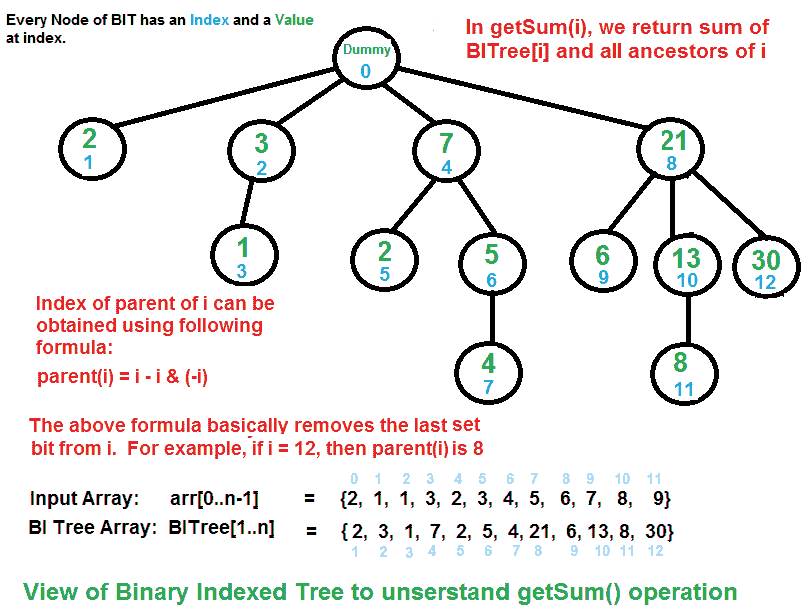

# 具有 N 个节点的二元索引树的直径

> 原文:[https://www . geesforgeks . org/diameter-of-a-binary-indexed-tree-with-n-nodes/](https://www.geeksforgeeks.org/diameter-of-a-binary-indexed-tree-with-n-nodes/)

给定一棵除根节点 0(从 1 到 N 编号)外有 N 个节点的二进制索引树，求其直径。
二进制索引树是节点号 X 的父节点= X –( X&(X–1))即 X 中最后一位未置位的树，树的直径是任意两片叶子之间最长的简单路径。
**例:**

> **输入:** N = 12
> **输出:** 6
> **说明:**从节点 7 到节点 11 的路径。
> 
> 
> 
> **输入:n = 15**
> **输出:7**

**进场:**

*   在 BIT 中，根总是节点 0。在第一级，所有节点的功率都是 2。(1, 2, 4, 8, ….)
*   考虑第一级(1，2，4，8)中的任何节点，它的子树将包括与根节点具有相同位数的所有节点。
    1.  根为 1 的子树将没有子树。
    2.  根为 2 的子树将有 3 个子树。
    3.  根为 4 的子树将有 5、6、7 作为子树。
    4.  根为 8 的子树将有 9、10、11、12、13、14、15 作为子树。(前一个子树的两倍大小)
    5.  所以有根 K 的子树会有包括根在内的 K 个节点。每个子树的高度相等:
        *   对于根为 1 的子树
        *   对于根为 2 的子树
        *   对于根为 4 的子树
*   现在，我们需要找到 N 所在的子树。比方说，在 N 所在的子树之前的子树的高度是 H，大小是 l。因此，以下情况是可能的:
    *   **情况 1 :** 当 N>= L * 2–1 时，在这种情况下，N 处于其子树的最后一级。因此，直径将是 2*H + 1。(从前一个子树的最底层叶子到 N 的路径)。

    *   **情况 2 :** 当 N>= L+L/2–1 时，在这种情况下，N 在其子树中处于 H 级。因此，直径将为 2*H.

    *   **情况 3 :** 否则，最好考虑 N 所在子树前两个子树的叶节点之间的最大路径长度，即直径为 2 * H–1。

以下是上述方法的实现:

## C++

```
#include <bits/stdc++.h>
using namespace std;

// Function to find diameter
// of BIT with N + 1 nodes
int diameter(int n)
{
    // L is size of subtree just before subtree
    // in which N lies
    int L, H, templen;
    L = 1;

    // H is the height of subtree just before
    // subtree in which N lies
    H = 0;

    // Base Cases
    if (n == 1) {
        return 1;
    }
    if (n == 2) {
        return 2;
    }
    if (n == 3) {
        return 3;
    }

    // Size of subtree are power of 2
    while (L * 2 <= n) {
        L *= 2;
        H++;
    }

    // 3 Cases as explained in Approach
    if (n >= L * 2 - 1)
        return 2 * H + 1;
    else if (n >= L + (L / 2) - 1)
        return 2 * H;
    return 2 * H - 1;
}

// Driver Code
int main()
{
    int n = 15;
    cout << diameter(n) << endl;
}
```

## Java 语言(一种计算机语言，尤用于创建网站)

```
// Java implementation of the approach
class GFG
{

// Function to find diameter
// of BIT with N + 1 nodes
static int diameter(int n)
{
    // L is size of subtree just before subtree
    // in which N lies
    int L, H, templen;
    L = 1;

    // H is the height of subtree just before
    // subtree in which N lies
    H = 0;

    // Base Cases
    if (n == 1) {
        return 1;
    }
    if (n == 2) {
        return 2;
    }
    if (n == 3) {
        return 3;
    }

    // Size of subtree are power of 2
    while (L * 2 <= n) {
        L *= 2;
        H++;
    }

    // 3 Cases as explained in Approach
    if (n >= L * 2 - 1)
        return 2 * H + 1;
    else if (n >= L + (L / 2) - 1)
        return 2 * H;
    return 2 * H - 1;
}

// Driver Code
public static void main(String []args)
{
    int n = 15;

    System.out.println(diameter(n));
}
}

// This code contributed by PrinciRaj1992
```

## 蟒蛇 3

```
# Python3 implementation of the approach

# Function to find diameter
# of BIT with N + 1 nodes
def diameter(n):

    # L is size of subtree just before
    # subtree in which N lies
    L, H, templen = 0, 0, 0;
    L = 1;

    # H is the height of subtree just before
    # subtree in which N lies
    H = 0;

    # Base Cases
    if (n == 1):
        return 1;

    if (n == 2):
        return 2;

    if (n == 3):
        return 3;

    # Size of subtree are power of 2
    while (L * 2 <= n):
        L *= 2;
        H += 1;

    # 3 Cases as explained in Approach
    if (n >= L * 2 - 1):
        return 2 * H + 1;
    elif (n >= L + (L / 2) - 1):
        return 2 * H;
    return 2 * H - 1;

# Driver Code
n = 15;
print(diameter(n));

# This code is contributed by Rajput-Ji
```

## C#

```
// C# implementation of the approach
using System;

class GFG
{

// Function to find diameter
// of BIT with N + 1 nodes
static int diameter(int n)
{
    // L is size of subtree just before subtree
    // in which N lies
    int L, H;
    L = 1;

    // H is the height of subtree just before
    // subtree in which N lies
    H = 0;

    // Base Cases
    if (n == 1)
    {
        return 1;
    }
    if (n == 2)
    {
        return 2;
    }
    if (n == 3)
    {
        return 3;
    }

    // Size of subtree are power of 2
    while (L * 2 <= n)
    {
        L *= 2;
        H++;
    }

    // 3 Cases as explained in Approach
    if (n >= L * 2 - 1)
        return 2 * H + 1;
    else if (n >= L + (L / 2) - 1)
        return 2 * H;
    return 2 * H - 1;
}

// Driver Code
public static void Main(String []args)
{
    int n = 15;

    Console.WriteLine(diameter(n));
}
}

// This code is contributed by 29AjayKumar
```

## java 描述语言

```
<script>

// Function to find diameter
// of BIT with N + 1 nodes
function diameter(n)
{
    // L is size of subtree just before subtree
    // in which N lies
    var L, H, templen;
    L = 1;

    // H is the height of subtree just before
    // subtree in which N lies
    H = 0;

    // Base Cases
    if (n == 1) {
        return 1;
    }
    if (n == 2) {
        return 2;
    }
    if (n == 3) {
        return 3;
    }

    // Size of subtree are power of 2
    while (L * 2 <= n) {
        L *= 2;
        H++;
    }

    // 3 Cases as explained in Approach
    if (n >= L * 2 - 1)
        return 2 * H + 1;
    else if (n >= L + (L / 2) - 1)
        return 2 * H;
    return 2 * H - 1;
}

// Driver Code
var n = 15;
document.write( diameter(n));

</script>
```

**Output:** 

```
7
```