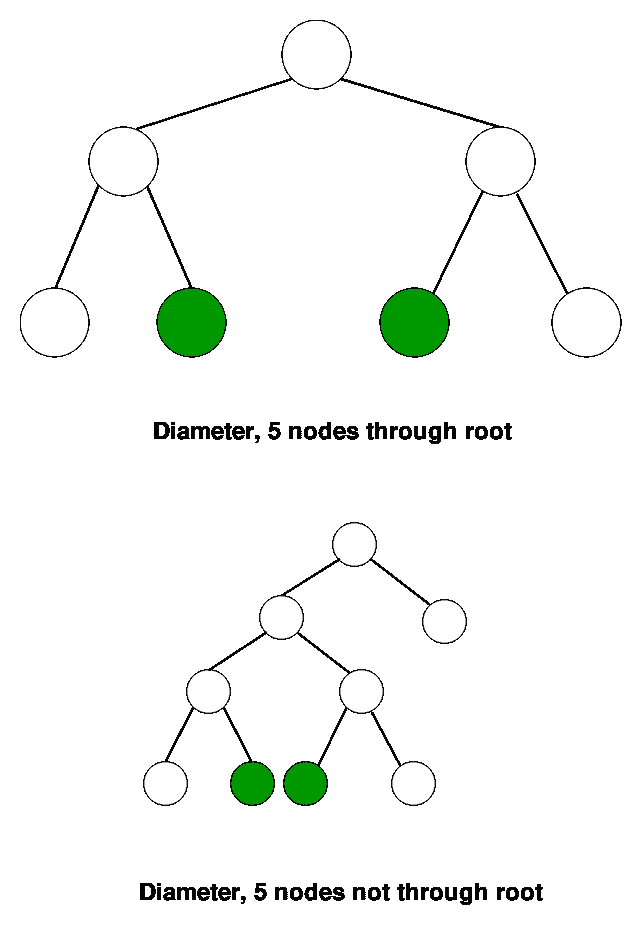

# 使用 DFS 的树的直径

> 原文:[https://www.geeksforgeeks.org/diameter-tree-using-dfs/](https://www.geeksforgeeks.org/diameter-tree-using-dfs/)

树的直径(有时称为宽度)是树中两片叶子之间最长路径上的节点数。下图为两棵直径各为五的树，形成最长路径末端的树叶被遮蔽(注意每棵长度为五的树中有多条路径，但路径长度不超过五个节点)



我们在下面的帖子
[二叉树的直径](https://www.geeksforgeeks.org/diameter-of-a-binary-tree/)
中讨论了一个解决方案。在这篇帖子中，我们讨论了一个不同的基于 DFS 的解决方案。观察上面的树后，我们可以看到最长的路径总是出现在两个叶节点之间。我们从一个随机节点开始 DFS，然后看哪个节点离它最远。设最远的节点为 X，很明显 X 永远是 DFS 的叶节点和角。现在，如果我们从 X 开始 DFS，并检查离它最远的节点，我们将得到树的直径。
c++实现使用图的邻接表表示。STL 的列表容器用于存储相邻节点的列表。

## C++

```
// C++ program to find diameter of a binary tree
// using DFS.
#include <iostream>
#include <limits.h>
#include <list>
using namespace std;

// Used to track farthest node.
int x;

// Sets maxCount as maximum distance from node.
void dfsUtil(int node, int count, bool visited[],
                   int& maxCount, list<int>* adj)
{
    visited[node] = true;
    count++;
    for (auto i = adj[node].begin(); i != adj[node].end(); ++i) {
        if (!visited[*i]) {
            if (count >= maxCount) {
                maxCount = count;
                x = *i;
            }
            dfsUtil(*i, count, visited, maxCount, adj);
        }
    }
}

// The function to do DFS traversal. It uses recursive
// dfsUtil()
void dfs(int node, int n, list<int>* adj, int& maxCount)
{
    bool visited[n + 1];
    int count = 0;

    // Mark all the vertices as not visited
    for (int i = 1; i <= n; ++i)
        visited[i] = false;

    // Increment count by 1 for visited node
    dfsUtil(node, count + 1, visited, maxCount, adj);
}

// Returns diameter of binary tree represented
// as adjacency list.
int diameter(list<int>* adj, int n)
{
    int maxCount = INT_MIN;

    /* DFS from a random node and then see
    farthest node X from it*/
    dfs(1, n, adj, maxCount);

    /* DFS from X and check the farthest node
    from it */
    dfs(x, n, adj, maxCount);

    return maxCount;
}

/* Driver program to test above functions*/
int main()
{
    int n = 5;

    /* Constructed tree is
         1
        / \
        2    3
       / \
      4   5 */
    list<int>* adj = new list<int>[n + 1];

    /*create undirected edges */
    adj[1].push_back(2);
    adj[2].push_back(1);
    adj[1].push_back(3);
    adj[3].push_back(1);
    adj[2].push_back(4);
    adj[4].push_back(2);
    adj[2].push_back(5);
    adj[5].push_back(2);

    /* maxCount will have diameter of tree */
    cout << "Diameter of the given tree is "
        << diameter(adj, n) << endl;
    return 0;
}
```

## Java 语言(一种计算机语言，尤用于创建网站)

```
// Java program to find diameter of a 
// binary tree using DFS.
import java.util.ArrayList;
import java.util.Arrays;
import java.util.List;
public class Diametre_tree {

    // Used to track farthest node.
    static int x;
    static int maxCount;
    static List<Integer> adj[];

    // Sets maxCount as maximum distance 
    // from node
    static void dfsUtil(int node, int count, 
                         boolean visited[],
                       List<Integer> adj[])
    {
        visited[node] = true;
        count++;

        List<Integer> l = adj[node];
        for(Integer i: l)
        {
            if(!visited[i]){
                if (count >= maxCount) {
                    maxCount = count;
                    x = i;
                }
                dfsUtil(i, count, visited, adj);
            }
        }
    }

    // The function to do DFS traversal. It uses 
    // recursive dfsUtil()
    static void dfs(int node, int n, List<Integer>
                                       adj[])
    {
        boolean[] visited = new boolean[n + 1];
        int count = 0;

        // Mark all the vertices as not visited
        Arrays.fill(visited, false);

        // Increment count by 1 for visited node
        dfsUtil(node, count + 1, visited, adj);

    }

    // Returns diameter of binary tree represented
    // as adjacency list.
    static int diameter(List<Integer> adj[], int n)
    {
        maxCount = Integer.MIN_VALUE;

        /* DFS from a random node and then see
        farthest node X from it*/
        dfs(1, n, adj);

        /* DFS from X and check the farthest node
        from it */
        dfs(x, n, adj);

        return maxCount;
    }

    /* Driver program to test above functions*/
    public static void main(String args[])
    {
        int n = 5;

        /* Constructed tree is
             1
            / \
            2    3
           / \
          4   5 */
        adj = new List[n + 1];
        for(int i = 0; i < n+1 ; i++)
            adj[i] = new ArrayList<Integer>(); 

        /*create undirected edges */
        adj[1].add(2);
        adj[2].add(1);
        adj[1].add(3);
        adj[3].add(1);
        adj[2].add(4);
        adj[4].add(2);
        adj[2].add(5);
        adj[5].add(2);

        /* maxCount will have diameter of tree */
        System.out.println("Diameter of the given " +
                       "tree is " + diameter(adj, n));
    }
}
// This code is contributed by Sumit Ghosh
```

## 蟒蛇 3

```
# Python3 program to find diameter of a binary tree
# using DFS.

# Sets maxCount as maximum distance from node.
def dfsUtil(node, count):
    global visited, x, maxCount, adj
    visited[node] = 1
    count += 1
    for i in adj[node]:
        if (visited[i] == 0):
            if (count >= maxCount):
                maxCount = count
                x = i
            dfsUtil(i, count)

# The function to do DFS traversal. It uses recursive
# dfsUtil()
def dfs(node, n):
    count = 0
    for i in range(n + 1):
        visited[i] = 0

    # Increment count by 1 for visited node
    dfsUtil(node, count + 1)

# Returns diameter of binary tree represented
# as adjacency list.
def diameter(n):
    global adj, maxCount

    # DFS from a random node and then see
    # farthest node X from it*/
    dfs(1, n)

    # DFS from X and check the farthest node
    dfs(x, n)
    return maxCount

## Driver code*/
if __name__ == '__main__':
    n = 5

    # # Constructed tree is
    #      1
    #     / \
    #     2    3
    #    / \
    #   4   5 */
    adj, visited = [[] for i in range(n + 1)], [0 for i in range(n + 1)]
    maxCount = -10**19
    x = 0

    # create undirected edges */
    adj[1].append(2)
    adj[2].append(1)
    adj[1].append(3)
    adj[3].append(1)
    adj[2].append(4)
    adj[4].append(2)
    adj[2].append(5)
    adj[5].append(2)

    # maxCount will have diameter of tree */
    print ("Diameter of the given tree is ", diameter(n))

    # This code is contributed by mohit kumar 29
```

## C#

```
// C# program to find diameter of a 
// binary tree using DFS.
using System;
using System.Collections.Generic;

class GFG 
{

    // Used to track farthest node.
    static int x;
    static int maxCount;
    static List<int> []adj;

    // Sets maxCount as maximum distance 
    // from node
    static void dfsUtil(int node, int count, 
                             bool []visited,
                            List<int> []adj)
    {
        visited[node] = true;
        count++;

        List<int> l = adj[node];
        foreach(int i in l)
        {
            if(!visited[i])
            {
                if (count >= maxCount)
                {
                    maxCount = count;
                    x = i;
                }
                dfsUtil(i, count, visited, adj);
            }
        }
    }

    // The function to do DFS traversal. It uses 
    // recursive dfsUtil()
    static void dfs(int node, int n,
                    List<int> []adj)
    {
        bool[] visited = new bool[n + 1];
        int count = 0;

        // Increment count by 1 for visited node
        dfsUtil(node, count + 1, visited, adj);
    }

    // Returns diameter of binary tree represented
    // as adjacency list.
    static int diameter(List<int> []adj, int n)
    {
        maxCount = int.MinValue;

        /* DFS from a random node and then see
        farthest node X from it*/
        dfs(1, n, adj);

        /* DFS from X and check the farthest node
        from it */
        dfs(x, n, adj);

        return maxCount;
    }

    // Driver Code
    public static void Main(String []args)
    {
        int n = 5;

        /* Constructed tree is
            1
            / \
            2 3
        / \
        4 5 */
        adj = new List<int>[n + 1];
        for(int i = 0; i < n + 1; i++)
            adj[i] = new List<int>(); 

        /*create undirected edges */
        adj[1].Add(2);
        adj[2].Add(1);
        adj[1].Add(3);
        adj[3].Add(1);
        adj[2].Add(4);
        adj[4].Add(2);
        adj[2].Add(5);
        adj[5].Add(2);

        /* maxCount will have diameter of tree */
        Console.WriteLine("Diameter of the given " +
                     "tree is " + diameter(adj, n));
    }
}

// This code is contributed by PrinciRaj1992
```

## java 描述语言

```
<script>

// JavaScript program to find diameter of a
// binary tree using DFS.

    // Used to track farthest node.
    let x;
    let maxCount;
    let adj=[];

    // Sets maxCount as maximum distance
    // from node
    function dfsUtil(node,count,visited,adj)
    {
        visited[node] = true;
        count++;

        let l = adj[node];
        for(let i=0;i<l.length;i++)
        {
            if(!visited[l[i]]){
                if (count >= maxCount) {
                    maxCount = count;
                    x = l[i];
                }
                dfsUtil(l[i], count, visited, adj);
            }
        }
    }

    // The function to do DFS traversal. It uses
    // recursive dfsUtil()
    function dfs(node,n,adj)
    {
        let visited = new Array(n + 1);
        let count = 0;

        // Mark all the vertices as not visited
        for(let i=0;i<visited.length;i++)
        {
            visited[i]=false;
        }

        // Increment count by 1 for visited node
        dfsUtil(node, count + 1, visited, adj);
    }

    // Returns diameter of binary tree represented
    // as adjacency list.
    function diameter(adj,n)
    {
        maxCount = Number.MIN_VALUE;

        /* DFS from a random node and then see
        farthest node X from it*/
        dfs(1, n, adj);

        /* DFS from X and check the farthest node
        from it */
        dfs(x, n, adj);

        return maxCount;
    }

    /* Driver program to test above functions*/
    let n = 5;
    /* Constructed tree is
             1
            / \
            2    3
           / \
          4   5 */
        adj = new Array(n + 1);
        for(let i = 0; i < n+1 ; i++)
            adj[i] = [];

        /*create undirected edges */
        adj[1].push(2);
        adj[2].push(1);
        adj[1].push(3);
        adj[3].push(1);
        adj[2].push(4);
        adj[4].push(2);
        adj[2].push(5);
        adj[5].push(2);

        /* maxCount will have diameter of tree */
        document.write("Diameter of the given " +
                       "tree is " + diameter(adj, n));

// This code is contributed by unknown2108

</script>
```

**输出:**

```
Diameter of the given tree is 4
```

本文由**安库尔·辛格**供稿。如果你喜欢 GeeksforGeeks 并想投稿，你也可以使用[write.geeksforgeeks.org](https://write.geeksforgeeks.org)写一篇文章或者把你的文章邮寄到 review-team@geeksforgeeks.org。看到你的文章出现在极客博客主页上，帮助其他极客。
如果你发现任何不正确的地方，或者你想分享更多关于上面讨论的话题的信息，请写评论。