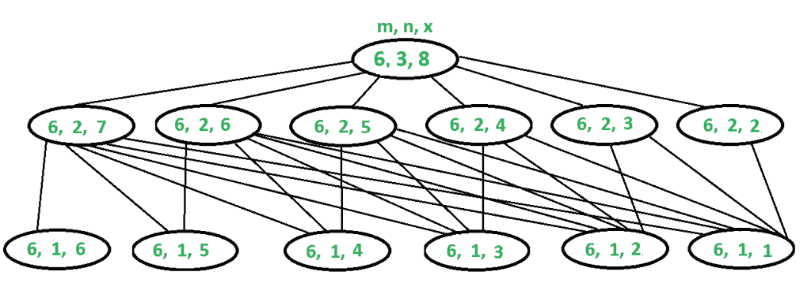

# 掷骰子| DP-30

> 原文:[https://www.geeksforgeeks.org/dice-throw-dp-30/](https://www.geeksforgeeks.org/dice-throw-dp-30/)

给定 n 个骰子，每个骰子有 m 个面，从 1 到 m，找出获得 X 和的方法。X 是所有骰子投掷时每个面上的值的总和。

**天真的方法**是从 n 个骰子中找到所有可能的值组合，并继续计算总和为 x 的结果。

使用**动态规划(DP)** 可以高效解决这个问题。

```
Let the function to find X from n dice is: Sum(m, n, X)
The function can be represented as:
Sum(m, n, X) = Finding Sum (X - 1) from (n - 1) dice plus 1 from nth dice
               + Finding Sum (X - 2) from (n - 1) dice plus 2 from nth dice
               + Finding Sum (X - 3) from (n - 1) dice plus 3 from nth dice
                  ...................................................
                  ...................................................
                  ...................................................
              + Finding Sum (X - m) from (n - 1) dice plus m from nth dice

So we can recursively write Sum(m, n, x) as following
Sum(m, n, X) = Sum(m, n - 1, X - 1) + 
               Sum(m, n - 1, X - 2) +
               .................... + 
               Sum(m, n - 1, X - m)
```

**为什么 DP 进场？**
上述问题展示了重叠的子问题。见下图。还有，参见[这个](http://codepad.org/ffppgOdK)递归实现。假设有 3 个骰子，每个骰子有 6 个面，我们需要找到获得总和 8 的方法数量:



```
Sum(6, 3, 8) = Sum(6, 2, 7) + Sum(6, 2, 6) + Sum(6, 2, 5) + 
               Sum(6, 2, 4) + Sum(6, 2, 3) + Sum(6, 2, 2)

To evaluate Sum(6, 3, 8), we need to evaluate Sum(6, 2, 7) which can 
recursively written as following:
Sum(6, 2, 7) = Sum(6, 1, 6) + Sum(6, 1, 5) + Sum(6, 1, 4) + 
               Sum(6, 1, 3) + Sum(6, 1, 2) + Sum(6, 1, 1)

We also need to evaluate Sum(6, 2, 6) which can recursively written
as following:
Sum(6, 2, 6) = Sum(6, 1, 5) + Sum(6, 1, 4) + Sum(6, 1, 3) +
               Sum(6, 1, 2) + Sum(6, 1, 1)
..............................................
..............................................
Sum(6, 2, 2) = Sum(6, 1, 1)
```

请仔细看看上面的递归。第一次解决红色的子问题，再次解决蓝色的子问题(显示重叠的子问题)。因此，存储已解决的子问题的结果节省了时间。

下面是动态规划方法的实现。

## C++

```
// C++ program to find number of ways to get sum 'x' with 'n'
// dice where every dice has 'm' faces
#include <iostream>
#include <string.h>
using namespace std;

//  The main function that returns number of ways to get sum 'x'
//  with 'n' dice and 'm' with m faces.
int findWays(int m, int n, int x)
{
    // Create a table to store results of subproblems.  One extra
    // row and column are used for simpilicity (Number of dice
    // is directly used as row index and sum is directly used
    // as column index).  The entries in 0th row and 0th column
    // are never used.
    int table[n + 1][x + 1];
    memset(table, 0, sizeof(table)); // Initialize all entries as 0

    // Table entries for only one dice
    for (int j = 1; j <= m && j <= x; j++)
        table[1][j] = 1;

    // Fill rest of the entries in table using recursive relation
    // i: number of dice, j: sum
    for (int i = 2; i <= n; i++)
        for (int j = 1; j <= x; j++)
            for (int k = 1; k <= m && k < j; k++)
                table[i][j] += table[i-1][j-k];

    /* Uncomment these lines to see content of table
    for (int i = 0; i <= n; i++)
    {
      for (int j = 0; j <= x; j++)
        cout << table[i][j] << " ";
      cout << endl;
    } */
    return table[n][x];
}

// Driver program to test above functions
int main()
{
    cout << findWays(4, 2, 1) << endl;
    cout << findWays(2, 2, 3) << endl;
    cout << findWays(6, 3, 8) << endl;
    cout << findWays(4, 2, 5) << endl;
    cout << findWays(4, 3, 5) << endl;

    return 0;
}
```

## Java 语言(一种计算机语言，尤用于创建网站)

```
// Java program to find number of ways to get sum 'x' with 'n'
// dice where every dice has 'm' faces
import java.util.*;
import java.lang.*;
import java.io.*;

class GFG {
    /* The main function that returns the number of ways to get sum 'x' with 'n' dice and 'm' with m faces. */
    public static long findWays(int m, int n, int x){

    /* Create a table to store the results of subproblems.
    One extra row and column are used for simplicity
    (Number of dice is directly used as row index and sum is directly used as column index).
    The entries in 0th row and 0th column are never used. */
    long[][] table = new long[n+1][x+1];

    /* Table entries for only one dice */
    for(int j = 1; j <= m && j <= x; j++)
                table[1][j] = 1;

    /* Fill rest of the entries in table using recursive relation
    i: number of dice, j: sum */
    for(int i = 2; i <= n;i ++){
                for(int j = 1; j <= x; j++){
                    for(int k = 1; k < j && k <= m; k++)
                        table[i][j] += table[i-1][j-k];
                }
        }

        /* Uncomment these lines to see content of table
        for(int i = 0; i< n+1; i++){
            for(int j = 0; j< x+1; j++)
                System.out.print(dt[i][j] + " ");
            System.out.println();
        } */

        return table[n][x];
    }

    // Driver Code
    public static void main (String[] args) {
        System.out.println(findWays(4, 2, 1));
        System.out.println(findWays(2, 2, 3));
        System.out.println(findWays(6, 3, 8));
        System.out.println(findWays(4, 2, 5));
        System.out.println(findWays(4, 3, 5));
    }
}

// This code is contributed by MaheshwariPiyush
```

## 蟒蛇 3

```
# Python3 program to find the number of ways to get sum 'x' with 'n' dice
# where every dice has 'm' faces

# The main function that returns number of ways to get sum 'x'
# with 'n' dice and 'm' with m faces.
def findWays(m,n,x):
    # Create a table to store results of subproblems. One extra
    # row and column are used for simpilicity (Number of dice
    # is directly used as row index and sum is directly used
    # as column index). The entries in 0th row and 0th column
    # are never used.
    table=[[0]*(x+1) for i in range(n+1)] #Initialize all entries as 0

    for j in range(1,min(m+1,x+1)): #Table entries for only one dice
        table[1][j]=1

    # Fill rest of the entries in table using recursive relation
    # i: number of dice, j: sum
    for i in range(2,n+1):
        for j in range(1,x+1):
            for k in range(1,min(m+1,j)):
                table[i][j]+=table[i-1][j-k]

    #print(dt)
    # Uncomment above line to see content of table

    return table[-1][-1]

# Driver code
print(findWays(4,2,1))
print(findWays(2,2,3))
print(findWays(6,3,8))
print(findWays(4,2,5))
print(findWays(4,3,5))

# This code is contributed by MaheshwariPiyush
```

## C#

```
// C# program to find number
// of ways to get sum 'x'
// with 'n' dice where every
// dice has 'm' faces
using System;

class GFG
{
// The main function that returns
// number of ways to get sum 'x'
// with 'n' dice and 'm' with m faces.
static int findWays(int m,
                    int n, int x)
{
    // Create a table to store
    // results of subproblems.
    // row and column are used
    // for simpilicity (Number
    // of dice is directly used
    // as row index and sum is
    // directly used as column
    // index). The entries in 0th
    // row and 0th column are
    // never used.
    int[,] table = new int[n + 1,
                           x + 1];

    // Initialize all
    // entries as 0
    for (int i = 0; i <= n; i++)
    for (int j = 0; j <= x; j++)
    table[i, j] = 0;

    // Table entries for
    // only one dice
    for (int j = 1;
             j <= m && j <= x; j++)
        table[1, j] = 1;

    // Fill rest of the entries
    // in table using recursive
    // relation i: number of
    // dice, j: sum
    for (int i = 2; i <= n; i++)
        for (int j = 1; j <= x; j++)
            for (int k = 1;
                     k <= m && k < j; k++)
                table[i, j] += table[i - 1,
                                     j - k];

    /* Uncomment these lines to
    see content of table
    for (int i = 0; i <= n; i++)
    {
    for (int j = 0; j <= x; j++)
        cout << table[i][j] << " ";
    cout << endl;
    } */
    return table[n, x];
}

// Driver Code
public static void Main()
{
    Console.WriteLine(findWays(4, 2, 1));
    Console.WriteLine(findWays(2, 2, 3));
    Console.WriteLine(findWays(6, 3, 8));
    Console.WriteLine(findWays(4, 2, 5));
    Console.WriteLine(findWays(4, 3, 5));
}
}

// This code is contributed by mits.
```

## 服务器端编程语言（Professional Hypertext Preprocessor 的缩写）

```
<?php
// PHP program to find number
// of ways to get sum 'x' with
// 'n' dice where every dice
// has 'm' faces

// The main function that returns
// number of ways to get sum 'x'
// with 'n' dice and 'm' with m faces.
function findWays($m, $n, $x)
{
    // Create a table to store results 
    // of subproblems. One extra row
    // and column are used for
    // simpilicity (Number of dice is
    // directly used as row index and
    // sum is directly used as column
    // index). The entries in 0th row
    // and 0th column are never used.
    $table;

    // Initialize all entries as 0
        for ($i = 1; $i < $n + 1; $i++)
        for ($j = 1; $j < $x + 1; $j++)
        $table[$i][$j] = 0;

    // Table entries for
    // only one dice
    for ($j = 1; $j <= $m &&
                 $j <= $x; $j++)
        $table[1][$j] = 1;

    // Fill rest of the entries
    // in table using recursive
    // relation i: number of dice,
    // j: sum
    for ($i = 2; $i <= $n; $i++)
        for ($j = 1; $j <= $x; $j++)
            for ($k = 1; $k <= $m &&
                         $k < $j; $k++)
                $table[$i][$j] +=
                        $table[$i - 1][$j - $k];

    return $table[$n][$x];
}

// Driver Code
echo findWays(4, 2, 1). "\n";
echo findWays(2, 2, 3). "\n";
echo findWays(6, 3, 8). "\n";
echo findWays(4, 2, 5). "\n";
echo findWays(4, 3, 5). "\n";

// This code is contributed by mits.
?>
```

## java 描述语言

```
<script>
// Javascript program to find number of ways to get sum 'x' with 'n'
// dice where every dice has 'm' faces

 /* The main function that returns the number of ways to get sum 'x' with 'n' dice and 'm' with m faces. */
function findWays(m,n,x)
{
    /* Create a table to store the results of subproblems.
    One extra row and column are used for simplicity
    (Number of dice is directly used as row index and sum is directly used as column index).
    The entries in 0th row and 0th column are never used. */
    let table = new Array(n+1);
    for(let i=0;i<(n+1);i++)
    {
        table[i]=new Array(x+1);
        for(let j=0;j<(x+1);j++)
        {
            table[i][j]=0;
        }
    }

    /* Table entries for only one dice */
    for(let j = 1; j <= m && j <= x; j++)
                table[1][j] = 1;

    /* Fill rest of the entries in table using recursive relation
    i: number of dice, j: sum */
    for(let i = 2; i <= n;i ++){
                for(let j = 1; j <= x; j++){
                    for(let k = 1; k < j && k <= m; k++)
                        table[i][j] += table[i-1][j-k];
                }
        }

        /* Uncomment these lines to see content of table
        for(int i = 0; i< n+1; i++){
            for(int j = 0; j< x+1; j++)
                System.out.print(dt[i][j] + " ");
            System.out.println();
        } */

        return table[n][x];
}

// Driver Code
document.write(findWays(4, 2, 1)+"<br>");
document.write(findWays(2, 2, 3)+"<br>");
document.write(findWays(6, 3, 8)+"<br>");
document.write(findWays(4, 2, 5)+"<br>");
document.write(findWays(4, 3, 5)+"<br>");

// This code is contributed by rag2127
</script>
```

**输出:**

```
0
2
21
4
6
```

**时间复杂度:** O(m * n * x)其中 m 为面数，n 为骰子数，x 为给定和。

**辅助空间:** O(n * x)
我们可以在 findWays()的开头添加以下两个条件，以提高程序在极端情况下的性能(x 太高或 x 太低)

## C++

```
// When x is so high that sum can not go beyond x even when we
// get maximum value in every dice throw.
if (m*n <= x)
    return (m*n == x);

// When x is too low
if (n >= x)
    return (n == x);
```

## Java 语言(一种计算机语言，尤用于创建网站)

```
    // When x is so high that sum can not go beyond x even when we
    // get maximum value in every dice throw.
    if (m*n <= x)
        return (m*n == x);

    // When x is too low
    if (n >= x)
        return (n == x);

// This code is contributed by umadevi9616
```

加上上述条件，当 x >= m*n 或 x <= n 时，时间复杂度变为 O(1)。

下面是优化动态编程方法的实现。

## C++

```
//  C++ program
//  The main function that returns number of ways to get sum 'x'
//  with 'n' dice and 'm' with m faces.
#include<bits/stdc++.h>
using namespace std;

long findWays(int f, int d, int s)
{
    // Create a table to store results of subproblems. One extra
    // row and column are used for simpilicity (Number of dice
    // is directly used as row index and sum is directly used
    // as column index). The entries in 0th row and 0th column
    // are never used.
    long mem[d + 1][s + 1];
    memset(mem,0,sizeof mem);
    // Table entries for no dices
    // If you do not have any data, then the value must be 0, so the result is 1
    mem[0][0] = 1;
    // Iterate over dices
    for (int i = 1; i <= d; i++)
    {
        // Iterate over sum
        for (int j = i; j <= s; j++)
        {
            // The result is obtained in two ways, pin the current dice and spending 1 of the value,
            // so we have mem[i-1][j-1] remaining combinations, to find the remaining combinations we
            // would have to pin the values ??above 1 then we use mem[i][j-1] to sum all combinations
            // that pin the remaining j-1's. But there is a way, when "j-f-1> = 0" we would be adding
            // extra combinations, so we remove the combinations that only pin the extrapolated dice face and
            // subtract the extrapolated combinations.
            mem[i][j] = mem[i][j - 1] + mem[i - 1][j - 1];
            if (j - f - 1 >= 0)
                mem[i][j] -= mem[i - 1][j - f - 1];
        }
    }
    return mem[d][s];
}

// Driver code
int main(void)
{
    cout << findWays(4, 2, 1) << endl;
    cout << findWays(2, 2, 3) << endl;
    cout << findWays(6, 3, 8) << endl;
    cout << findWays(4, 2, 5) << endl;
    cout << findWays(4, 3, 5) << endl;
    return 0;
}

// This code is contributed by ankush_953
```

## Java 语言(一种计算机语言，尤用于创建网站)

```
/**
 * The main function that returns number of ways to get sum 'x'
 * with 'n' dice and 'm' with m faces.
 *
 * @author Pedro H. Chaves <pedrohcd@hotmail.com> <https://github.com/pedrohcdo>
 */
public class GFG {

    /**
     * Count ways
     *
     * @param f
     * @param d
     * @param s
     * @return
     */
    public static long findWays(int f, int d, int s) {
        // Create a table to store results of subproblems.  One extra
        // row and column are used for simpilicity (Number of dice
        // is directly used as row index and sum is directly used
        // as column index).  The entries in 0th row and 0th column
        // are never used.
        long mem[][] = new long[d + 1][s + 1];
        // Table entries for no dices
        // If you do not have any data, then the value must be 0, so the result is 1
        mem[0][0] = 1;
        // Iterate over dices
        for(int i=1; i<=d; i++) {
            // Iterate over sum
            for(int j=i; j<=s; j++) {
                // The result is obtained in two ways, pin the current dice and spending 1 of the value,
                // so we have mem[i-1][j-1] remaining combinations, to find the remaining combinations we
                // would have to pin the values ??above 1 then we use mem[i][j-1] to sum all combinations
                // that pin the remaining j-1's. But there is a way, when "j-f-1> = 0" we would be adding
                // extra combinations, so we remove the combinations that only pin the extrapolated dice face and
                // subtract the extrapolated combinations.
                mem[i][j] = mem[i][j-1] + mem[i-1][j-1];
                if(j-f-1 >= 0)
                    mem[i][j] -= mem[i-1][j-f-1];
            }
        }
        return mem[d][s];
    }

    /**
     * Main
     *
     * @param args
     */
    public static void main(String[] args) {
        System.out.println(findWays(4, 2, 1));
        System.out.println(findWays(2, 2, 3));
        System.out.println(findWays(6, 3, 8));
        System.out.println(findWays(4, 2, 5));
        System.out.println(findWays(4, 3, 5));
    }
}
```

## 蟒蛇 3

```
#  Python program
#  The main function that returns number of ways to get sum 'x'
#  with 'n' dice and 'm' with m faces.

def findWays(f, d, s):
    # Create a table to store results of subproblems. One extra
    # row and column are used for simpilicity (Number of dice
    # is directly used as row index and sum is directly used
    # as column index). The entries in 0th row and 0th column
    # are never used.
    mem = [[0 for i in range(s+1)] for j in range(d+1)]
    # Table entries for no dices
    # If you do not have any data, then the value must be 0, so the result is 1
    mem[0][0] = 1
    # Iterate over dices
    for i in range(1, d+1):

        # Iterate over sum
        for j in range(1, s+1):
            # The result is obtained in two ways, pin the current dice and spending 1 of the value,
            # so we have mem[i-1][j-1] remaining combinations, to find the remaining combinations we
            # would have to pin the values ??above 1 then we use mem[i][j-1] to sum all combinations
            # that pin the remaining j-1's. But there is a way, when "j-f-1> = 0" we would be adding
            # extra combinations, so we remove the combinations that only pin the extrapolated dice face and
            # subtract the extrapolated combinations.
            mem[i][j] = mem[i][j - 1] + mem[i - 1][j - 1]
            if j - f - 1 >= 0:
                mem[i][j] -= mem[i - 1][j - f - 1]
    return mem[d][s]

# Driver code

print(findWays(4, 2, 1))
print(findWays(2, 2, 3))
print(findWays(6, 3, 8))
print(findWays(4, 2, 5))
print(findWays(4, 3, 5))

# This code is contributed by ankush_953
```

## C#

```
// C# program
// The main function that returns number of ways to get sum 'x'
// with 'n' dice and 'm' with m faces.
using System;

class GFG
{

    /**
    * Count ways
    *
    * @param f
    * @param d
    * @param s
    * @return
    */
    public static long findWays(int f, int d, int s)
    {
        // Create a table to store results of subproblems. One extra
        // row and column are used for simpilicity (Number of dice
        // is directly used as row index and sum is directly used
        // as column index). The entries in 0th row and 0th column
        // are never used.
        long [,]mem = new long[d + 1,s + 1];

        // Table entries for no dices
        // If you do not have any data, then the value must be 0, so the result is 1
        mem[0,0] = 1;
        // Iterate over dices
        for(int i = 1; i <= d; i++)
        {
            // Iterate over sum
            for(int j = i; j <= s; j++)
            {
                // The result is obtained in two ways, pin the current dice and spending 1 of the value,
                // so we have mem[i-1,j-1] remaining combinations, to find the remaining combinations we
                // would have to pin the values ??above 1 then we use mem[i,j-1] to sum all combinations
                // that pin the remaining j-1's. But there is a way, when "j-f-1> = 0" we would be adding
                // extra combinations, so we remove the combinations that only pin the extrapolated dice face and
                // subtract the extrapolated combinations.
                mem[i,j] = mem[i,j-1] + mem[i-1,j-1];
                if(j-f-1 >= 0)
                    mem[i,j] -= mem[i-1,j-f-1];
            }
        }
        return mem[d,s];
    }

    // Driver code
    public static void Main(String[] args)
    {
        Console.WriteLine(findWays(4, 2, 1));
        Console.WriteLine(findWays(2, 2, 3));
        Console.WriteLine(findWays(6, 3, 8));
        Console.WriteLine(findWays(4, 2, 5));
        Console.WriteLine(findWays(4, 3, 5));
    }
}

// This code is contributed by 29AjayKumar
```

## java 描述语言

```
<script>

// Javascript program
// The main function that returns number
// of ways to get sum 'x' with 'n' dice
// and 'm' with m faces.

/**
     * Count ways
     *
     * @param f
     * @param d
     * @param s
     * @return
     */
function findWays(f, d, s)
{

    // Create a table to store results of subproblems.
    // One extra row and column are used for simpilicity
    // (Number of dice is directly used as row index and
    // sum is directly used as column index). The entries
    // in 0th row and 0th column are never used.
    let mem = new Array(d + 1);
    for(let i = 0; i < (d + 1); i++)
    {
        mem[i] = new Array(s + 1);
        for(let j = 0; j < s + 1; j++)
        {
            mem[i][j] = 0;
        }
    }

    // Table entries for no dices
    // If you do not have any data,
    // then the value must be 0,
    // so the result is 1
    mem[0][0] = 1;

    // Iterate over dices
    for(let i = 1; i <= d; i++)
    {

        // Iterate over sum
        for(let j = i; j <= s; j++)
        {

            // The result is obtained in two ways,
            // pin the current dice and spending 1
            // of the value, so we have mem[i-1][j-1]
            // remaining combinations, to find the
            // remaining combinations we would have
            // to pin the values ??above 1 then we
            // use mem[i][j-1] to sum all combinations
            // that pin the remaining j-1's. But there
            // is a way, when "j-f-1> = 0" we would be
            // adding extra combinations, so we remove
            // the combinations that only pin the
            // extrapolated dice face and subtract the
            // extrapolated combinations.
            mem[i][j] = mem[i][j - 1] + mem[i - 1][j - 1];

            if (j - f - 1 >= 0)
                mem[i][j] -= mem[i - 1][j - f - 1];
        }
    }
    return mem[d][s];
}

// Driver code
document.write(findWays(4, 2, 1) + "<br>");
document.write(findWays(2, 2, 3) + "<br>");
document.write(findWays(6, 3, 8) + "<br>");
document.write(findWays(4, 2, 5) + "<br>");
document.write(findWays(4, 3, 5) + "<br>");

// This code is contributed by avanitrachhadiya2155

</script>
```

**输出:**

```
0
2
21
4
6
```

**时间复杂度:** O(n * x)，其中 n 为骰子数，x 为给定和。
**练习:**
扩展以上算法找到概率得到 Sum > X.
本文由[aashis Barnwal](https://www.facebook.com/barnwal.aashish)编译。如果您发现任何不正确的地方，请写评论，或者您想分享更多关于上面讨论的主题的信息