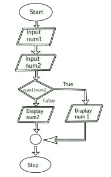

# 算法和流程图的区别

> 原文:[https://www . geesforgeks . org/算法和流程图之间的差异/](https://www.geeksforgeeks.org/difference-between-algorithm-and-flowchart/)

**算法:**

[算法](https://www.geeksforgeeks.org/introduction-to-algorithms/)这个词的意思是“在计算或其他解决问题的操作中要遵循的一个过程或一组规则”。因此，算法指的是一组规则/指令，这些规则/指令一步一步地定义如何执行工作，以获得预期的结果。

让我们看一个例子，以便更好地理解。作为一名程序员，我们都知道线性搜索程序。([线性搜索](https://www.geeksforgeeks.org/linear-search/))

**线性搜索算法:**

```
1\. Start from the leftmost element of arr[] and 
one by one compare x with each element of arr[]. 
2\. If x matches with an element, return the index. 
3\. If x doesn’t match with any of elements, return -1\. 

```

在这里，我们可以看到如何用简单的英语解释线性搜索程序的步骤。

**流程图:**

[流程图](https://www.geeksforgeeks.org/an-introduction-to-flowcharts/)是算法的图形表示。程序员经常使用它作为解决问题的程序规划工具。它利用相互连接的符号来表示信息的流动和处理。
为算法绘制流程图的过程被称为“流程图”。

示例:绘制流程图，从用户输入两个数字，并显示两个数字中最大的一个

[](https://contribute.geeksforgeeks.org/wp-content/uploads/flowchart-3.jpg)

让我们看看算法和流程图的区别:-

| S.NO | 算法 | 流程图 |
| 1. | 算法是一步一步解决问题的程序。 | 流程图是由不同形状创建的图表，用于显示数据流。 |
| 2. | 算法很难理解。 | 流程图很容易理解。 |
| 3. | 在算法中使用纯文本。 | 在流程图中，使用符号/形状。 |
| 4. | 算法易于调试。 | 流程图很难调试。 |
| 5. | 算法很难构造。 | 流程图很容易构建。 |
| 6. | 算法不遵循任何规则。 | 流程图遵循要构建的规则。 |
| 7. | 算法是程序的伪代码。 | 流程图只是该逻辑的图形表示。 |