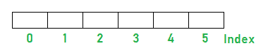

# 数组和树的区别

> 原文:[https://www . geesforgeks . org/数组与树的区别/](https://www.geeksforgeeks.org/difference-between-array-and-tree/)

### [**<u>阵</u>**](https://www.geeksforgeeks.org/introduction-to-arrays/) **:**

数组是存储在[连续存储位置](https://www.geeksforgeeks.org/difference-between-contiguous-and-noncontiguous-memory-allocation/)的同类(相同类型)数据项的集合。例如，如果一个数组是“int”类型，它只能存储整数元素，不能允许其他类型的元素，如 double、float、char 等。

*   该数组是一种[线性数据结构](https://www.geeksforgeeks.org/difference-between-linear-and-non-linear-data-structures/)，其中元素存储在连续的存储位置。
*   在数组中，我们将相同数据类型的元素存储在一起。
*   它具有基于索引的寻址，因为元素存储在连续的存储位置。
*   索引从 **0** 开始，一直到**(N–1)**，其中 **N** 是数组中的元素数量。
*   因为数组允许随机访问 0(1)中的元素。它使得通过位置访问元素更快。
*   数组最大的缺点是它的大小不能增加。

下面是数组的一般表示:

### **<u>树</u> :**

树表示由边连接的节点。二叉树具体还是二叉查找树的。一个[二叉树](https://www.geeksforgeeks.org/binary-tree-data-structure/)是一个特殊的[数据结构](https://www.geeksforgeeks.org/data-structures/)用于数据存储目的。二叉树有一个特殊条件，即每个节点最多可以有两个子节点。二叉树兼有有序数组和链表的优点，因为搜索和排序数组一样快，插入或删除操作和链表一样快。

*   树是从根节点开始的一组节点。
*   每个节点都有一个特定的父节点，并且可能有也可能没有多个子节点。
*   每个节点都包含一个值和对子节点的引用。
*   它是一种图形数据结构，但没有循环，是完全连通的。
*   可视化树数据结构的最佳示例是可视化自然根树。

**<u>阵列和树的表格区别</u> :**

<figure class="table">

| **参数** | **阵列** | **树** |
| 自然 | 它是一种线性数据结构 | 它是一个线性的非线性数据结构 |
| 基本概念 | 数组的第 0 个索引 | 树的根 |
| 继任者 | 引用索引+ 1 处的元素 | 当前节点的子节点。 |
| 前任 | reference_index 处的元素–1 | 当前节点的父节点。 |
| 自然直觉 | 以基础楼梯为第 i 个索引的楼梯模型 | 可视化树数据结构的最佳示例是可视化自然根树。 |
| 插入顺序 | 通常是在 current_index + 1 处插入的元素 | 取决于树的类型。 |
| 删除顺序 | 在任何索引处，但是在删除之后，元素被重新排列 | 取决于树的类型。 |
| 插入复杂性 | O(1)->结尾插入。O(N)->随机索引插入。 | 取决于类型，例如 AVL-0(对数 2 N)。 |
| 删除复杂性 | O(1)->从末尾删除。O(N)->从随机索引中删除。 | 取决于类型，例如 AVL-0(对数 2 N)。 |
| 搜索 | O(N) | 取决于类型，例如 AVL-0(对数 2 N)。 |
| 寻找分钟 | O(N) | 取决于类型，例如最小堆 0(记录 2 N)。 |
| 寻找麦克斯 | O(N) | 取决于类型，例如最大堆 0(日志 2 N)。 |
| 伊西普西伊普西伊普西伊普西伊普西伊普西伊普西伊普西伊普西伊普西伊普西伊普西伊普西伊普西伊普西伊普西 | O(1) | 大多是 O(1) |
| 随机存取 | O(1) | 大部分是氧(氮) |
| 应用 | 数组用于实现其他数据结构，如列表、堆、散列表、去 q、队列和堆栈。, | 快速搜索、插入、删除等。 |

</figure>