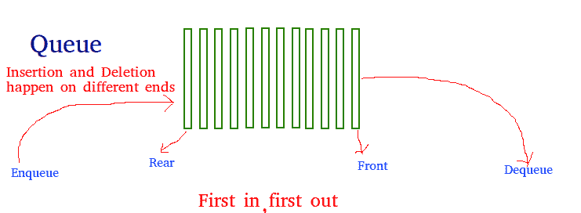
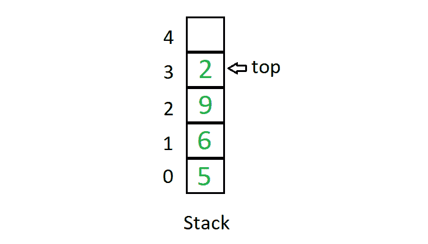

# 数组、队列和堆栈的区别

> 原文:[https://www . geesforgeks . org/数组队列和堆栈之间的差异/](https://www.geeksforgeeks.org/difference-between-array-queue-and-stack/)

### **阵列:**

[数组](https://www.geeksforgeeks.org/array-data-structure/)是存储在连续存储位置的项目的集合。想法是将多个相同类型的项目存储在一起。这使得通过简单地将偏移加到基值，即数组的第一个元素的存储位置(通常由数组的名称表示)，来计算每个元素的位置变得更容易。
阵列的图示如下:

### 队列:

一个[队列](https://www.geeksforgeeks.org/queue-data-structure/)是一个线性结构，它遵循执行操作的特定顺序。顺序为**先进先出(先进先出)**。队列的一个很好的例子是资源的任何消费者队列，其中先到的消费者先被服务。堆栈和队列的区别在于移除。在堆栈中，我们移除最近添加的项目；在队列中，我们移除最近添加最少的项目。
队列的图示如下:

### **堆叠:**

一个[栈](https://www.geeksforgeeks.org/stack-data-structure-introduction-program/)是一个线性数据结构，其中元素只能从列表的一侧插入和删除，称为**顶部**。堆栈遵循**后进先出**(后进先出)原则，即最后插入的元素是第一个出来的元素。将元素插入堆栈称为**推**操作，将元素从堆栈中删除称为**弹出**操作。在堆栈中，我们总是使用名为 **top** 的指针来跟踪列表中的最后一个元素。
堆栈的图示如下:

下面是数组、堆栈和队列之间差异的表格表示:

<figure class="table">

| 行列 | 排列 | 堆 |
| --- | --- | --- |
| 队列基于先进先出原则，即首先插入的元素是列表中的第一个元素。 | 在数组中，元素属于索引，也就是说，如果你想进入第四个元素，你必须把变量名及其索引或位置写在方括号内，例如 arr[4] | 栈基于 LIFO 原理，即最后插入的元素，是列表中第一个出来的元素。 |
| 队列中的插入和删除分别只从后面和前面进行。 | 数组中的插入和删除可以在数组中的任何索引处完成。 | 堆叠中的插入和删除仅从称为顶部的列表的一端占据位置。 |
| 队列具有动态和固定的大小。 | 数组具有固定的大小。 | 堆栈具有动态和固定的大小。 |
| 队列可以包含不同数据类型的元素。 | 数组包含相同数据类型的元素。 | 堆栈可以包含不同数据类型的元素。 |
| 不同类型的队列有循环队列、优先级队列、双端队列 | 不同类型的阵列有 1D、2D 等 | 堆栈只有一种类型。 |

</figure>