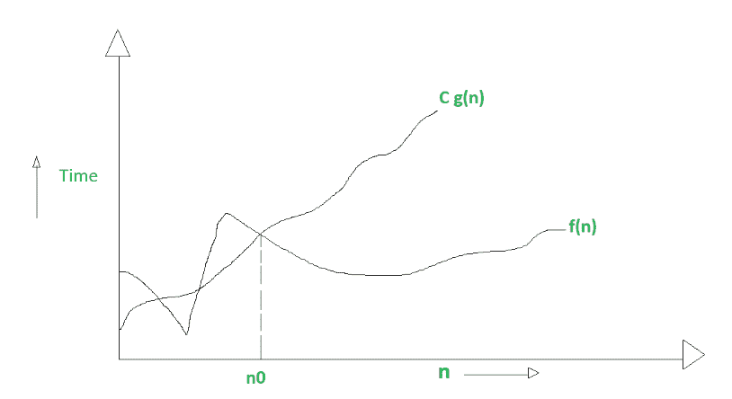
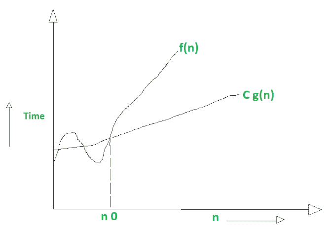
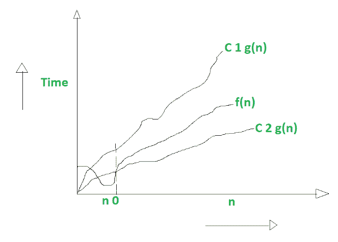

# 大 Oh、大ω、大θ的区别

> 原文:[https://www . geesforgeks . org/big-oh-big-omega-和 big-theta 之间的差异/](https://www.geeksforgeeks.org/difference-between-big-oh-big-omega-and-big-theta/)

先决条件–[渐近符号](https://www.geeksforgeeks.org/analysis-of-algorithms-set-3asymptotic-notations/)、[渐近符号](https://www.geeksforgeeks.org/properties-of-asymptotic-notations/)、
T5 的属性 1。 [**大 oh 符号(O)**](https://www.geeksforgeeks.org/analysis-of-algorithms-set-3asymptotic-notations/) **:**
大 Oh 符号用于描述渐近上界。

数学上，如果 f(n)描述了算法的运行时间；f(n)是 O(g(n))，如果存在正常数 C 和 n0

```
0 <=f(n) <= c g(n) for all n>=n0
```

n =用于给出 a 函数的上限。
如果一个函数是 O(n)，那么它也自动是 O(n 平方)！

大哦(O)的图形示例:



**2。大ω符号(ω):**
就像 O 符号提供渐近上界一样，ω符号提供渐近下界。
让 f(n)定义一个算法的运行时间；

如果存在正常数 C 和(n 0)，则 f(n)被称为ω(g(n))

```
O<= C g(n) <= f(n) for all n>=n 0
```

n=用于给定一个函数的下界
如果一个函数是ω(n 平方)，它也自动是ω(n)。

大ω(ω)的图形示例:



**3。大θ符号(θ):**
让 f(n)定义一个算法的运行时间。

如果 f(n)是 O(g(n))，f(n)是ω(g(n))，则 f(n)称为θ(g(n))

数学上，

```
O<=f(n)<=C 1 g(n) for n>=n 0

O<= C 2 g(n)<=f(n) for n >=n 0
```

合并这两个等式，我们得到:

```
O<=C 2 g(n)<=f(n)<=C 1 g(n) for n>=n 0
```

该方程简单地表示存在正常数 C 1 和 C 2，使得 f(n)夹在 C 2 g(n)和 C 1 g(n)之间。

大θ(θ)的图形示例:



**大哦、大欧米茄和大θ的区别:**

<figure class="table">

| 序列号
 | 大哦
 | 大欧米茄
 | 大θ
 |
| 1. | 就像<= 
算法的增长率小于或等于一个特定值
 | 它就像> =
增长率大于或等于一个指定值
 | 它就像==
意味着增长率等于一个特定的值
 |
| 2. | 算法的上限用大 O 符号表示。只有上述函数是以大 O 为界的，渐近上键是由大 O 符号给出的。 | 该算法的下限由欧米茄符号表示。渐近下键由欧米茄符号给出 | 函数的上下边界用θ符号表示。精确的渐近行为是由这个θ符号完成的。 |
| 3. | 大哦(0)–最坏的情况 | 大ω(ω)-最佳情况 | 大θ(θ)-平均情况 |
| 4. | 大 O 是算法完成可能需要的最长时间的度量。 | 与大 O 相比，大ω只需要很少的时间来完成算法。 | 与大 0 和大-相比，大-θ花费时间非常短。算法可能需要一段时间才能完成。 |
| 5. | 数学上–大 Oh 为 0 <=f(n) <= c g(n) for all n> =n0 | 数学上——大欧米茄是 0<= C g(n) <= f(n) for all n>= n0 | 数学上–大θ为 0<=C 2 g(n)<=f(n)<=C 1 g(n) for n>= n0 |

</figure>