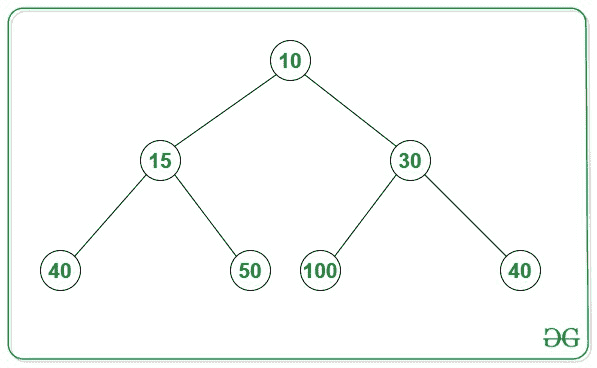
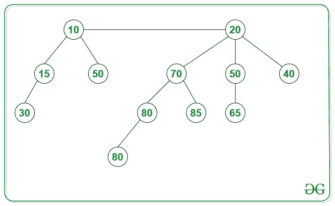
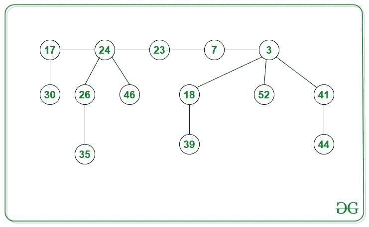

# 二进制堆、二项式堆和斐波那契堆的区别

> 原文:[https://www . geeksforgeeks . org/二进制堆二项式堆和斐波那契堆之间的差异/](https://www.geeksforgeeks.org/difference-between-binary-heap-binomial-heap-and-fibonacci-heap/)

[**<u>二进制堆</u> :**](https://www.geeksforgeeks.org/binary-heap/)
二进制堆是具有以下属性的二叉树。

1.  这是一个[完整的二叉树](https://www.geeksforgeeks.org/binary-tree-set-3-types-of-binary-tree/)，也就是说，除了可能的最后一级，所有的级别都被完全填充，最后一级尽可能地保留所有的键。二进制堆的这个属性使它们适合存储在数组中。
2.  二进制堆要么是 [**最小堆**](https://www.geeksforgeeks.org/implement-min-heap-using-stl/) 要么是 [**最大堆**](https://www.geeksforgeeks.org/priority-queue-in-cpp-stl/) 。在最小二进制堆中，根的键必须是二进制堆中所有键中最小的。对于[二叉树](https://www.geeksforgeeks.org/binary-tree-data-structure/)中的所有节点，相同的属性必须递归为真。最大二进制堆类似于**最小堆**。

**最小堆示例:**

[**二项式堆:**](https://www.geeksforgeeks.org/binomial-heap-2/)
A [二项式堆](https://www.geeksforgeeks.org/binomial-heap-2/)是一个二叉树的集合，其中每个二叉树都遵循最小堆属性，并且最多可以有一个任意程度的二叉树。

**二项式堆示例:**

一个**二进制堆**和一个**二进制堆**之间的关键区别在于堆的结构。在二进制堆中，堆是一个单独的树，这是一个完整的二叉树。在二项式堆中，堆是较小的树的集合(也就是说，树的森林)，每个树都是一棵二项式树。可以构建一个完整的二叉树来保存任意数量的元素，但是某种顺序的二叉树中的元素数量 **N** 总是 **2*N** 。因此，需要一个完整的二叉树来支持二进制堆，但是我们可能需要多个二叉树来支持二进制堆。

[**<u>斐波那契堆</u> :**](https://www.geeksforgeeks.org/fibonacci-heap-set-1-introduction/)
与二项式堆一样，**斐波那契堆**是具有最小堆或最大堆属性的树的集合。在斐波那契堆中，树可以有任何形状，甚至所有的树都可以是单个节点(这与二叉树堆不同，二叉树堆中的每棵树都必须是二叉树)。斐波那契堆保持一个指向最小值(即树的根)的指针。所有的树根使用[循环双向链表](https://www.geeksforgeeks.org/doubly-circular-linked-list-set-1-introduction-and-insertion/)连接，所以所有的树根都可以用一个‘min’指针访问。

**斐波那契堆示例:**

下表中提到了与二进制堆、二项式堆和斐波那契堆相关的各种操作在时间复杂性上的差异。

<figure class="table">

| **操作** | **二进制堆** | **二项式堆** | **斐波那契堆** |
| --- | --- | --- | --- |
| 插入 | o(对数 N) | o(对数 N) | O(1) |
| find-min | O(1) | o(对数 N) | O(1) |
| 删除 | o(对数 N) | o(对数 N) | o(对数 N) |
| 减号键 | o(对数 N) | o(对数 N) | O(1) |
| 联盟 | O(N) | o(对数 N) | O(1) |

</figure>