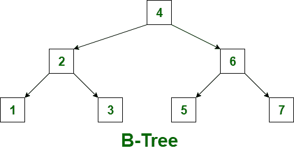
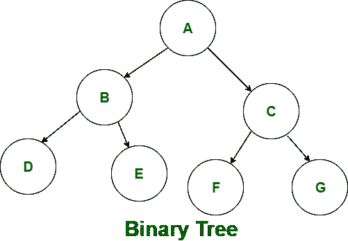

# 二叉树和 B 树的区别

> 原文:[https://www . geesforgeks . org/二叉树和 b 树的区别/](https://www.geeksforgeeks.org/difference-between-binary-tree-and-b-tree/)

**[B- Tree](https://www.geeksforgeeks.org/introduction-of-b-tree-2/):**
B- Tree 被称为自平衡树，因为它的节点是按顺序遍历排序的。与二叉树不同，在 B 树中，一个节点可以有两个以上的子节点。b 树的高度为 logM ^ N(其中‘M’是树的阶，N 是节点数)。并且高度会在每次更新时自动调整。在 B 树中，数据按特定顺序排序，最低值在左边，最高值在右边。在 B 树中插入数据或密钥比二叉树更复杂。

有一些条件必须由 B 树保持:

*   B 树的所有叶节点必须在同一级别。
*   在 B 树的叶节点之上，不应该有空的子树。
*   b 树的高度应该尽可能低。

**[二叉树](https://www.geeksforgeeks.org/binary-tree-data-structure/) :**
二叉树是一般树的特殊类型。与 B 树不同，在二叉树中，一个节点最多可以有两个节点。在二叉树中，节点的度是有限制的，因为二叉树中的节点不能有两个以上的子节点(或二度)。二叉树的最顶端的节点叫做根节点，主要有两个子树，一个是左子树，另一个是右子树。与一般的树不同，二叉树可以是空的。像 B 树一样，二叉树也可以在有序遍历中排序。但是它也可以按照前序和后序进行排序。在二叉树中，数据插入并不比 B 树复杂。

让我们看看 B 树和二叉树的区别:

| S.NO | B 树 | 二叉树 |
| --- | --- | --- |
| 1. | 在 B 树中，一个节点可以有最大数量的子节点。 | 而在二叉树中，一个节点最多可以有两个子节点或子树。 |
| 2. | b 树被称为排序树，因为它的节点是按顺序遍历排序的。 | 而二叉树不是排序树。它可以按顺序、前序或后序遍历进行排序。 |
| 3. | b 树的高度为 logM ^ N(其中‘M’是树的阶，N 是节点数)。 | 而二叉树的高度为 log2 N(其中 N 是节点数)。 |
| 4. | B-Tree 在数据加载到磁盘时执行。 | 与 B 树不同，二叉树是在数据加载到内存(更快的内存)时执行的。 |
| 5. | b 树用于数据库管理系统(代码索引等)。 | 而二叉树用于霍夫曼编码和代码优化等许多其他方面。 |
| 6. | 在 B 树中插入数据或密钥比二叉树更复杂。 | 而在二叉树中，数据插入并不比 B 树复杂。 |

