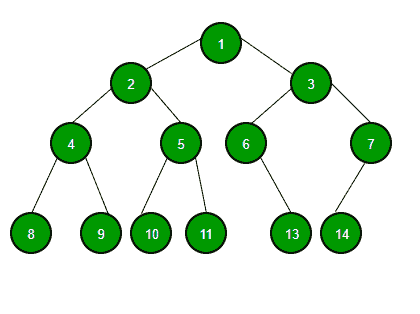

# 二叉树和二叉查找树的区别

> 原文:[https://www . geesforgeks . org/二叉树和二进制搜索树的区别/](https://www.geeksforgeeks.org/difference-between-binary-tree-and-binary-search-tree/)

**二叉树数据结构**

元素最多有两个子元素的树称为二叉树。由于二叉树中的每个元素只能有两个子元素，我们通常将它们命名为左右子元素。

**二叉查找树数据结构**

二叉查找树是一种基于节点的二叉树数据结构，具有以下特性:

*   节点的左子树只包含键小于节点键的节点。
*   节点的右子树只包含键大于节点键的节点。
*   左右子树也必须是二叉查找树树。
*   不能有重复的节点。

**二叉树和二叉查找树的区别:**

<figure class="table">

| 二叉树 | 二叉查找树 |
| --- | --- |
| 二叉树是一种非线性数据结构，其中每个节点最多可以有两个子节点 | 二叉查找树是一个基于节点的二叉树，它进一步有右和左子树，也是二叉查找树。 |
| 二叉树是无序的，因此插入、删除和搜索过程较慢。 | 由于有序特性，在二叉查找树，元素的插入、删除和搜索比二叉树更快 |
| 在二叉树中，节点的排列没有顺序 | 在二叉查找树，左子树的元素少于节点元素，右子树的元素多于节点元素。 |

</figure>