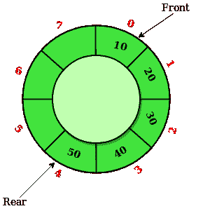

# 循环队列和优先级队列的区别

> 原文:[https://www . geesforgeks . org/循环队列和优先级队列的区别/](https://www.geeksforgeeks.org/difference-between-circular-queue-and-priority-queue/)

[**循环队列:**](https://www.geeksforgeeks.org/circular-queue-set-1-introduction-array-implementation/) 循环队列是基于 [FIFO(先进先出)](https://www.geeksforgeeks.org/fifo-first-in-first-out-approach-in-programming/)原理进行运算的线性数据结构，最后一个位置连接回第一个位置做一个圆。也叫**【环形缓冲】**。

[**优先级队列:**](https://www.geeksforgeeks.org/priority-queue-set-1-introduction/) 优先级队列是一种特殊类型的队列，其中每个元素都与一个优先级相关联，并根据其优先级进行服务。

**循环队列和优先队列的区别如下:**

<figure class="table">

| **循环队列** | **优先级队列** |
| 循环队列不是线性的，而是循环的。 | 优先级是一种特殊类型的数据结构，其中可以根据优先级插入或删除项目。 |
| 它也被称为环形缓冲区。 | 也叫简单队列。 |
| 可以在 0(1)分钟内从队列中插入或删除项目。 | 它可以执行插入、删除和显示三种操作。 |
| 前后指针都绕到数组的开头。 | 它不允许排序数组中的元素。 |
| 它克服了线性排队的问题。 | 它允许重复的元素。 |
| 它需要更少的内存。 | 它需要更多的内存。 |
| 效率更高 | 效率更低。 |

</figure>