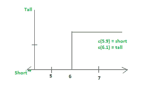
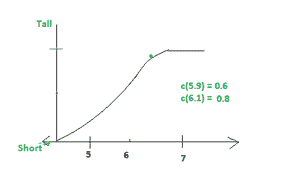

# 清晰集和模糊集的区别

> 原文:[https://www . geesforgeks . org/crisp-set 和 fuzzy-set 的区别/](https://www.geeksforgeeks.org/difference-between-crisp-set-and-fuzzy-set/)

**脆集:**可数性和有限性是相同的性质，是脆集的集合对象。 *X* 是一个简洁的集合，定义为通用集合上的一组元素，即 *U* 。在这种情况下，随机元素可能是 *X* 的一部分，也可能不是，这意味着有两种方法可以定义集合。这些是第一个元素将从集合*变成 X* ，或者它不来自 *X* 。

**模糊集:**集合中隶属度变化的元素的集合称为模糊集。 *fuzzy* 一词表示模糊性，另一方面，我们可以说不同隶属度之间的替换意味着模糊集的模糊性和模糊性。因此，根据检测不确定性和模糊性的函数，测量宇宙中元素的隶属度。

<figure class="table">

| **序列号** | **脆皮套装**

 | **模糊集** |
| one | Crisp set 定义值为 0 或 1。 | 模糊集定义 0 和 1 之间的值，包括 0 和 1。 |
| Two | 它也被称为经典集。 | 它规定了某事真实的程度。 |
| three | 它显示为正式成员 | 它显示了部分成员身份。 |
| four | Eg1。她 18 岁。Eg2。拉胡尔身高 1.6 米 | Eg1。她大约 18 岁。

Eg2。拉胡尔大约 1.6 米高。 |
| five | Crisp set 在数字化设计中的应用。 | 模糊集在模糊控制器中的应用。 |
| six | 它是双值函数逻辑。 | 它是无限值函数逻辑 |
| seven | 正式会员意味着完全正确/错误，是/否，0/1。 | 部分成员意味着真到假，是到否，0 到 1。 |

脆皮套装

模糊集合

**结论:**

不同集合理论的部分是模糊集合和清晰集合，其中没有有限数量的逻辑在模糊集合中实现，而只有两个数量的逻辑在清晰集合中实现。

</figure>