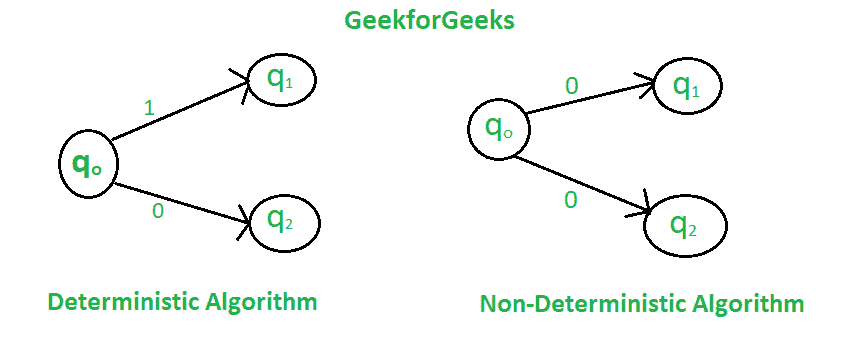

# 确定性算法和非确定性算法的区别

> 原文:[https://www . geesforgeks . org/确定性算法和非确定性算法的区别/](https://www.geeksforgeeks.org/difference-between-deterministic-and-non-deterministic-algorithms/)

在**确定性算法**中，对于给定的特定输入，计算机将总是产生经过相同状态的相同输出，但是在**非确定性算法**的情况下，对于相同的输入，编译器可能在不同的运行中产生不同的输出。事实上，非确定性算法不能在多项式时间内解决问题，也不能确定下一步是什么。非确定性算法可以在不同的执行中表现出相同输入的不同行为，并且具有一定的随机性。



为了实现非确定性算法，我们有两种语言，比如 Prolog，但是它们没有标准的编程语言操作符，这些操作符也不是任何标准编程语言的一部分。

**与非确定性算法相关的一些术语定义如下**:

*   **选择(X) :** 从集合 X 中随机选择任意值
*   **失败():**表示不成功的解决方案。
*   **成功():**解决成功，当前线程终止。

**示例:**

> **问题陈述:**在 A[1:n]上搜索元素 x，其中 n > =1，如果 a[j]等于 x，则成功搜索返回 j，否则返回 0。
> 
> **该问题的非确定性算法:**
> 
> ```
> 1.j= choice(a, n)
> 2.if(A[j]==x) then
>     {
>        write(j);
>        success();
>     }
> 3.write(0); failure();
> ```

| 确定性算法 | 非确定性算法 |
| --- | --- |
| 对于特定的输入，计算机将总是给出相同的输出。 | 对于特定的输入，计算机将在不同的执行中给出不同的输出。 |
| 可以在多项式时间内解决问题。 | 不能在多项式时间内解决问题。 |
| 可以决定下一步的执行。 | 由于算法可以采用多条路径，因此无法确定下一个执行步骤。 |