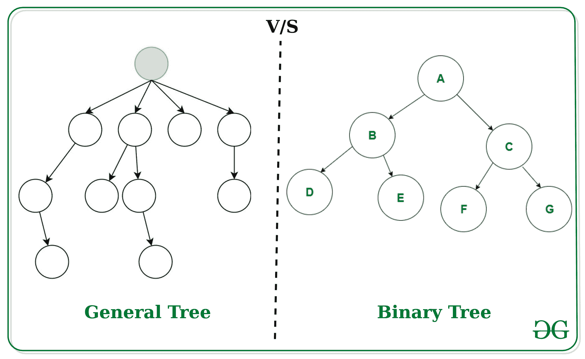
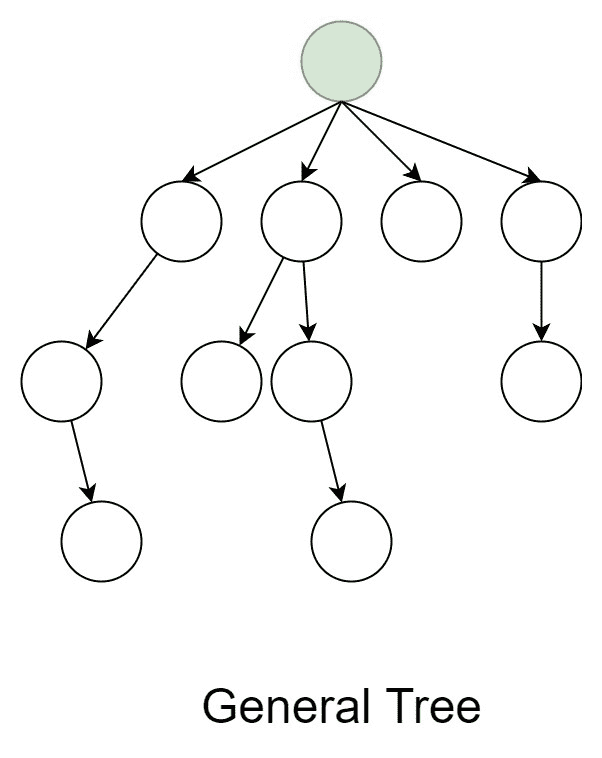
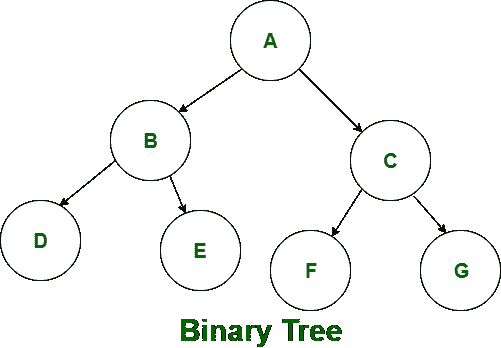

# 普通树和二叉树的区别

> 原文:[https://www . geesforgeks . org/general-tree 和-二叉树的区别/](https://www.geeksforgeeks.org/difference-between-general-tree-and-binary-tree/)

 
**[【通用树】](https://www.geeksforgeeks.org/generic-tree-level-order-traversal/) :**
在数据结构中，**通用树**是每个节点可以有零个或多个子节点的树。它不能为空。在一般的树中，节点的度没有限制。一般树的最顶端的节点称为根节点。一般树有很多子树。一般树的子树是无序的，因为一般树的节点不能根据特定的标准进行排序。在一般的树中，每个节点都有一个入度(父节点数)和一个最大出度(子节点数)n。

**[二叉树](https://www.geeksforgeeks.org/binary-tree-data-structure/) :**
二叉树是通用树的专门化版本。二叉树是每个节点最多可以有两个节点的树。在二叉树中，节点的度是有限制的，因为二叉树中的节点不能有两个以上的子节点(或二度)。二叉树的最顶端的节点叫做根节点，主要有两个子树一个是**左子树**，另一个是**右子树**。与一般的树不同，二叉树可以是空的。与一般的树不同，二叉树的子树是有序的，因为二叉树的节点可以根据特定的标准进行排序。

**普通树和二叉树的区别**

| 普通树 | 二叉树 |
| --- | --- |
| 常规树是一种树，其中每个节点可以有许多子节点或节点。 | 而在二叉树中，每个节点最多只能有两个节点。 |
| 一般树的子树不包含有序属性。 | 而二叉树的子树持有有序属性。 |
| 在数据结构中，一般树不能为空。 | 虽然它可以是空的。 |
| 一般树中，一个节点最多可以有 **n(子节点数)**个节点。 | 而在二叉树中，一个节点最多可以有 **2(子节点数)**个节点。 |
| 在一般的树中，节点的度没有限制。 | 而在二叉树中，节点的度是有限制的，因为二叉树中的节点不能有两个以上的子节点。 |
| 在一般树中，不是零子树就是多子树。 | 而在二叉树中，主要有两个子树:**左子树**和**右子树**。 |