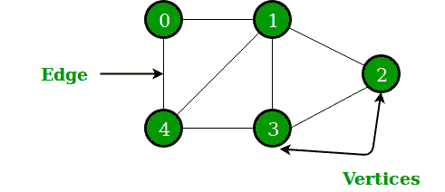

# 图与树的区别

> 原文:[https://www . geesforgeks . org/图树差/](https://www.geeksforgeeks.org/difference-between-graph-and-tree/)

**[图形](https://www.geeksforgeeks.org/graph-data-structure-and-algorithms/)** :

一个[图](https://www.geeksforgeeks.org/graph-data-structure-and-algorithms/)是两个集合 V 和 E 的集合，其中 V 是顶点的有限非空集合，E 是边的有限非空集合。

*   顶点只是图中的节点。
*   两个相邻的顶点由边连接。
*   任何图都表示为 G = {V，E}。

例如:

G = {{V 1 ，V 2 ，V 3 ，V 4 ，V 5 ，V 6 }，{E 1 ，E 2 ，E 3 ，E 4 ，E 5 ，E6【T22

**[树](https://www.geeksforgeeks.org/binary-tree-data-structure/) :**

树是一个或多个节点的有限集合，因此–

1.  有一个特别指定的节点叫做根。
2.  其余节点被划分为 n>=0 的不相交集合 T 1 、T 2 、T 3 、…、TnT8【其中 T 1 、T 2 、T 3 、…、T n 称为根的子树。

树的概念由下图表示

#### **图形对树**

| 号码 | 图表 | 树 |
| one | 图形是一种非线性数据结构。 | 树是一种非线性数据结构。 |
| Two | 它是顶点/节点和边的集合。 | 它是节点和边的集合。 |
| three | 每个节点可以有任意数量的边。 | 一般树由具有任意数量子节点的节点组成。但是在二叉树的情况下，每个节点最多只能有两个子节点。 |
| four | 图中没有称为根的唯一节点。 | 树中有一个唯一的节点叫做根。 |
| five | 可以形成一个循环。 | 不会有任何循环。 |
| six | 应用:用于寻找网络图中的最短路径。 | 应用:对于游戏树，决策树，使用树。 |