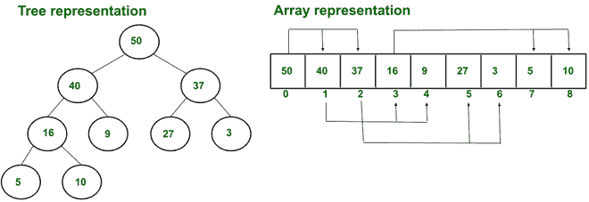
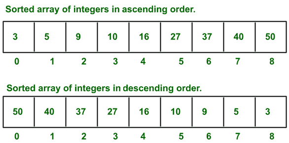

# 堆和排序数组的区别

> 原文:[https://www . geeksforgeeks . org/堆与排序数组之差/](https://www.geeksforgeeks.org/difference-between-heaps-and-sorted-array/)

**1。堆:**
堆是一种基于树的数据结构，其中树应该几乎是完整的。它有两种类型，即最大堆和最小堆。

*   **最大堆**在最大堆中，如果 p 是父堆，c 是子堆，那么对于每个父堆，p 的值都大于或等于 c 的值
*   **最小堆**在最小堆中，如果 p 是父堆，c 是其子堆，那么对于每个父堆，p 值都小于或等于 c 值。

堆也作为优先级队列。其中最高(在最大堆的情况下)或最低(在最小堆的情况下)元素出现在根。
**Heap 用于我们需要移除最高或最低优先级元素的问题。堆的一种常见实现是二进制堆。**

**实施**

*   因为堆可以被实现为树，但是在这些大量的存储中浪费了存储指针。**由于堆的性质，因为它几乎是完整的二叉树，所以可以很容易地存储在数组中。**
*   其中根元素存储在第一个索引处，其子索引可以计算为
*   左子索引= 2×r，其中 r 是索引，r 是根，数组起始索引为 0。
*   右子索引= 2×r+1。
*   父索引可以计算为 floor(i/2)，其中 I 是其左或右子索引。

**例:**

**最大堆示例**

**2。排序数组:**
排序数组是一种数据结构，其中元素按数字、字母或其他顺序排序，并存储在连续的内存位置**。**

**排序数组示例**

*   根据使用的问题或算法，所有数据结构都有自己的优缺点。**例如**堆是我们在寻找(最大或最小)、删除(最大或最小)或插入(最大或最小)元素时需要最优性的情况下的最佳数据结构。
*   而排序数组则用于项目需要以升序或降序存储的情况。**例如最短作业调度算法中的**优先，其中进程(存储在数组中)需要根据进程的突发时间进行排序。如果需要排序数组。

<figure class="table">

| **数据结构** | 插入 | 搜索 | 查找最小值 | 删除最小值 |
| --- | --- | --- | --- | --- |
| **排序数组** | O(n) | o(对数 n) | O(1) | O(n) |
| **最小堆** | **O(对数 n)** | O(n) | **O(1)** | **O(对数 n)** |

</figure>

**堆和排序数组的区别:**

<figure class="table">

| 

排序数组

 | 

很

 |
| --- | --- |
| 在排序数组中，元素按数字、字母或其他顺序排序，并存储在连续的内存位置。 | 一个堆几乎是完全二叉树，在最大堆的情况下，如果 p 是它的父，c 是它的子，那么 p 的值大于等于 c 的值，在最小堆的情况下，如果 p 是它的父，c 是它的子，那么 p 的值小于等于 c 的值。 |
| 当使用基于数组的堆实现时，排序数组可以充当堆。 | 使用基于数组的堆实现时，堆可以是排序数组，也可以不是排序数组。 |
| 对于给定的整数集，排序后可能有两种排列方式(即升序或降序)。 | 对于给定的一组 n 个整数，可以形成多个可能的堆(最大或最小)。更多详情请参考[文章](https://www.geeksforgeeks.org/number-ways-form-heap-n-distinct-integers/) |
| 这里，可以通过增加当前元素的索引来访问下一个元素地址。 | 这里左边的子索引可以通过计算 2×r 来访问，右边的元素索引可以通过计算 2×r+1 来访问，其中 r 是根的索引，数组是基于 0 的索引。 |
| 通过使用二分搜索法，可以在排序的数组中执行(log n)时间复杂度的搜索。 | 堆对于搜索操作来说不是最佳的，但是搜索可以以 O(n)的复杂度执行。 |
| 堆排序可用于对数组进行排序，但对于这种情况，第一个堆是用 n 个整数的数组构建的，然后应用堆排序在这里，构建堆需要 O(n)个时间复杂度，从堆中移除 n (min 或 max)个元素并放在数组的末尾并减小数组的大小需要 O(n log n)，即堆排序。 | 应用于堆(最小或最大)的堆排序，它是在 O(n log n)时间复杂度中执行排序的就地排序算法。 |
| 对数组进行排序需要 O(n log n)的复杂度，这是在基于比较的排序算法中对 n 项数组进行排序的最佳时间复杂度。 | 构建堆需要 O(n)个时间复杂度。 |
| 排序数组用于执行有效的搜索(即二分搜索法)，SJFS 调度算法，以及在需要按排序顺序排列数据的组织中等等。 | 堆用于堆排序、优先级队列、图算法和 K 路合并等。 |

</figure>