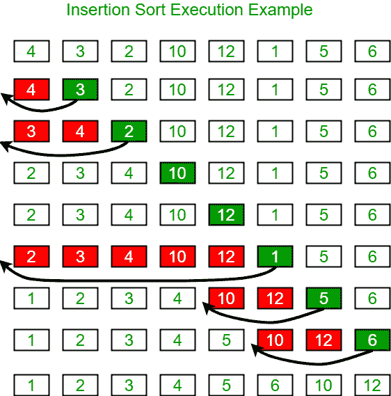

# 插入排序和选择排序的区别

> 原文:[https://www . geeksforgeeks . org/insert-sort-and-selection-sort/](https://www.geeksforgeeks.org/difference-between-insertion-sort-and-selection-sort/)

在本文中，我们将讨论插入排序和选择排序之间的区别:

[插入排序](https://www.geeksforgeeks.org/insertion-sort/)是一种简单的排序算法，其工作原理类似于你对手中的扑克牌进行排序。数组实际上被分成一个排序的部分和一个未排序的部分。未排序部分的值被拾取并放置在排序部分的正确位置。

**算法:**
要按升序对大小为 n 的数组进行排序:

*   在数组上从 arr[1]迭代到 arr[n]。
*   将当前元素(键)与其前身进行比较。
*   如果关键元素小于其前身，请将其与之前的元素进行比较。将较大的元素向上移动一个位置，为交换的元素腾出空间。

下图说明了插入排序:



下面是同样的程序:

## C++

```
// C++ program for the insertion sort
#include <bits/stdc++.h>
using namespace std;

// Function to sort an array using
// insertion sort
void insertionSort(int arr[], int n)
{
    int i, key, j;
    for (i = 1; i < n; i++) {
        key = arr[i];
        j = i - 1;

        // Move elements of arr[0..i-1],
        // that are greater than key to
        // one position ahead of their
        // current position
        while (j >= 0 && arr[j] > key) {
            arr[j + 1] = arr[j];
            j = j - 1;
        }
        arr[j + 1] = key;
    }
}

// Function to print an array of size N
void printArray(int arr[], int n)
{
    int i;

    // Print the array
    for (i = 0; i < n; i++) {
        cout << arr[i] << " ";
    }
    cout << endl;
}

// Driver Code
int main()
{
    int arr[] = { 12, 11, 13, 5, 6 };
    int N = sizeof(arr) / sizeof(arr[0]);

    // Function Call
    insertionSort(arr, N);
    printArray(arr, N);

    return 0;
}
```

## Java 语言(一种计算机语言，尤用于创建网站)

```
// Java program for the above approach
import java.util.*;
class GFG
{

// Function to sort an array using
// insertion sort
static void insertionSort(int arr[], int n)
{
    int i, key, j;
    for (i = 1; i < n; i++)
    {
        key = arr[i];
        j = i - 1;

        // Move elements of arr[0..i-1],
        // that are greater than key to
        // one position ahead of their
        // current position
        while (j >= 0 && arr[j] > key)
        {
            arr[j + 1] = arr[j];
            j = j - 1;
        }
        arr[j + 1] = key;
    }
}

// Function to print an array of size N
static void printArray(int arr[], int n)
{
    int i;

    // Print the array
    for (i = 0; i < n; i++) {
        System.out.print(arr[i] + " ");
    }
    System.out.println();
}

// Driver code
public static void main(String[] args)
{
    int arr[] = { 12, 11, 13, 5, 6 };
    int N = arr.length;

    // Function Call
    insertionSort(arr, N);
    printArray(arr, N);
}
}

// This code is contributed by code_hunt.
```

## 蟒蛇 3

```
# Python 3 program for the insertion sort

# Function to sort an array using
# insertion sort
def insertionSort(arr, n):
    i = 0
    key = 0
    j = 0
    for i in range(1,n,1):
        key = arr[i]
        j = i - 1

        # Move elements of arr[0..i-1],
        # that are greater than key to
        # one position ahead of their
        # current position
        while (j >= 0 and arr[j] > key):
            arr[j + 1] = arr[j]
            j = j - 1
        arr[j + 1] = key

# Function to print an array of size N
def printArray(arr, n):
    i = 0

    # Print the array
    for i in range(n):
        print(arr[i],end = " ")
    print("\n",end = "")

# Driver Code
if __name__ == '__main__':
    arr =  [12, 11, 13, 5, 6]
    N =  len(arr)

    # Function Call
    insertionSort(arr, N)
    printArray(arr, N)

    # This code is contributed by bgangwar59.
```

## C#

```
// C# program for the above approach
using System;
class GFG
{

    // Function to sort an array using
    // insertion sort
    static void insertionSort(int[] arr, int n)
    {
        int i, key, j;
        for (i = 1; i < n; i++)
        {
            key = arr[i];
            j = i - 1;

            // Move elements of arr[0..i-1],
            // that are greater than key to
            // one position ahead of their
            // current position
            while (j >= 0 && arr[j] > key)
            {
                arr[j + 1] = arr[j];
                j = j - 1;
            }
            arr[j + 1] = key;
        }
    }

    // Function to print an array of size N
    static void printArray(int[] arr, int n)
    {
        int i;

        // Print the array
        for (i = 0; i < n; i++)
        {
            Console.Write(arr[i] + " ");
        }
        Console.WriteLine();
    }

    // Driver code
    static public void Main()
    {
        int[] arr = new int[] { 12, 11, 13, 5, 6 };
        int N = arr.Length;

        // Function Call
        insertionSort(arr, N);
        printArray(arr, N);
    }
}

// This code is contributed by Dharanendra L V
```

## java 描述语言

```
<script>

// JavaScript program for the above approach

// Function to sort an array using
// insertion sort
function insertionSort(arr,n)
{
    let i, key, j;
    for (i = 1; i < n; i++)
    {
        key = arr[i];
        j = i - 1;

        // Move elements of arr[0..i-1],
        // that are greater than key to
        // one position ahead of their
        // current position
        while (j >= 0 && arr[j] > key)
        {
            arr[j + 1] = arr[j];
            j = j - 1;
        }
        arr[j + 1] = key;
    }
}

// Function to print an array of size N
function printArray(arr,n)
{
    let i;

    // Print the array
    for (i = 0; i < n; i++) {
        document.write(arr[i] + " ");
    }
    document.write("<br>");
}

// Driver code
let arr=[12, 11, 13, 5, 6];
let N = arr.length;

// Function Call
insertionSort(arr, N);
printArray(arr, N);

// This code is contributed by avanitrachhadiya2155

</script>
```

**Output:** 

```
5 6 11 12 13
```

[选择排序](https://www.geeksforgeeks.org/selection-sort/)算法通过从未排序的部分重复寻找最小元素(考虑升序)并将其放在开头来对数组进行排序。该算法在给定的阵列中保持两个子阵列。

*   子阵列已经排序。
*   未排序的剩余子阵列。

在选择排序的每次迭代中，来自未排序子阵列的最小元素(考虑升序)被挑选并移动到排序子阵列。

下面是解释上述步骤的示例:

```
arr[] = 64 25 12 22 11

// Find the minimum element in arr[0...4]
// and place it at beginning
11 25 12 22 64

// Find the minimum element in arr[1...4]
// and place it at beginning of arr[1...4]
11 12 25 22 64

// Find the minimum element in arr[2...4]
// and place it at beginning of arr[2...4]
11 12 22 25 64

// Find the minimum element in arr[3...4]
// and place it at beginning of arr[3...4]
11 12 22 25 64 
```

下面是同样的程序:

## C++

```
// C++ program for implementation of
// selection sort
#include <bits/stdc++.h>
using namespace std;

// Function to swap two number
void swap(int* xp, int* yp)
{
    int temp = *xp;
    *xp = *yp;
    *yp = temp;
}

// Function to implement the selection
// sort
void selectionSort(int arr[], int n)
{
    int i, j, min_idx;

    // One by one move boundary of
    // unsorted subarray
    for (i = 0; i < n - 1; i++) {

        // Find the minimum element
        // in unsorted array
        min_idx = i;
        for (j = i + 1; j < n; j++)
            if (arr[j] < arr[min_idx])
                min_idx = j;

        // Swap the found minimum element
        // with the first element
        swap(&arr[min_idx], &arr[i]);
    }
}

// Function to print an array
void printArray(int arr[], int size)
{
    int i;

    for (i = 0; i < size; i++) {
        cout << arr[i] << " ";
    }
    cout << endl;
}

// Driver Code
int main()
{
    int arr[] = { 64, 25, 12, 22, 11 };
    int n = sizeof(arr) / sizeof(arr[0]);

    // Function Call
    selectionSort(arr, n);
    cout << "Sorted array: \n";

    // Print the array
    printArray(arr, n);
    return 0;
}
```

## Java 语言(一种计算机语言，尤用于创建网站)

```
// Java program for implementation of
// selection sort
import java.util.*;
class GFG
{

// Function to implement the selection
// sort
static void selectionSort(int arr[], int n)
{
    int i, j, min_idx;

    // One by one move boundary of
    // unsorted subarray
    for (i = 0; i < n - 1; i++)
    {

        // Find the minimum element
        // in unsorted array
        min_idx = i;
        for (j = i + 1; j < n; j++)
            if (arr[j] < arr[min_idx])
                min_idx = j;

        // Swap the found minimum element
        // with the first element
        int temp = arr[min_idx];
        arr[min_idx]= arr[i];
        arr[i] = temp;
    }
}

// Function to print an array
static void printArray(int arr[], int size)
{
    int i;

    for (i = 0; i < size; i++) {
        System.out.print(arr[i]+ " ");
    }
    System.out.println();
}

// Driver Code
public static void main(String[] args)
{
    int arr[] = { 64, 25, 12, 22, 11 };
    int n = arr.length;

    // Function Call
    selectionSort(arr, n);
    System.out.print("Sorted array: \n");

    // Print the array
    printArray(arr, n);
}
}

// This code is contributed by aashish1995
```

## 蟒蛇 3

```
# Python3 program for implementation of
# selection sort

# Function to implement the selection
# sort
def selectionSort(arr, n):

    # One by one move boundary of
    # unsorted subarray
    for i in range(n - 1):

        # Find the minimum element
        # in unsorted array
        min_idx = i
        for j in range(i + 1, n):
            if (arr[j] < arr[min_idx]):
                min_idx = j

        # Swap the found minimum element
        # with the first element
        arr[min_idx], arr[i] = arr[i], arr[min_idx]

# Function to print an array
def printArray(arr, size):

    for i in range(size):
        print(arr[i], end = " ")

    print()

# Driver Code
if __name__ == "__main__":

    arr = [64, 25, 12, 22, 11]
    n = len(arr)

    # Function Call
    selectionSort(arr, n)
    print("Sorted array: ")

    # Print the array
    printArray(arr, n)

# This code is contributed by ukasp
```

## C#

```
// C# program for implementation of
// selection sort
using System;
public class GFG
{

// Function to implement the selection
// sort
static void selectionSort(int []arr, int n)
{
    int i, j, min_idx;

    // One by one move boundary of
    // unsorted subarray
    for (i = 0; i < n - 1; i++)
    {

        // Find the minimum element
        // in unsorted array
        min_idx = i;
        for (j = i + 1; j < n; j++)
            if (arr[j] < arr[min_idx])
                min_idx = j;

        // Swap the found minimum element
        // with the first element
        int temp = arr[min_idx];
        arr[min_idx]= arr[i];
        arr[i] = temp;
    }
}

// Function to print an array
static void printArray(int []arr, int size)
{
    int i;

    for (i = 0; i < size; i++) {
        Console.Write(arr[i]+ " ");
    }
    Console.WriteLine();
}

// Driver Code
public static void Main(String[] args)
{
    int []arr = { 64, 25, 12, 22, 11 };
    int n = arr.Length;

    // Function Call
    selectionSort(arr, n);
    Console.Write("Sorted array: \n");

    // Print the array
    printArray(arr, n);
}
}

// This code is contributed by gauravrajput1
```

## java 描述语言

```
<script>

// Javascript program for implementation of
// selection sort

// Function to implement the selection
// sort
function selectionSort(arr, n)
{
    let i, j, min_idx;

    // One by one move boundary of
    // unsorted subarray
    for(i = 0; i < n - 1; i++)
    {

        // Find the minimum element
        // in unsorted array
        min_idx = i;

        for(j = i + 1; j < n; j++)
            if (arr[j] < arr[min_idx])
                min_idx = j;

        // Swap the found minimum element
        // with the first element
        let temp = arr[min_idx];
        arr[min_idx]= arr[i];
        arr[i] = temp;
    }
}

// Function to print an array
function printArray(arr, size)
{
    let i;

    for(i = 0; i < size; i++)
    {
        document.write(arr[i] + " ");
    }
    document.write("<br>");
}

// Driver Code
let arr = [ 64, 25, 12, 22, 11 ];
let n = arr.length;

// Function Call
selectionSort(arr, n);
document.write("Sorted array: <br>");

// Print the array
printArray(arr, n);

// This code is contributed by rag2127

</script>
```

**Output:** 

```
Sorted array: 
11 12 22 25 64
```

**插入排序和选择排序的表格差异:**

<figure class="table">

|  | 插入排序 | 选择排序 |
| --- | --- | --- |
| 1. | 在预先排序的数组中插入值，以对数组中的值集进行排序。 | 从列表中查找最小/最大数字，并按升序/降序排序。 |
| 2. | 它是一种稳定的排序算法。 | 它是一种不稳定的排序算法。 |
| 3.  | 当数组已经是升序时，最佳情况下的时间复杂度是 O(N)。 | 没有最佳情况时间复杂度在所有情况下都是 O(N <sup>2</sup> )。 |
| 4. | 此排序算法中执行的比较操作的数量少于执行的交换。 | 此排序算法中执行的比较操作的数量多于执行的交换。 |
| 5.  | 它比选择排序更有效。 | 它的效率低于插入排序。 |
| 6.  | 这里的元素是事先知道的，我们搜索正确的位置来放置它们。 | 放置元素的位置是已知的，我们搜索要在该位置插入的元素。 |

</figure>