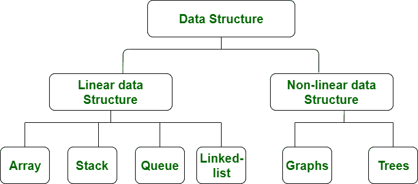

# 线性和非线性数据结构的区别

> 原文:[https://www . geesforgeks . org/线性和非线性数据结构的区别/](https://www.geeksforgeeks.org/difference-between-linear-and-non-linear-data-structures/)

[**【线性数据结构】**](https://www.geeksforgeeks.org/overview-of-data-structures-set-1-linear-data-structures/) **:**
数据结构，其中数据元素按顺序或线性排列，元素与其前一个和下一个相邻元素相连，称为**线性数据结构**。在线性数据结构中，涉及单个层次。因此，我们只能在一次运行中遍历所有元素。线性数据结构易于实现，因为计算机内存是以线性方式排列的。它的例子有[数组](https://www.geeksforgeeks.org/array-data-structure/)、[堆栈](https://www.geeksforgeeks.org/stack-data-structure/)、[队列](https://www.geeksforgeeks.org/queue-data-structure/)、[链表](https://www.geeksforgeeks.org/data-structures/linked-list/)等。

**1。阵列**

数组是一种存储相同类型元素的数据结构。这些是最基本和最基本的数据结构。存储在数组每个位置的数据被赋予一个正值，称为元素的索引。索引有助于识别数组中元素的位置。

如果假设我们必须存储一些数据，即十辆汽车的价格，那么我们可以创建一个数组结构，并将所有整数存储在一起。这不需要创建十个独立的整数变量。因此，减少了代码中的行数并节省了内存。在数组的情况下，第一个元素的索引值从 0 开始。

**2。堆叠**

数据结构遵循后进先出(后进先出)规则，即先移除最后添加的数据元素。Push 操作用于在堆栈上添加数据元素，pop 操作用于从堆栈中删除数据。这可以用书堆在一起的例子来解释。为了取用最后一本书，所有放在最后一本书上面的书都必须安全地移走。

**3 .队列〔t1〕**

这种结构几乎类似于堆栈，因为数据是按顺序存储的。不同的是，队列数据结构遵循先进先出规则，即第一个添加的元素首先退出队列。前面和后面是队列中使用的两个术语。

入队是插入操作，出列是删除操作。前者在队列末端执行，后者在开始末端执行。数据结构可以用人们排队乘坐公共汽车的例子来解释。队伍中的第一个人将有机会退出队列，而最后一个人将是最后一个退出的人。

**4。链表**

链表是以节点形式存储数据的类型，节点由数据元素和指针组成。指针的用途是指向或指向序列中紧挨着元素的节点。存储在链接列表中的数据可以是任何形式、字符串、数字或字符。已排序和未排序的数据都可以与唯一或重复的元素一起存储在链表中。

**5。哈希表**

这些类型可以实现为线性或非线性数据结构。数据结构由键值对组成。

[**【非线性数据结构】**](https://www.geeksforgeeks.org/overview-of-data-structures-set-2-binary-tree-bst-heap-and-hash/) **:**
数据元素未按顺序或线性排列的数据结构称为**非线性数据结构**。在非线性数据结构中，不涉及单个级别。因此，我们不能只在一次运行中遍历所有元素。与线性数据结构相比，非线性数据结构不容易实现。与线性数据结构相比，它能有效地利用计算机内存。它的例子有[树](https://www.geeksforgeeks.org/data-structures/)和[图](https://www.geeksforgeeks.org/graph-data-structure-and-algorithms/)。

**1。树木**

树形数据结构由链接在一起的各种节点组成。树的结构是分层的，它形成了一种类似于父母和孩子的关系。树的结构是这样形成的，每个父子节点关系都有一个连接。从根到树中的节点之间应该只有一条路径。各种类型的树基于它们的结构而存在，如 AVL 树、二叉树、二叉查找树树等。

**2。图表**

图是由一定数量的顶点和边组成的非线性数据结构。顶点或节点参与存储数据，而边显示顶点关系。图与树的区别在于图中没有特定的节点连接规则。现实生活中的问题，如社交网络、电话网络等。可以用图表来表示。

**线性和非线性数据结构的区别:**

<figure class="table">

| S.NO | 线性数据结构 | 非线性数据结构 |
| --- | --- | --- |
| 1. | 在线性数据结构中，数据元素以线性顺序排列，其中每个元素都与其前一个和下一个相邻元素相连。 | 在非线性数据结构中，数据元素以分层方式附加。 |
| 2. | 在线性数据结构中，涉及单个层次。 | 而在非线性数据结构中，涉及多个层次。 |
| 3. | 与非线性数据结构相比，它的实现很容易。 | 而它的实现与线性数据结构相比是复杂的。 |
| 4. | 在线性数据结构中，数据元素只能在一次运行中遍历。 | 而在非线性数据结构中，数据元素不能只在一次运行中遍历。 |
| 5. | 在线性数据结构中，内存没有得到有效利用。 | 在非线性数据结构中，内存得到了有效利用。
 |
| 6. | 它的例子有:数组、栈、队列、链表等。 | 而它的例子是:树和图。 |
| 7. | 线性数据结构的应用主要是在应用软件开发中。 | 非线性数据结构在人工智能和图像处理中的应用。 |

</figure>