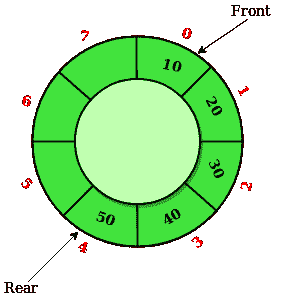

# 线性队列和循环队列的区别

> 原文:[https://www . geesforgeks . org/线性队列和循环队列的区别/](https://www.geeksforgeeks.org/difference-between-linear-queue-and-circular-queue/)

[**<u>线性队列</u> :**](https://www.geeksforgeeks.org/queue-data-structure/) 线性队列一般称为队列。它是一个[线性数据结构](https://www.geeksforgeeks.org/difference-between-linear-and-non-linear-data-structures/)，遵循先进先出的顺序。队列的一个实际例子是顾客排队等候从商店购买产品，先到的顾客先得。在队列中，所有删除([出列](https://www.geeksforgeeks.org/deque-set-1-introduction-applications/))都在前端进行，所有插入(入队)都在后端进行。

[**<u>循环队列:</u>**](https://www.geeksforgeeks.org/circular-queue-set-1-introduction-array-implementation/) 循环队列只是线性队列的一种变体，其中前端和后端相互连接，以优化线性队列的空间浪费并使其高效。

### **<u>线性和圆形队列的表格差异</u> :**

<figure class="table">

| 没有。 | 线性队列 | 循环队列 |
| --- | --- | --- |
| **1。** | 以线性模式排列数据。 | 以循环顺序排列数据，后端与前端相连。 |
| **2。** | 插入和删除操作是固定的，即分别在后端和前端完成。 | 插入和删除不是固定的，可以在任何位置进行。 |
| **3。** | 线性队列需要更多的内存空间。 | 它需要更少的内存空间。 |
| **4。** | 在线性队列的情况下，在第一个位置添加的元素将在第一个位置被删除。对任何元素执行的操作顺序都是固定的，即先进先出。 | 在循环队列的情况下，对元素执行的操作顺序可能会改变。 |
| **5。** | 与循环队列相比，它效率低下。 | 与线性队列相比，它更有效。 |

</figure>