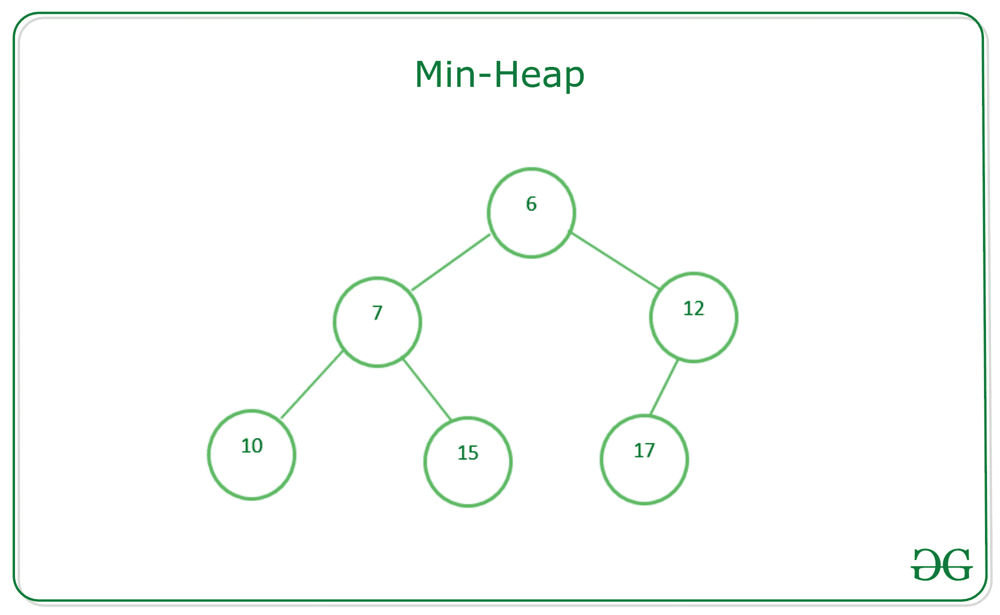
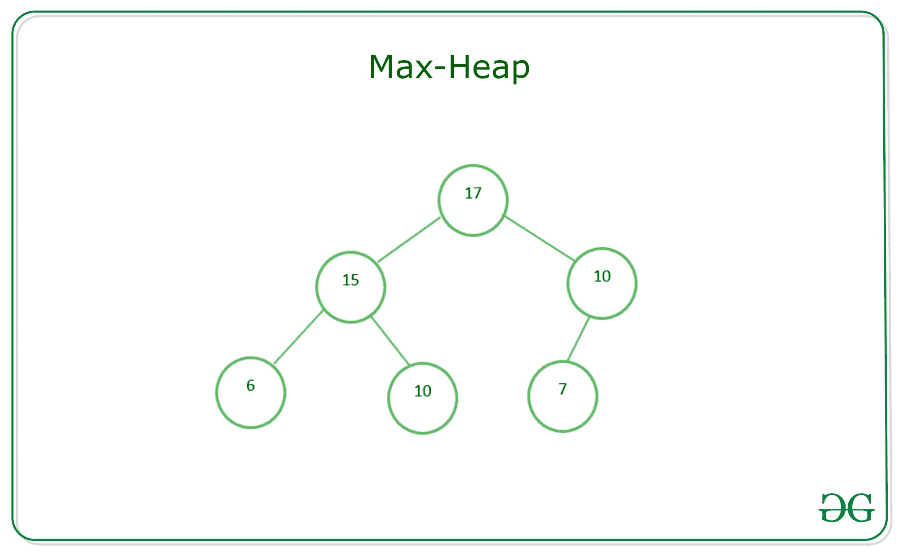

# 最小堆和最大堆之间的差异

> 原文:[https://www . geesforgeks . org/min-heap 和 max-heap 之差/](https://www.geeksforgeeks.org/difference-between-min-heap-and-max-heap/)

一个[堆](https://www.geeksforgeeks.org/binary-heap/)是一个特殊的[基于树的数据结构](https://www.geeksforgeeks.org/binary-tree-data-structure/)，其中树是一个[完整的二叉树](https://www.geeksforgeeks.org/binary-tree-set-3-types-of-binary-tree/)。因为一个堆是一个完整的二叉树，所以一个有 **N** 节点的堆有 **log N** 的高度。删除优先级最高或最低的元素非常有用。它通常被表示为一个[阵列](https://www.geeksforgeeks.org/array-representation-of-binary-heap/)。[数据结构](https://www.geeksforgeeks.org/data-structures/)中有两种类型的堆。

### <u>最小堆</u>

在[最小堆](https://www.geeksforgeeks.org/min-heap-in-java/)中，根节点上的键必须小于或等于其所有子节点上的键。对于该二叉树中的所有子树，相同的属性必须递归为真。在最小堆中，存在于根的最小关键元素。下面是满足最小堆所有属性的二叉树。

### <u>最大堆料</u>

在[最大堆](https://www.geeksforgeeks.org/max-heap-in-java/)中，根节点上的键必须大于或等于其所有子节点上的键。对于该二叉树中的所有子树，相同的属性必须是[递归](https://www.geeksforgeeks.org/recursion/) **真**。在最大堆中，出现在根的最大关键元素。下面是满足最大堆所有属性的二叉树。

### <u>最小堆和最大堆之间的差异</u>

<figure class="table">

|   | **最小堆** | **最大堆料** |
| --- | --- | --- |
| 1. | 在最小堆中，根节点上的键必须小于或等于其所有子节点上的键。 | 在最大堆中，根节点上的键必须大于或等于其所有子节点上的键。 |
| 2. | 在最小堆中，存在于根的最小关键元素。 | 在最大堆中，出现在根的最大关键元素。 |
| 3. | 最小堆使用升序优先级。 | 最大堆使用降序优先级。 |
| 4. | 在最小堆的构造中，最小的元素具有优先权。 | 在最大堆的构造中，最大的元素具有优先权。 |
| 5. | 在最小堆中，最小的元素是最先从堆中弹出的元素。 | 在最大堆中，最大的元素是最先从堆中弹出的元素。 |

</figure>

**<u>堆的应用</u> :**

1.  [堆排序](https://www.geeksforgeeks.org/heap-sort/):堆排序是在 **O(N*log N)** 时间内使用[二进制堆](https://www.geeksforgeeks.org/binary-heap/)对数组[进行排序的最佳排序算法之一。](https://www.geeksforgeeks.org/c-program-to-sort-an-array-in-ascending-order/)
2.  [优先级队列](https://www.geeksforgeeks.org/priority-queue-set-1-introduction/):优先级队列支持 **O(log N)** 时间内的 **insert()** 、 **delete()** 、 **extractMax()** 、**decorase key()**操作，所以可以使用堆来实现。
3.  [图形算法](https://www.geeksforgeeks.org/top-algorithms-and-data-structures-for-competitive-programming/#algo1):堆特别用于图形算法，如[迪克斯特拉最短路径](https://www.geeksforgeeks.org/greedy-algorithms-set-7-dijkstras-algorithm-for-adjacency-list-representation/)和[普里姆最小生成树](https://www.geeksforgeeks.org/greedy-algorithms-set-5-prims-minimum-spanning-tree-mst-2/)。

**<u>最小堆和最大堆性能分析</u> :**

*   获取最大或最小元素:0(1)
*   将元素插入最大堆或最小堆:0(对数 N)
*   移除最大或最小元素:0(对数 N)