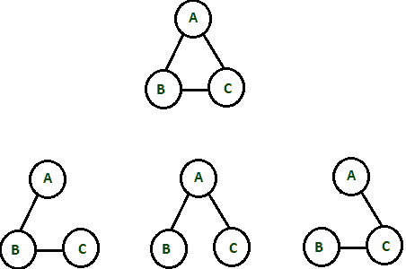
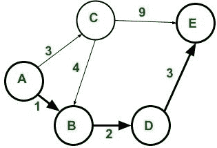
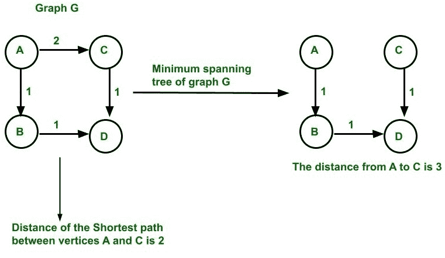
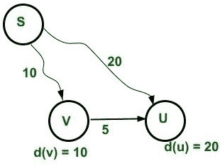

# 最小生成树和最短路径的区别

> 原文:[https://www . geesforgeks . org/最小生成树和最短路径之差/](https://www.geeksforgeeks.org/difference-between-minimum-spanning-tree-and-shortest-path/)

[**生成树**](https://www.geeksforgeeks.org/prims-minimum-spanning-tree-mst-greedy-algo-5/) **:** 一个[无向图(G)](https://www.geeksforgeeks.org/count-number-edges-undirected-graph/) 的一个[生成树](https://www.geeksforgeeks.org/prims-minimum-spanning-tree-mst-greedy-algo-5/)**是一个子图，它是一个包含图 **(G)** 的所有顶点和连接图 **(G)** 所需的最小边数的树。它是一个已知的没有循环的最大边集。**

****属性:****

*   **如果**图(G)** 不连通，则它不包含生成树(即它有许多生成树森林)。**
*   **如果一个**图(G)** 有 **V** 顶点，那么该图的生成树 **G** 有 **V-1** 边。**
*   **在一个[完整的](https://www.geeksforgeeks.org/binary-tree-set-3-types-of-binary-tree/)(**KnT5】)无向、有标签、无加权图的情况下，可以通过使用[凯莱公式](https://www.geeksforgeeks.org/cayleys-formula/):**Kn= nn-2求出可能的生成树的数量。******
*   **对于 **K 3** 图(即 3 个顶点的完全图)，可能的生成树的数量是 **3 3-2 = 3 1 = 3。****

**

**K 中可能的生成树 3 图**** 

*   **利用[基尔霍夫定理](https://www.geeksforgeeks.org/total-number-spanning-trees-graph/)，可以求出除完全图以外的图的最小生成树数。**

******最短路径:******

****

**加权有向图中顶点 A 和 E 之间的最短路径(A，B，D，E)****** 

*   ****图中任意两个顶点之间的最短路径(比如在 **A** 和 **E** 之间)，使得路径中存在的边的权重之和(即 **ABDE** )在 **A** 和 **E** 之间的所有可能路径中最小。****
*   ****对于有向图、无向图或混合图，可以找出最短路径。****
*   ****寻找最短路径的问题可以归类为

    *   **单源最短路径:**在这种情况下，最短路径是从一个源顶点到图中所有其他顶点的距离。
    *   **单目的最短路径:**在这种情况下，最短路径是从有向图中的所有顶点到单个目的顶点计算的。这可以通过反转有向图的边来转换成具有最短路径问题的单对。
    *   **所有对最短路径:**在此，计算每对顶点之间的最短路径。**** 

******以下是最小生成树和最短路径的区别:******

********

<figure class="table">

| **最小生成树(MST)** | **最短路径** |
| 在 MST 中没有源也没有目的地，但它是图( **G** )的子集(树)，它连接图的所有顶点 **G** ，没有任何循环，并且具有最小可能的总边权重。 | 有一个来源和目的地，人们需要找出它们之间的最短路径 |
| 图 **(G)** 应该是连通的，无向的，边加权的，有标号的。 | 图形 **(G)** 不必是连通的、无向的、边缘加权的、有标签的。 |
| 这里不执行边缘的**松弛**，但是这里从所有边缘权重的集合(根据最小权重排序)中逐个选择最小边缘权重，并且由它们形成树(即，不应该有任何循环)。 | 这里执行边缘的**松弛。**

*   这里 **d(U)** 表示源顶点 **S** 到顶点的距离，其中 **C(U，V)** 是 **U** 和**V**之间的距离
*   如果 **d(U) > d(V) + C(U，V)** 那么 **d(U) = d(V) + C(U，V)。**
*   例如 **20 > 10+5，d(U) = 15** ，是从源顶点 **S** 到顶点 **U** 的最小距离。
*   因此，执行放松。

 |
| 在这种情况下，可以形成最小生成树，但是通常不使用负权重边循环。利用 MST 的循环特性，可以选择负边循环中所有边权重中的最小边权重。 | 如果图是连通的，并且如果图中存在负权重边循环。那么不能计算最短路径，但是可以使用[贝尔曼-福特算法检测负边缘循环。](https://www.geeksforgeeks.org/bellman-ford-algorithm-dp-23/) |
| 在[断开图](https://www.geeksforgeeks.org/bfs-disconnected-graph/)的情况下，不能形成最小生成树，但是可以形成许多生成树森林。 | 在[不连续图形](https://www.geeksforgeeks.org/bfs-disconnected-graph/)的情况下，两个不同组件中存在的两个顶点之间的距离是无穷大。 |
| 这里[贪婪方法](https://www.geeksforgeeks.org/greedy-algorithms/)用于为一个图寻找 MST，例如[普里姆算法](https://www.geeksforgeeks.org/prims-minimum-spanning-tree-mst-greedy-algo-5/)和[克鲁斯卡尔算法](https://www.geeksforgeeks.org/kruskals-minimum-spanning-tree-algorithm-greedy-algo-2/)。 | 

*   [Dykstra algorithm](https://www.geeksforgeeks.org/dijkstras-shortest-path-algorithm-greedy-algo-7/) based on [greedy method](https://www.geeksforgeeks.org/greedy-algorithms/) and [Bellman Ford](https://www.geeksforgeeks.org/bellman-ford-algorithm-dp-23/) based on [dynamic programming](https://www.geeksforgeeks.org/dynamic-programming/) is generally used to find [single-source shortest path](https://www.geeksforgeeks.org/single-source-shortest-path-between-two-cities/) .
*   [Freud-Tactics algorithm](https://www.geeksforgeeks.org/floyd-warshall-algorithm-dp-16/) is based on [dynamic programming](https://www.geeksforgeeks.org/dynamic-programming/) to find the shortest path of all pairs [.](https://www.geeksforgeeks.org/floyd-warshall-algorithm-dp-16/)

 |
| 如果图 G 中存在 **N** 个顶点，那么图的最小生成树将包含 **N-1** 条边和 **N** 个顶点。 | 如果图 **G** 中存在 **N** 个顶点，那么在两个顶点之间的最短路径中最多只能有 **N-1** 条边，在最短路径中最多只能有 **N** 个顶点。 |
| 它用于网络设计(计算机网络、电信网络、供水网络)和电路设计应用等。 | 它被用来寻找物理位置之间的方向，就像在谷歌地图中一样。 |

</figure>