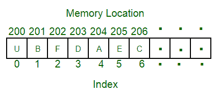

# 一维数组和二维数组的区别

> 原文:[https://www . geesforgeks . org/一维与二维数组的区别/](https://www.geeksforgeeks.org/difference-between-one-dimensional-and-two-dimensional-array/)

[数组](https://www.geeksforgeeks.org/introduction-to-arrays/)是一种[数据结构](https://www.geeksforgeeks.org/data-structures/)，用于在[相邻位置](https://www.geeksforgeeks.org/difference-between-contiguous-and-noncontiguous-memory-allocation/)存储类似数据类型的变量。阵列的主要[优势是随机访问和缓存友好性。阵列主要有三种类型:](https://www.geeksforgeeks.org/advantages-and-disadvantages-of-array-in-c/)

*   [一维(1D)阵列](https://www.geeksforgeeks.org/arrays-in-c-cpp/)
*   [二维(2D)阵列](https://www.geeksforgeeks.org/dynamically-allocate-2d-array-c/)
*   [多维数组](https://www.geeksforgeeks.org/multidimensional-arrays-c-cpp/)

[**【一维阵】**](https://www.geeksforgeeks.org/arrays-in-c-cpp/) **:**

*   是类似[数据类型](https://www.geeksforgeeks.org/c-data-types/)的变量列表。
*   它允许随机访问，所有元素都可以在索引的帮助下访问。
*   数组的大小是固定的。
*   对于动态大小的数组，[向量](https://www.geeksforgeeks.org/vector-in-cpp-stl/)可以在 [C++](https://www.geeksforgeeks.org/c-plus-plus/) 中使用。
*   1D 阵列的表示:

**二维数组:**

*   它是相同数据类型的变量列表的列表。
*   它还允许随机访问，所有的元素都可以在索引的帮助下被访问。
*   它也可以被视为 1D 阵列的集合。它也被称为矩阵。
*   它的尺寸可以从 2 增加到 3 和 4 等等。
*   它们都被称为一个[多维](https://www.geeksforgeeks.org/multidimensional-arrays-c-cpp/)阵列。
*   最常见的多维数组是 2D 数组。
*   二维数组的表示:

**差异表:**

<figure class="table">

| **基础** | **一维数组** | **二维数组** |
| **定义** | 存储类似数据类型的元素的单个列表。 | 存储类似数据类型元素的“列表列表”。 |
| **表示** | 将多个数据项表示为列表。 | 将多个数据项表示为由行和列组成的表。 |
| **申报** | 不同编程语言的声明不同:

1.  对于 C++、
    ***数据类型变量 _ 名称【行】***
2.  对于 Java，
    ***数据类型[]变量 _ 名称=新数据类型[行]***

 | 不同编程语言的声明不同:

1.  对于 C++、
    ***数据类型变量 _ 名称【行】【列】***
2.  对于 Java，
    ***数据类型[][]变量 _name=新数据类型[行][列]***

 |
| **尺寸** | 一个 | 二 |
| **大小(字节)** | (数组变量的数据类型)*数组的大小 | (数组变量的数据类型)*行数*列数。 |
| **地址计算。** | [索引]的地址等于(基地址+数组每个元素的大小*索引)。 | 一个[i[[j]的地址可以用两种方式计算-行-主和列-主

1.  **主列:**基地址+每个元素的大小(行数(j-列的下限)+(I-行的下限))
2.  **行高:**基址+每个元素的大小(列数(I-行的下限)+(j-列的下限))

 |
| **例** | int arr[5]；//将创建一个一行五列的数组。{a、b、c、d、e} | int arr[2][5]；//将创建一个两行五列的数组。a b c d ef g h i j |

**<u>数组的应用</u> :**

*   2D 阵列用于实现矩阵。
*   数组可以用来实现各种数据结构，比如[堆](https://www.geeksforgeeks.org/binary-heap/)、[栈](https://www.geeksforgeeks.org/stack-data-structure/)、[队列](https://www.geeksforgeeks.org/queue-data-structure/)等。
*   它们允许随机访问。
*   它们是缓存友好的。

</figure>