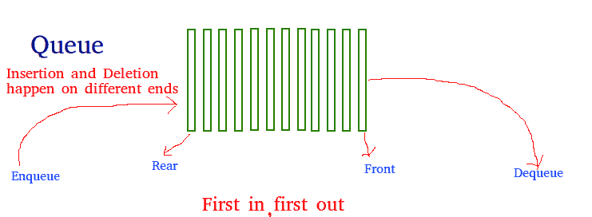
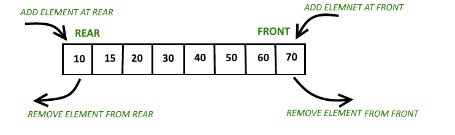

# c++中 Queue 和 Deque 的区别

> 原文:[https://www . geesforgeks . org/queue-and-deque-in-c/](https://www.geeksforgeeks.org/difference-between-queue-and-deque-in-c/)之间的差异

[**队列:**](https://www.geeksforgeeks.org/queue-data-structure/) 队列是一种线性数据结构，遵循先进先出(FIFO)的顺序执行操作。这是一种容器适配器，其中元件插入容器的一端，而从另一端删除。

[](https://media.geeksforgeeks.org/wp-content/cdn-uploads/gq/2014/02/Queue.png)

**功能:**

*   [空()](https://www.geeksforgeeks.org/queueempty-queuesize-c-stl/):测试队列是否为空。
*   [size()](https://www.geeksforgeeks.org/queueempty-queuesize-c-stl/) :返回队列的无符号整数大小。
*   [queue::front()和 queue::back()](https://www.geeksforgeeks.org/queuefront-queueback-c-stl/) : front()函数返回对队列中第一个元素或最早元素的引用。back()函数返回对队列最后或最新元素的引用。
*   [push(k)和 pop()](https://www.geeksforgeeks.org/queuepush-and-queuepop-in-cpp-stl/) : push()函数在队列末尾添加元素‘k’。pop()函数从队列的开头删除元素，并将其大小减少 1。
*   [swap()](https://www.geeksforgeeks.org/queue-swap-cpp-stl/) :交换两个相同类型但大小可能相同也可能不同的不同队列的元素。
*   [侵位()](https://www.geeksforgeeks.org/queueemplace-c-stl/):用于在队列末尾插入新元素。

**语法:**

```
queue <data_type> q
```

下面是同样的程序来说明:

## C++

```
// C++ program to demonstrate the
// working of queue
#include <bits/stdc++.h>
using namespace std;

// Driver Code
int main()
{
    // Declare a queue
    queue<int> q;

    // Insert elements in the queue
    q.push(10);
    q.push(5);
    q.push(15);
    q.push(1);

    // Delete elements from the queue
    q.pop();
    q.pop();

    cout << "Elements in Queue are: ";

    // Print the element stored
    // in queue
    while (!q.empty()) {
        cout << q.front() << ' ';

        // Pop the front element
        q.pop();
    }

    return 0;
}
```

**Output:** 

```
Elements in Queue are: 15 1
```

[**得克:**](https://www.geeksforgeeks.org/deque-set-1-introduction-applications/) 得克是一个[序列容器](https://www.geeksforgeeks.org/sequence-vs-associative-containers-cpp/)具有两端伸缩的能力。是 [C++](https://www.geeksforgeeks.org/c-plus-plus/) is 中[标准模板库或 STL](https://www.geeksforgeeks.org/the-c-standard-template-library-stl/) 的模板。它类似于[向量](https://www.geeksforgeeks.org/vector-in-cpp-stl/)，但是对于元素的插入和删除更有效。[在 deque 中的连续存储分配](https://www.geeksforgeeks.org/difference-between-contiguous-and-noncontiguous-memory-allocation/)可能无法像在矢量中那样得到保证。

[](https://media.geeksforgeeks.org/wp-content/uploads/anod.png)

**功能:**

*   [max_size()](https://www.geeksforgeeks.org/deque-max_size-function-in-c-stl/) :返回 deque 可以包含的最大元素数。
*   [push_back()](https://www.geeksforgeeks.org/dequepush_back-c-stl/) 和 [push_front()](https://www.geeksforgeeks.org/dequepush_front-c-stl/) : push_front()将元素从前面推入一个德格，push_back()将元素从后面推入一个德格。
*   [pop_front()和 pop_back()](https://www.geeksforgeeks.org/dequepop_front-dequepop_back-c-stl/) : pop_front()函数用于从正面弹出一个 deque 中的元素，pop_back()函数用于从背面弹出一个 deque 中的元素。
*   [clear()](https://www.geeksforgeeks.org/dequeclear-dequeerase-c-stl/) 和 [erase()](https://www.geeksforgeeks.org/dequeclear-dequeerase-c-stl/) : clear 用于从 deque 中移除所有元素，erase 用于移除一些指定的元素。
*   [插入()](https://www.geeksforgeeks.org/deque-insert-function-in-c-stl/):通过在指定位置插入元素来增加容器侧面。
*   [resize()](https://www.geeksforgeeks.org/deque-resize-function-in-c-stl/) :根据需要改变元素容器的大小。
*   [rbegin()](https://www.geeksforgeeks.org/deque-rbegin-function-in-c-stl/#:~:text=The%20deque%3A%3Arbegin(), i.e.%2C%20its%20reverse%20beginning).&text=Return%20value%3A%20It%20returns%20a, last%20element%20of%20the%20deque.) 和 [rend()](https://www.geeksforgeeks.org/deque-rend-function-in-c-stl/#:~:text=The%20deque%3A%3Arend(), is%20considered%20its%20reverse%20end).&text=Return%20value%3A%20It%20returns%20a, the%20beginning%20of%20the%20deque.) : rbegin()指向出格的最后一个元素，而 rend 指向出格开始之前的位置。
*   [at()和 swap()](https://www.geeksforgeeks.org/dequeat-dequeswap-c-stl/) : at()指向参数中给定元素的位置，swap()用于两个 deq 的两个 swap 元素。
*   [侵位 _front()和侵位 _back()](https://www.geeksforgeeks.org/deque-emplace_front-deque-emplace_back-cpp-stl/) :这两个功能分别用于在 deque 的开头和结尾向容器中插入新元素。

**语法:**

```
deque<data_type> dq
```

下面是同样的程序来说明:

## C++

```
// C++ program to demonstrate the
// working of deque
#include <bits/stdc++.h>
using namespace std;

// Driver Code
int main()
{
    // Declare a deque
    deque<int> dq;

    // Insert element in the front
    dq.push_front(10);
    dq.push_front(5);
    dq.push_front(3);

    // Delete elements from the the front
    dq.pop_front();
    dq.pop_front();

    // Insert elements in the back
    dq.push_back(1);
    dq.push_back(50);
    dq.push_back(2);

    // Delete elements from the the back
    dq.pop_back();
    dq.pop_back();

    cout << "Elements in deque are: ";

    // Print the element stored
    // in deque
    while (!dq.empty()) {
        cout << " " << dq.front();
        dq.pop_front();
    }

    return 0;
}
```

**Output:** 

```
Elements in deque are:  10 1
```

**<u>下面是队列和德格的表格区别:</u>**

<figure class="table">

| **序列号** | 队列 | 从开始 |
| one | 只能通过后端插入。 | 两端都可以插入。 |
| Two | 只能通过前端删除元素。 | 两端都可以删除元素。 |
| three | 元素不能通过迭代器访问。 | 元素可以通过迭代器来访问。 |
| four | 实现为容器适配器。 | 通常实现为某种形式的动态数组。 |
| five | 无法使用队列实现堆栈。 | 可以使用 deque 实现堆栈。 |

</figure>