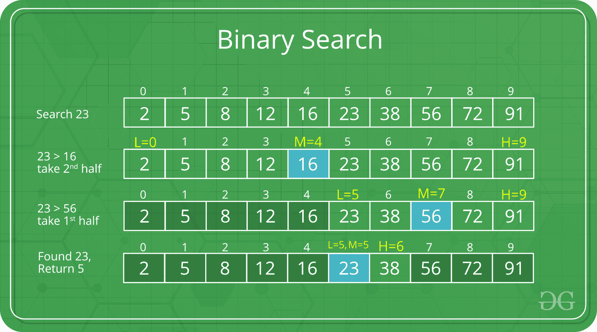

# 搜索和排序算法的区别

> 原文:[https://www . geeksforgeeks . org/搜索和排序算法之间的差异/](https://www.geeksforgeeks.org/difference-between-searching-and-sorting-algorithms/)

**先决条件:** [搜索](https://www.geeksforgeeks.org/searching-algorithms/)和[排序](https://www.geeksforgeeks.org/sorting-algorithms/)算法

[搜索算法](https://www.geeksforgeeks.org/searching-algorithms/)旨在检查某个元素或从使用该元素的任何[数据结构](https://www.geeksforgeeks.org/data-structures/)中检索该元素。根据操作类型，这些算法通常分为两类:

1.  **Sequential Search:** The Sequential Search is the basic and simple Searching Algorithm. Sequential Search starts at the beginning of the list or array. It traversed the list or array sequentially and checks for every element of the list or array. The Linear Search is an example of the Sequential Search. 
    A [Linear Search](https://www.geeksforgeeks.org/linear-search/) checks one by one each element of the array, without jumping to any item. It searches the element in the array until a match is found. If the match is found then it returns the index of the item otherwise it returns the **-1**. The worst-case complexity of the Linear Search Algorithm is ***O(N)***, where ***N*** is the total number of elements in the list. 

    **<u>线性搜索如何工作</u> :**

    让我们用一个线性搜索如何工作的例子来理解。假设在这个例子中，任务是搜索数组中的一个元素 *x* 。要搜索给定的元素，从数组最左边的元素开始，逐一比较 *x* 和数组的每个元素。如果 *x* 与元素匹配，则返回索引，否则返回 **-1** 。下图说明了同样的情况:

1.  **Interval Search:** These algorithms are designed to searching for a given element in sorted data structures. These types of searching algorithms are much more efficient than a Linear Search Algorithm. The Binary Search is an example of the Interval Search. 
    A [Binary Search](https://www.geeksforgeeks.org/binary-search/) searches the given element in the array by dividing the array into two halves. First, it finds the middle element of the array and then compares the given element with the middle element of thearray, if the element to be searched is less than the item in the middle of the array then the given element can only lie in the left subarray otherwise it lies in the right subarray. It repeatedly checks until the element is found. The worst-case complexity of the Binary Search Algorithm is ***O(log N)***, 

    **<u>二分搜索法如何运作</u> :**
    我们用一个二分搜索法如何运作的例子来理解。假设，在这个例子中，我们必须在数组中搜索一个元素 *x* 。为了搜索给定的元素，我们首先找到数组的中间元素，然后将 x 与数组的中间元素进行比较。如果 *x* 与中间元素匹配，我们返回中间索引，如果 *x* 大于中间元素，那么 x 只能位于中间元素之后的右半子阵列中，所以我们对右半部分重复，否则对左半部分重复。它反复检查，直到找到该元素。下图说明了同样的情况:

[**排序算法**](https://www.geeksforgeeks.org/sorting-algorithms/) :一种排序算法，用于将列表或数组的数据排列成某种特定的顺序。它可以是数字或字典顺序。**例如:**下面的字符列表按照其 [ASCII 值](https://www.geeksforgeeks.org/program-print-ascii-value-character/)的升序排序。也就是说，ASCII 值较小的字符将比 ASCII 值较大的字符放在第一位。[冒泡排序](https://www.geeksforgeeks.org/bubble-sort/)、[插入排序](https://www.geeksforgeeks.org/insertion-sort/)、[选择排序](https://www.geeksforgeeks.org/selection-sort/)、[合并排序](https://www.geeksforgeeks.org/merge-sort/)、[快速排序](https://www.geeksforgeeks.org/quick-sort/)、[堆排序](https://www.geeksforgeeks.org/heap-sort/)、[基数排序](https://www.geeksforgeeks.org/radix-sort/)等都是排序算法的例子。

排序有两种不同的类别。它们是:

*   **内部排序:**当所有数据都放在内存中时，那么排序称为内部排序。
*   **外部排序:**当需要排序的数据不能一次全部放入内存时，这种排序称为外部排序。外部排序用于海量数据。合并排序及其变体通常用于外部排序。一些外部存储，如**硬盘**、**光盘**等用于外部存储。

### **搜索和排序算法的区别:**

<figure class="table">

| **序列号** | **搜索算法** | **排序算法** |
| 1. | 搜索算法旨在从使用元素的任何数据结构中检索元素。 | 排序算法用于将列表或数组中的数据排列成特定的顺序。 |
| 2. | 这些算法通常分为两类，即顺序搜索和区间搜索。 | 排序有两种不同的类别。这些是内部和外部排序。 |
| 3. | 搜索算法的最坏时间复杂度为 O(N)。 | 许多排序算法(如冒泡排序、插入排序、选择排序和快速排序)的最坏情况时间复杂度是 O(N 2 )。 |
| 4. | 没有稳定和不稳定的搜索算法。 | 冒泡排序、插入排序、合并排序等是稳定的排序算法，而快速排序、堆排序等是不稳定的排序算法。 |
| 5. | 线性搜索和二分搜索法是搜索算法的例子。 | 冒泡排序、插入排序、选择排序、合并排序、快速排序等都是排序算法的例子。 |

</figure>