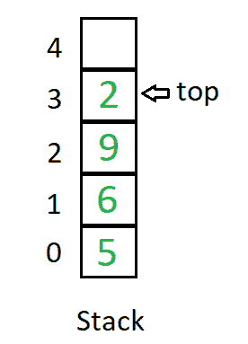

# 堆叠和阵列的区别

> 原文:[https://www . geeksforgeeks . org/栈与数组的区别/](https://www.geeksforgeeks.org/difference-between-stack-and-array/)

**[栈](https://www.geeksforgeeks.org/stack-data-structure-introduction-program/) :**
栈是一种线性数据结构，其中元素只能从列表的一侧插入和删除，称为 *top* 。堆栈遵循*后进先出*(后进先出)原则，即最后插入的元素是第一个出来的元素。将元素插入堆栈称为*推*操作，将元素从堆栈中删除称为*弹出*操作。在堆栈中，我们总是使用名为 *top* 的指针跟踪列表中的最后一个元素。

堆栈的图示如下:

**[数组](https://www.geeksforgeeks.org/array-data-structure/) :**
数组是存储在连续内存位置的项目的集合。想法是将多个相同类型的项目存储在一起。这使得通过简单地将偏移加到基值，即数组的第一个元素的存储位置(通常由数组的名称表示)，来计算每个元素的位置变得更容易。

数组的图示如下:

**堆栈和数组数据结构的区别:**

| 大量 | 排列 |
| --- | --- |
| 堆栈基于后进先出原则，即最后插入的元素是列表中的第一个元素。 | 在数组中，元素属于索引，也就是说，如果你想进入第四个元素，你必须把变量名及其索引或位置写在方括号内，例如 arr[4] |
| 栈中的插入和删除只发生在被称为顶部的列表的一端。 | 数组中的插入和删除可以在数组中的任何索引处完成。 |
| 堆栈具有动态大小。 | 数组具有固定的大小。 |
| 堆栈可以包含不同数据类型的元素。 | 数组包含相同数据类型的元素。 |
| 我们只能做线性搜索 | 我们可以做线性和二分搜索法 |

