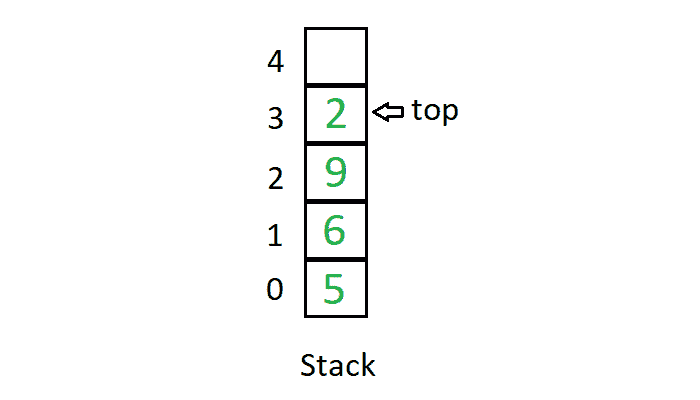
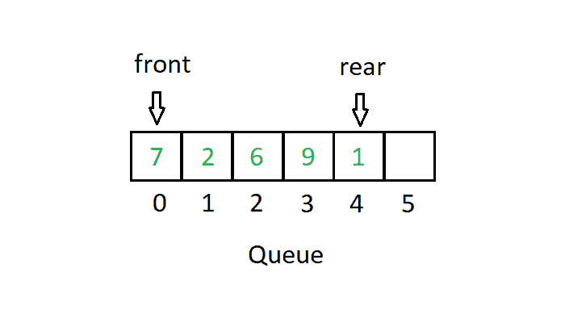

# 堆栈和队列数据结构的区别

> 原文:[https://www . geesforgeks . org/堆栈和队列数据结构之间的差异/](https://www.geeksforgeeks.org/difference-between-stack-and-queue-data-structures/)

**栈**一个[栈](https://www.geeksforgeeks.org/stack-data-structure-introduction-program/)是一个线性数据结构，其中元素只能从列表的一侧插入和删除，称为**顶部**。堆栈遵循**后进先出**(后进先出)原则，即最后插入的元素是第一个出来的元素。将元素插入堆栈称为**推送**操作，将元素从堆栈中删除称为**弹出**操作。在堆栈中，我们总是用一个名为 **top** 的指针跟踪列表中的最后一个元素。

堆栈的图示如下:

**队列:** A [队列](https://www.geeksforgeeks.org/queue-set-1introduction-and-array-implementation/)是一种线性数据结构，其中元素只能从名为**后方**的列表一侧插入，元素只能从名为**前方**的另一侧删除。队列数据结构遵循**先进先出**(先进先出)原则，即列表中最先插入的元素是要从列表中移除的第一个元素。在队列中插入元素称为**入队**操作，删除元素称为**出队**操作。在队列中，我们总是维护两个指针，一个指向第一个插入的元素，该元素仍然以**前**指针出现在列表中，第二个指针指向最后一个插入的元素，以**后**指针出现。

队列的图示如下:

**堆栈和队列数据结构的区别**

| 大量 | 行列 |
| --- | --- |
| 堆栈基于后进先出原则，即最后插入的元素是列表中的第一个元素。 | 队列基于先进先出原则，即首先插入的元素是列表中的第一个元素。 |
| 栈中的插入和删除只发生在被称为顶部的列表的一端。 | 队列中的插入和删除发生在列表的两端。插入发生在列表的后面，删除发生在列表的前面。 |
| 插入操作称为推送操作。 | 插入操作称为入队操作。 |
| 删除操作称为弹出操作。 | 删除操作称为出列操作。 |
| 在堆栈中，我们只维护一个访问列表的指针，称为 top，它总是指向列表中的最后一个元素。 | 在队列中，我们维护两个指针来访问列表。前指针始终指向列表中插入的第一个元素并且仍然存在，后指针始终指向最后一个插入的元素。 |
| 堆栈用于解决递归问题。 | 队列用于解决具有顺序处理的问题。 |