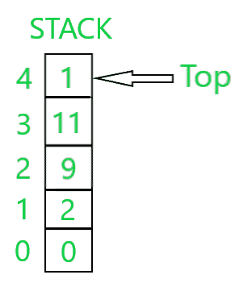
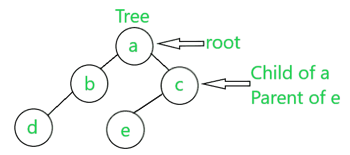

# 栈和树的区别

> 原文:[https://www . geeksforgeeks . org/栈树差/](https://www.geeksforgeeks.org/difference-between-stack-and-tree/)

**栈:** A [栈](https://www.geeksforgeeks.org/stack-data-structure/)是一种[线性数据结构](https://www.geeksforgeeks.org/difference-between-linear-and-non-linear-data-structures/)，其中元素只能从列表的一侧插入和删除，称为**顶部**。插入称为**推**操作，删除称为**弹出**操作，以防堆叠。插入和删除的顺序可以是**后进先出**(后进先出)**，即最晚插入堆栈的元素也将首先插入。在堆栈中，列表中最后一个元素的轨迹被一个名为 **top** 的指针跟踪。以下是同一的示意图:**

****

****树:**T2 树树是由一个或多个节点组成的有限集合，这样:**

*   **有一个特别指定的节点叫做**根**。**
*   **其余节点划分为 N>=0 的不相交集合 T 1 、T 2 、T 3 、…、T N ，其中 **T 1 、T 2 、T 3 、…、T N** 称为根的子树。**

**每个节点都有特定的父节点，并且可以有也可以没有子节点。每个节点都包含一个值和对子节点的引用。是一种[图形数据结构](https://www.geeksforgeeks.org/graph-data-structure-and-algorithms/)但是没有[循环](https://www.geeksforgeeks.org/print-all-the-cycles-in-an-undirected-graph/)，是[全连接](https://www.geeksforgeeks.org/connectivity-in-a-directed-graph/)。一个树的概念如下图所示:**

****

**下面是堆栈和树之间的表格差异:**

<figure class="table">

| **序列号** | 

#### **parameter**

 | 

#### **Stack**

 | 

#### **树**T3】

 |
| one | 基本性质 | 线性数据结构 | 非线性数据结构 |
| Two | 基本概念 | 栈顶 | 树的根 |
| three | 继任者 | 元素推到引用元素之前 | 孩子和父母的概念是存在的 |
| four | 插入顺序 | 插入堆栈顶部的元素 | 取决于树的类型。 |
| five | 删除顺序 | 从堆栈顶部删除的元素 | 取决于树的类型。 |
| six | 插入复杂性 | O(1) | 取决于类型，例如 AVL-0(对数 2 N)。 |
| seven | 删除复杂性 | O(1) | 取决于类型，例如 AVL-0(对数 2 N)。 |
| eight | 搜索 | O(1) | 取决于类型，例如 AVL-0(对数 2 N)。 |
| nine | 寻找分钟 | O(N) | 取决于类型，例如最小堆 0(记录 2 N)。 |
| Ten | 寻找麦克斯 | O(N) | 取决于类型，例如最小堆 0(记录 2 N)。 |
| Eleven | 伊西普西伊普西伊普西伊普西伊普西伊普西伊普西伊普西伊普西伊普西伊普西伊普西伊普西伊普西伊普西伊普西 | O(1) | 大多是 O(1) |
| Twelve | 履行 | 使用数组和链表 | 可以使用数组和用户定义的节点类型来实现 |
| Thirteen | 类型 | 不存在任何类型 | 很多类型，如二叉树、二叉树、二叉树等。 |
| Fourteen | 应用程序 | 表达式求值、[回溯](https://www.geeksforgeeks.org/backtracking-algorithms/)、内存管理等。 | 快速搜索、插入、删除等。 |

</figure>