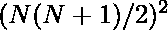
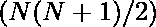
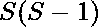
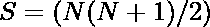

# 立方之和与前 N 个自然数之和之差

> 原文:[https://www . geeksforgeeks . org/立方之和与前 n 个自然数之和之差/](https://www.geeksforgeeks.org/difference-between-sum-of-cubes-and-sum-of-first-n-natural-numbers/)

给定一个整数 N，求前 N 个自然数的立方之和与前 N 个自然数之和的绝对差。

```
Input: N = 3
Output: 30
Sum of first three numbers is 3 + 2 + 1 = 6
Sum of Cube of first three numbers is = 1 + 8 + 27 = 36
Absolute difference = 36 - 6 = 30

Input: N = 5
Output: 210
```

**进场:**

1.  前 N 个自然数的立方之和，使用公式:
    

2.  前 N 个数字之和，使用公式:
    

3.  两者之和的绝对差值是
    

    

以下是上述方法的实现:

## C++

```
// C++ program to find the difference
// between the sum of the cubes of the
// first N natural numbers and
// the sum of the first N natural number

#include <bits/stdc++.h>
using namespace std;

int difference(int n)
{

    int S, res;

    // Sum of first n natural numbers
    S = (n * (n + 1)) / 2;

    // Find the required difference
    res = S * (S - 1);

    return res;
}

// Driver Code
int main()
{
    int n = 5;
    cout << difference(n);

    return 0;
}
```

## Java 语言(一种计算机语言，尤用于创建网站)

```
// Java program to find the difference
// between the sum of the cubes of the
// first N natural numbers and
// the sum of the first N natural number

class GFG
{

static int difference(int n)
{

    int S, res;

    // Sum of first n natural numbers
    S = (n * (n + 1)) / 2;

    // Find the required difference
    res = S * (S - 1);

    return res;
}

// Driver Code
public static void main(String[] args)
{
    int n = 5;
    System.out.print(difference(n));
}
}

// This code is contributed by 29AjayKumar
```

## 蟒蛇 3

```
# Python3 program to find the difference
# between the sum of the cubes of the
# first N natural numbers and
# the sum of the first N natural number
def difference(n) :

    # Sum of first n natural numbers
    S = (n * (n + 1)) // 2;

    # Find the required difference
    res = S * (S - 1);

    return res;

# Driver Code
if __name__ == "__main__" :

    n = 5;
    print(difference(n));

# This code is contributed by AnkitRai01
```

## C#

```
// C# program to find the difference
// between the sum of the cubes of the
// first N natural numbers and
// the sum of the first N natural number
using System;

class GFG
{
static int difference(int n)
{
    int S, res;

    // Sum of first n natural numbers
    S = (n * (n + 1)) / 2;

    // Find the required difference
    res = S * (S - 1);

    return res;
}

// Driver Code
static public void Main ()
{
    int n = 5;
    Console.Write(difference(n));
}
}

// This code is contributed by ajit
```

## java 描述语言

```
<script>
// JavaScript program to find the difference
// between the sum of the cubes of the
// first N natural numbers and
// the sum of the first N natural number

    function difference(n)
    {

        let S, res;

        // Sum of first n natural numbers
        S = Math.floor((n * (n + 1)) / 2);

        // Find the required difference
        res = S * (S - 1);

        return res;
    }

    // Driver Code

    let n = 5;
    document.write(difference(n));

//This code is contributed by Surbhi Tyagi

</script>
```

**Output:** 

```
210
```