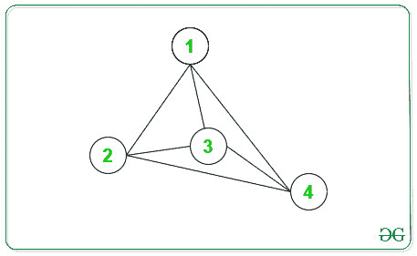

# 无向图中奇数度节点和偶数度节点的度数之和之差

> 原文:[https://www . geesforgeks . org/无向图中奇数度和偶数度节点之和之差/](https://www.geeksforgeeks.org/difference-between-sum-of-degrees-of-odd-and-even-degree-nodes-in-an-undirected-graph/)

给定一个具有 **N** 顶点和 **M** 边的[无向图](https://www.geeksforgeeks.org/graph-data-structure-and-algorithms/)，任务是找出无向图中奇数度节点和偶数度节点的度数之和的绝对差。

**示例:**

> **输入:** N = 4，边[][] = { { 1，2 }，{ 1，3 }，{ 1，4 }，{ 2，3 }，{ 2，4 }，{ 3，4 } }
> **输出:** 12
> **解释:**
> 下图为上述信息:
> 
> 
> 
> 节点->度
> 1->3
> 2->3
> 3->3
> 4->3
> 奇数度节点之和= 3+3+3 = 12
> 偶数度节点之和= 0
> 差= 12
> 
> **输入:** N = 5，边[][] = { { 1，2 }，{ 1，3 }，{ 2，4 }，{ 2，5 } }
> **输出:** 4

**进场:**

1.  对于每个顶点，可以通过给定图在对应顶点的[邻接表](https://www.geeksforgeeks.org/convert-adjacency-matrix-to-adjacency-list-representation-of-graph/)中 [](https://www.geeksforgeeks.org/convert-adjacency-matrix-to-adjacency-list-representation-of-graph/) 的长度来计算度数。
2.  统计奇数度节点和偶数度节点的度数之和并打印差值。

下面是上述方法的实现:

## C++

```
// C++ implementation to print the
// Difference Between sum of degrees
// of odd degree nodes and even
// degree nodes.
#include <bits/stdc++.h>
using namespace std;

// Function to print the difference
// Between sum of degrees of odd
// degree nodes and even degree nodes.
int OddEvenDegree(int N, int M,
                    int edges[][2])
{
    // To store Adjacency List of
    // a Graph
    vector<int> Adj[N + 1];

    int EvenSum = 0;
    int OddSum = 0;

    // Make Adjacency List
    for (int i = 0 ; i < M ; i++) {
        int x = edges[i][0];
        int y = edges[i][1];

        Adj[x].push_back(y);
        Adj[y].push_back(x);
    }

    // Traverse each vertex
    for (int i = 1; i <= N; i++) {

        // Find size of Adjacency List
        int x = Adj[i].size();

        // If length of Adj[i] is
        // an odd number, add
        // length in OddSum
        if (x % 2 != 0)
        {
            OddSum += x;
        }
        else
        {
            // If length of Adj[i] is
            // an even number, add
            // length in EvenSum
            EvenSum += x;
        }

    }

    return abs(OddSum - EvenSum);
}

// Driver code
int main()
{
    // Vertices and Edges
    int N = 4, M = 6;

    // Edges
    int edges[M][2] = { { 1, 2 }, { 1, 3 }, { 1, 4 },
                       { 2, 3 }, { 2, 4 }, { 3, 4 } };

    // Function Call
    cout<< OddEvenDegree(N, M, edges);

    return 0;
}
```

## Java 语言(一种计算机语言，尤用于创建网站)

```
// Java implementation to print the
// difference between sum of degrees
// of odd degree nodes and even
// degree nodes.
import java.util.*;

class GFG{

// Function to print the difference
// between sum of degrees of odd
// degree nodes and even degree nodes.
static int OddEvenDegree(int N, int M,
                         int edges[][])
{

    // To store adjacency list
    // of a graph
    @SuppressWarnings("unchecked")
    Vector<Integer> []Adj = new Vector[N + 1];

    for(int i = 0; i < N + 1; i++)
    {
       Adj[i] = new Vector<Integer>();
    }

    int EvenSum = 0;
    int OddSum = 0;

    // Make adjacency list
    for(int i = 0; i < M; i++)
    {
       int x = edges[i][0];
       int y = edges[i][1];

       Adj[x].add(y);
       Adj[y].add(x);
    }

    // Traverse each vertex
    for(int i = 1; i <= N; i++)
    {

       // Find size of adjacency list
       int x = Adj[i].size();

       // If length of Adj[i] is
       // an odd number, add
       // length in OddSum
       if (x % 2 != 0)
       {
           OddSum += x;
       }
       else
       {

           // If length of Adj[i] is
           // an even number, add
           // length in EvenSum
           EvenSum += x;
       }
    }
    return Math.abs(OddSum - EvenSum);
}

// Driver code
public static void main(String[] args)
{

    // Vertices and edges
    int N = 4, M = 6;

    // Edges
    int edges[][] = { { 1, 2 }, { 1, 3 }, { 1, 4 },
                      { 2, 3 }, { 2, 4 }, { 3, 4 } };

    // Function call
    System.out.print(OddEvenDegree(N, M, edges));
}
}

// This code is contributed by PrinciRaj1992
```

## 蟒蛇 3

```
# Python3 implementation to print the
# Difference Between sum of degrees
# of odd degree nodes and even
# degree nodes.

# Function to print the difference
# Between sum of degrees of odd
# degree nodes and even degree nodes.
def OddEvenDegree(N, M, edges):

    # To store Adjacency
    # List of a Graph
    Adj = [[] for i in range(N + 1)]

    EvenSum = 0;
    OddSum = 0;

    # Make Adjacency List
    for i in range(M):
        x = edges[i][0];
        y = edges[i][1];

        Adj[x].append(y);
        Adj[y].append(x);

    # Traverse each vertex
    for i in range(1, N + 1):

        # Find size of
        # Adjacency List
        x = len(Adj[i])

        # If length of Adj[i] is
        # an odd number, add
        # length in OddSum
        if (x % 2 != 0):
            OddSum += x;       
        else:

            # If length of Adj[i] is
            # an even number, add
            # length in EvenSum
            EvenSum += x;       

    return abs(OddSum - EvenSum);

# Driver code
if __name__ == "__main__":

    # Vertices and Edges
    N = 4
    M = 6

    # Edges
    edges = [[1, 2], [1, 3],
             [1, 4], [2, 3],
             [2, 4], [3, 4]]

    # Function Call
    print(OddEvenDegree(N, M,
                        edges));

# This code is contributed by rutvik_56
```

## C#

```
// C# implementation to print the
// difference between sum of degrees
// of odd degree nodes and even
// degree nodes.
using System;
using System.Collections.Generic;
class GFG{

// Function to print the difference
// between sum of degrees of odd
// degree nodes and even degree nodes.
static int OddEvenDegree(int N, int M,
                         int [,]edges)
{
  // To store adjacency list
  // of a graph
  List<int> []Adj = new List<int>[N + 1];

  for(int i = 0; i < N + 1; i++)
  {
    Adj[i] = new List<int>();
  }

  int EvenSum = 0;
  int OddSum = 0;

  // Make adjacency list
  for(int i = 0; i < M; i++)
  {
    int x = edges[i, 0];
    int y = edges[i, 1];

    Adj[x].Add(y);
    Adj[y].Add(x);
  }

  // Traverse each vertex
  for(int i = 1; i <= N; i++)
  {
    // Find size of adjacency list
    int x = Adj[i].Count;

    // If length of Adj[i] is
    // an odd number, add
    // length in OddSum
    if (x % 2 != 0)
    {
      OddSum += x;
    }
    else
    {
      // If length of Adj[i] is
      // an even number, add
      // length in EvenSum
      EvenSum += x;
    }
  }
  return Math.Abs(OddSum - EvenSum);
}

// Driver code
public static void Main(String[] args)
{
  // Vertices and edges
  int N = 4, M = 6;

  // Edges
  int [,]edges = {{1, 2}, {1, 3}, {1, 4},
                  {2, 3}, {2, 4}, {3, 4}};

  // Function call
  Console.Write(OddEvenDegree(N, M, edges));
}
}

// This code is contributed by Princi Singh
```

## java 描述语言

```
<script>

// Javascript implementation to print the
// Difference Between sum of degrees
// of odd degree nodes and even
// degree nodes.

// Function to print the difference
// Between sum of degrees of odd
// degree nodes and even degree nodes.
function OddEvenDegree(N, M, edges)
{
    // To store Adjacency List of
    // a Graph
    var Adj = Array.from(Array(N+1), ()=>Array());

    var EvenSum = 0;
    var OddSum = 0;

    // Make Adjacency List
    for (var i = 0 ; i < M ; i++) {
        var x = edges[i][0];
        var y = edges[i][1];

        Adj[x].push(y);
        Adj[y].push(x);
    }

    // Traverse each vertex
    for (var i = 1; i <= N; i++) {

        // Find size of Adjacency List
        var x = Adj[i].length;

        // If length of Adj[i] is
        // an odd number, add
        // length in OddSum
        if (x % 2 != 0)
        {
            OddSum += x;
        }
        else
        {
            // If length of Adj[i] is
            // an even number, add
            // length in EvenSum
            EvenSum += x;
        }

    }

    return Math.abs(OddSum - EvenSum);
}

// Driver code
// Vertices and Edges
var N = 4, M = 6;
// Edges
var edges = [ [ 1, 2 ], [ 1, 3 ], [ 1, 4 ],
                   [ 2, 3 ], [ 2, 4 ], [ 3, 4 ] ];
// Function Call
document.write( OddEvenDegree(N, M, edges));

</script>
```

**Output:** 

```
12
```