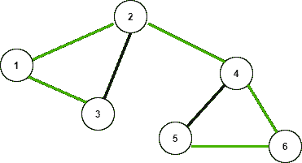

# 图中树边和后边的区别

> 原文:[https://www . geesforgeks . org/图中树边和后边的区别/](https://www.geeksforgeeks.org/difference-between-tree-edge-and-back-edge-in-graph/)

[**树边**](https://www.geeksforgeeks.org/tree-back-edge-and-cross-edges-in-dfs-of-graph/) **:** 是在图 上执行 [DFS 后得到的树中存在的边。如下图所示，所有绿色边都是树边。](https://www.geeksforgeeks.org/depth-first-search-or-dfs-for-a-graph/)

[**后沿**](https://www.geeksforgeeks.org/tree-back-edge-and-cross-edges-in-dfs-of-graph/) **:** 它是一条边 **(u，v)** ，使得 **v** 是节点 **u** 的祖先，但不是树的 DFS 遍历的一部分。从 **5** 到 **4** 的边是一条后边。后边缘的存在[指示有向图中的循环](https://www.geeksforgeeks.org/detect-cycle-in-a-graph/) 。

考虑下面给出的一个[无向图](https://www.geeksforgeeks.org/detect-cycle-undirected-graph/)，下图的 [DFS](https://www.geeksforgeeks.org/depth-first-traversal-for-a-graph/) 为 **3 1 2 4 6 5** 。在下图中，如果将 DFS 应用于该图，则获得使用绿色边连接的[树](https://www.geeksforgeeks.org/data-structures/)。

**后边缘和树边缘之间的表格:**

<figure class="table">

| **本公告** | **树边** | **后沿** |
| **1** | 它将节点与其后代连接起来。 | 它将节点与其祖先连接起来。 |
| **2** | 是 [DFS](https://www.geeksforgeeks.org/depth-first-traversal-for-a-graph/) 期间经过的路径。 | 这是 [DFS](https://www.geeksforgeeks.org/depth-first-traversal-for-a-graph/) 期间未访问的路径。 |
| **3** | 它们可以形成[桥梁](https://www.geeksforgeeks.org/bridge-in-a-graph/)。 | 他们永远无法建立桥梁。 |
| **4** | 如果断开，[连接的部件](https://www.geeksforgeeks.org/strongly-connected-components/)的数量可能会增加。 | 即使断开连接，连接的组件数量也保持不变。 |
| **5** | 它从不创造循环。 | 它可以创造一个循环。 |

</figure>