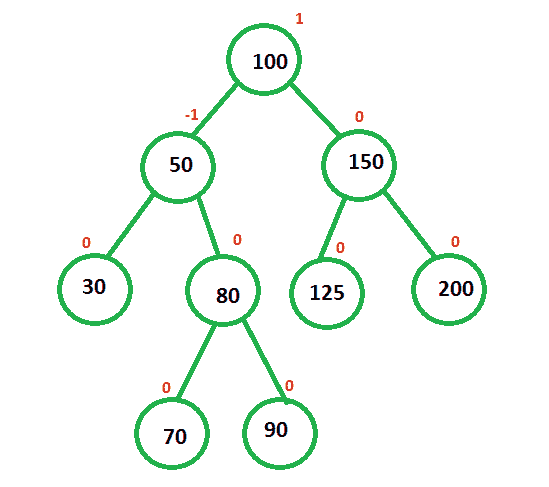
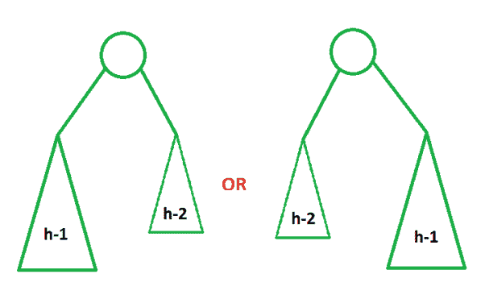

# 在高度 h

处可能出现不同形状的 AVL

> 原文:[https://www . geeksforgeeks . org/不同形状的 AVL-可能的高度-h/](https://www.geeksforgeeks.org/different-shapes-of-avl-possible-at-height-h/)

[**【AVL 树】**](https://www.geeksforgeeks.org/avl-tree-set-1-insertion/) **:** 是一个[自平衡二叉查找树](https://www.geeksforgeeks.org/self-balancing-binary-search-trees-comparisons/)，所有节点的平衡因子不能超过一。平衡因子可以定义为左右子树高度之差。

**示例:**

任务是找到高度为 **h** 的最小 **AVL 树**可能形成的不同形状的可能数量。这可以通过创建树，然后为这个计算生成一个通用公式来理解。

**<u>解</u> :**

让 **N(h)** 表示树的可能性数， **h** 表示 **AVL 树的高度**。在下图中，可能的树是随着它们的高度而成形的。第一列显示高度分析，第二列显示可能的树。

现在让我们概括上述观察结果:

该公式可概括为:

> 