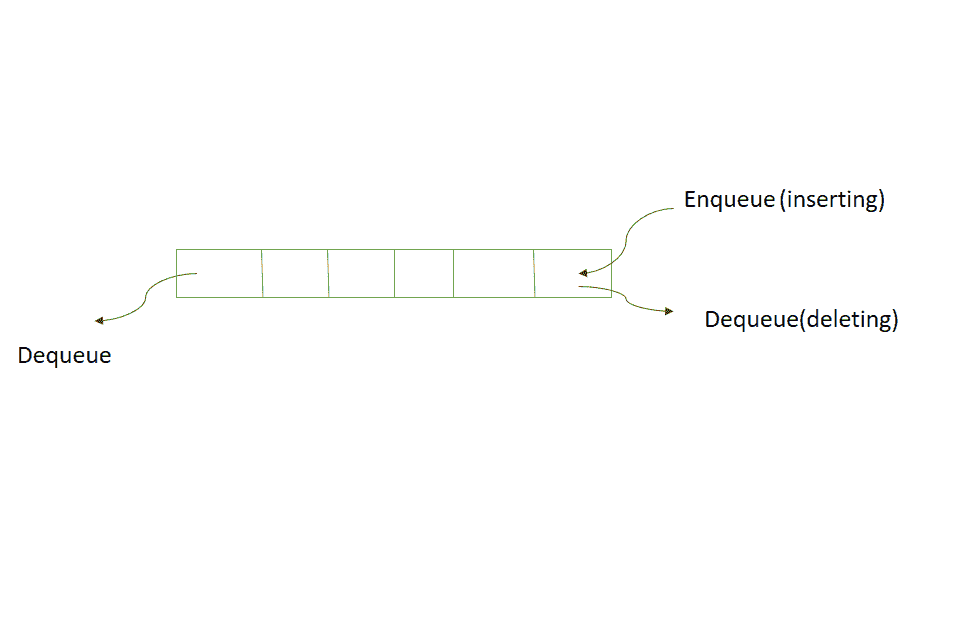
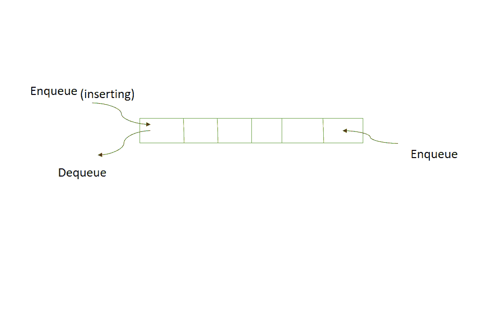
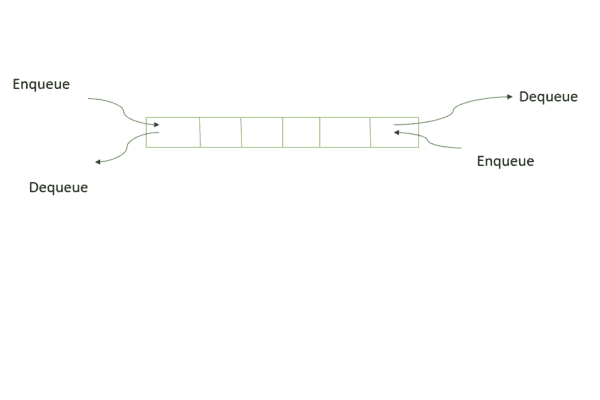

# 不同类型的队列及其应用

> 原文:[https://www . geeksforgeeks . org/不同类型的队列及其应用/](https://www.geeksforgeeks.org/different-types-of-queues-and-its-applications/)

[队列](https://www.geeksforgeeks.org/queue-set-1introduction-and-array-implementation/)是一种线性结构，它遵循执行操作的特定顺序。顺序是先进先出。队列的一个很好的例子是资源的任何消费者队列，其中先到的消费者先被服务。在本文中，将讨论不同类型的队列。

[队列](https://www.geeksforgeeks.org/queue-set-1introduction-and-array-implementation/)用于不必立即处理，但必须按照先进先出的顺序处理的情况，如[广度优先搜索](https://www.geeksforgeeks.org/breadth-first-search-or-bfs-for-a-graph/)。队列的这一属性使得它在以下场景中也很有用。

1.  当资源在多个使用者之间共享时。例如 [CPU 调度](https://www.geeksforgeeks.org/cpu-scheduling-in-operating-systems/)、[磁盘调度](https://www.geeksforgeeks.org/disk-scheduling-algorithms/)。
2.  当数据在两个进程之间异步传输时(数据接收的速率不一定与发送的速率相同)。例子包括 IO 缓冲区、[管道](https://www.geeksforgeeks.org/piping-in-unix-or-linux/)、文件 IO 等。

有五种不同类型的队列用于不同的场景。它们是:

1.  **[循环队列](https://www.geeksforgeeks.org/circular-queue-set-1-introduction-array-implementation/) :** 循环队列是基于 FIFO(先进先出)原理进行运算的线性数据结构，最后一个位置连接回第一个位置做一个圆。也叫**【环形缓冲区】**。该队列主要用于以下情况:
    1.  **内存管理:**普通队列中未使用的内存位置可以在循环队列中使用。
    2.  **交通系统:**在计算机控制的交通系统中，环形队列用于按照设定的时间一个接一个地重复打开交通灯。
    3.  **CPU 调度:**操作系统通常会维护一个准备执行或等待特定事件发生的进程队列。
2.  **Input restricted Queue:** In this type of Queue, the input can be taken from one side only(rear) and deletion of element can be done from both side(front and rear). This kind of Queue does not follow FIFO(first in first out).

    

    该队列用于数据消耗需要按先进先出顺序进行的情况，但是如果由于某些原因需要删除最近插入的数据，这种情况可能是不相关的数据、性能问题等。

3.  **Output restricted Queue:** In this type of Queue, the input can be taken from both sides(rear and front) and the deletion of the element can be done from only one side(front).

    

    该队列用于输入具有要执行的优先级顺序的情况，甚至可以将输入放在第一个位置，以便它首先被执行。

4.  **[Double ended Queue](https://www.geeksforgeeks.org/deque-set-1-introduction-applications/):** Double Ended Queue is also a Queue data structure in which the insertion and deletion operations are performed at both the ends (front and rear). That means, we can insert at both front and rear positions and can delete from both front and rear positions.

    

    因为 Deque 同时支持堆栈和队列操作，所以它可以同时用作两者。Deque 数据结构支持 O(1)时间内的顺时针和逆时针旋转，这在某些应用中非常有用。此外，需要在两端移除和/或添加元素的问题可以使用 Deque 来有效地解决。

5.  **[Priority Queue](https://www.geeksforgeeks.org/priority-queue-set-1-introduction/):** A priority queue is a special type of queue in which each element is associated with a priority and is served according to its priority. There are two types of Priority Queues. They are:
    1.  **升序优先级队列:**元素可以任意插入，但只能删除最小的元素。例如，假设有一个数组，其元素 4、2、8 的顺序相同。因此，在插入元素时，插入的顺序是相同的，但是在删除时，顺序是 2，4，8。
    2.  **递减优先级队列:**元素可以任意插入，但只能先从给定队列中移除最大的元素。例如，假设有一个数组，其元素 4、2、8 的顺序相同。因此，在插入元素时，插入的顺序是相同的，但是在删除时，顺序是 8，4，2。

    优先级队列主要用于实现 [CPU 调度算法](https://www.geeksforgeeks.org/cpu-scheduling-in-operating-systems/)。