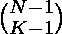

# N 表示为 K 个非零整数之和的不同方式

> 原文:[https://www . geesforgeks . org/不同方式表示 n 为 k 的非零整数之和/](https://www.geeksforgeeks.org/different-ways-to-represent-n-as-sum-of-k-non-zero-integers/)

给定 N 和 K，任务是找出有多少种不同的方法可以将 N 表示为 K 个非零整数之和。

**示例:**

> **输入:** N = 5，K = 3
> **输出:** 6
> 整数的可能组合为:
> ( 1，1，3 )
> ( 1，3，1 )
> ( 3，1，1 )
> ( 1，2，2 )
> ( 2，2，1 )
> ( 2，1，2)
> 
> **输入:** N = 10，K = 4
> T3】输出: 84

**处理问题的方法**是观察一个序列，用组合来解决问题。要得到一个数 N，需要 N ^ 1，N ^ 1 的和将给出 N。这个问题允许你只使用 K 个整数来做 N

**观察:**

```
Let's take N = 5 and K = 3, then all 
possible combinations of K numbers are: ( 1, 1, 3 )
                                        ( 1, 3, 1 )
                                        ( 3, 1, 1 )
                                        ( 1, 2, 2 )
                                        ( 2, 2, 1 )
                                        ( 2, 1, 2 )

The above can be rewritten as: ( 1, 1, 1 + 1 + 1 )
                               ( 1, 1 + 1 + 1, 1 )
                               ( 1 + 1 + 1, 1, 1 )
                               ( 1, 1 + 1, 1 + 1 )
                               ( 1 + 1, 1 + 1, 1 )
                               ( 1 + 1, 1, 1 + 1 )
```

从上面可以得出一个结论，在 N 1 中，必须在 N 1 之间放置 k-1 个逗号，其余地方用“+”号填充。把 k-1 个逗号和把“+”号放在其余地方的所有组合将是答案。因此，一般来说，对于 N，在所有 1 之间会有 N-1 个空格，从这些空格中选择 k-1，并在这些 1 之间放置一个逗号。在其余 1 之间，放置“+”符号。所以从 N-1 中选择 K-1 对象的方式是。使用[动态编程](https://www.geeksforgeeks.org/dynamic-programming-set-9-binomial-coefficient/)方法计算。

下面是上述方法的实现:

## C++

```
// CPP program to calculate Different ways to
// represent N as sum of K non-zero integers.
#include <bits/stdc++.h>
using namespace std;

// Returns value of Binomial Coefficient C(n, k)
int binomialCoeff(int n, int k)
{
    int C[n + 1][k + 1];
    int i, j;

    // Calculate value of Binomial Coefficient in bottom up manner
    for (i = 0; i <= n; i++) {
        for (j = 0; j <= min(i, k); j++) {
            // Base Cases
            if (j == 0 || j == i)
                C[i][j] = 1;

            // Calculate value using previously stored values
            else
                C[i][j] = C[i - 1][j - 1] + C[i - 1][j];
        }
    }

    return C[n][k];
}

// Driver Code
int main()
{
    int n = 5, k = 3;
    cout << "Total number of different ways are "
         << binomialCoeff(n - 1, k - 1);
    return 0;
}
```

## Java 语言(一种计算机语言，尤用于创建网站)

```
// Java program to calculate
// Different ways to represent
// N as sum of K non-zero integers.
import java.io.*;

class GFG
{

// Returns value of Binomial
// Coefficient C(n, k)
static int binomialCoeff(int n,
                         int k)
{
    int C[][] = new int [n + 1][k + 1];
    int i, j;

    // Calculate value of Binomial
    // Coefficient in bottom up manner
    for (i = 0; i <= n; i++)
    {
        for (j = 0;
             j <= Math.min(i, k); j++)
        {
            // Base Cases
            if (j == 0 || j == i)
                C[i][j] = 1;

            // Calculate value using
            // previously stored values
            else
                C[i][j] = C[i - 1][j - 1] +
                          C[i - 1][j];
        }
    }

    return C[n][k];
}

// Driver Code
public static void main (String[] args)
{
    int n = 5, k = 3;
    System.out.println( "Total number of " +
                     "different ways are " +
                        binomialCoeff(n - 1,
                                      k - 1));
}
}

// This code is contributed
// by anuj_67.
```

## 蟒蛇 3

```
# python 3 program to calculate Different ways to
# represent N as sum of K non-zero integers.

# Returns value of Binomial Coefficient C(n, k)
def binomialCoeff(n, k):
    C = [[0 for i in range(k+1)]for i in range(n+1)]

    # Calculate value of Binomial Coefficient in bottom up manner
    for i in range(0,n+1,1):
        for j in range(0,min(i, k)+1,1):
            # Base Cases
            if (j == 0 or j == i):
                C[i][j] = 1

            # Calculate value using previously stored values
            else:
                C[i][j] = C[i - 1][j - 1] + C[i - 1][j]

    return C[n][k]

# Driver Code
if __name__ == '__main__':
    n = 5
    k = 3
    print("Total number of different ways are",binomialCoeff(n - 1, k - 1))

# This code is contributed by
# Sanjit_Prasad
```

## C#

```
// C# program to calculate
// Different ways to represent
// N as sum of K non-zero integers.
using System;

class GFG
{

// Returns value of Binomial
// Coefficient C(n, k)
static int binomialCoeff(int n,
                         int k)
{
    int [,]C = new int [n + 1,
                        k + 1];
    int i, j;

    // Calculate value of
    // Binomial Coefficient
    // in bottom up manner
    for (i = 0; i <= n; i++)
    {
        for (j = 0;
            j <= Math.Min(i, k); j++)
        {
            // Base Cases
            if (j == 0 || j == i)
                C[i, j] = 1;

            // Calculate value using
            // previously stored values
            else
                C[i, j] = C[i - 1, j - 1] +
                          C[i - 1, j];
        }
    }

    return C[n,k];
}

// Driver Code
public static void Main ()
{
    int n = 5, k = 3;
    Console.WriteLine( "Total number of " +
                    "different ways are " +
                       binomialCoeff(n - 1,
                                   k - 1));
}
}

// This code is contributed
// by anuj_67.
```

## 服务器端编程语言（Professional Hypertext Preprocessor 的缩写）

```
<?php
// PHP program to calculate
// Different ways to represent
// N as sum of K non-zero integers.

// Returns value of Binomial
// Coefficient C(n, k)
function binomialCoeff($n, $k)
{
    $C = array(array());
    $i; $j;

    // Calculate value of Binomial
    // Coefficient in bottom up manner
    for ($i = 0; $i <= $n; $i++)
    {
        for ($j = 0;
             $j <= min($i, $k); $j++)
        {
            // Base Cases
            if ($j == 0 or $j == $i)
                $C[$i][$j] = 1;

            // Calculate value using
            // previously stored values
            else
                $C[$i][$j] = $C[$i - 1][$j - 1] +
                             $C[$i - 1][$j];
        }
    }

    return $C[$n][$k];
}

// Driver Code
$n = 5; $k = 3;
echo "Total number of " ,
  "different ways are " ,
   binomialCoeff($n - 1,
                 $k - 1);

// This code is contributed
// by anuj_67.
?>
```

## java 描述语言

```
<script>
    // Javascript program to calculate
    // Different ways to represent
    // N as sum of K non-zero integers.

    // Returns value of Binomial
    // Coefficient C(n, k)
    function binomialCoeff(n, k)
    {
        let C = new Array(n + 1);
        for(let i = 0; i < n + 1; i ++)
        {
            C[i] = new Array(k + 1);
            for(let j = 0; j < k + 1; j++)
            {
                C[i][j] = 0;
            }
        }
        let i, j;

        // Calculate value of Binomial
        // Coefficient in bottom up manner
        for (i = 0; i <= n; i++)
        {
            for (j = 0; j <= Math.min(i, k); j++)
            {
                // Base Cases
                if (j == 0 || j == i)
                    C[i][j] = 1;

                // Calculate value using
                // previously stored values
                else
                    C[i][j] = C[i - 1][j - 1] +
                              C[i - 1][j];
            }
        }

        return C[n][k];
    }

    let n = 5, k = 3;
    document.write( "Total number of " +
                     "different ways are " +
                        binomialCoeff(n - 1,
                                      k - 1));

</script>
```

**Output:** 

```
Total number of different ways are 6
```

**时间复杂度:**O(N * K)
T3】辅助空间: O(N * K)