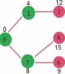
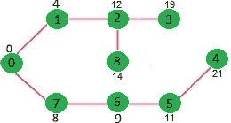

# 邻接列表表示的 Dijkstra 算法|贪婪算法-8

> 原文:[https://www . geeksforgeeks . org/dijkstras-算法-邻接表-表示-贪婪-algo-8/](https://www.geeksforgeeks.org/dijkstras-algorithm-for-adjacency-list-representation-greedy-algo-8/)

我们建议阅读以下两篇文章作为这篇文章的先决条件。
**1。** [贪婪算法|集合 7(迪克斯特拉最短路径算法)](https://www.geeksforgeeks.org/dijkstras-shortest-path-algorithm-greedy-algo-7/)
**2。** [图及其表示](https://www.geeksforgeeks.org/graph-and-its-representations/)
我们讨论了图的邻接矩阵表示的 [Dijkstra 算法及其实现。矩阵表示的时间复杂度是 O(V^2).本文讨论了邻接表表示的 O(ELogV)算法。
如前一篇文章所述，在 Dijkstra 算法中，维护了两个集合，一个集合包含已经包含在 SPT(最短路径树)中的顶点列表，另一个集合包含尚未包含的顶点。使用邻接表表示，可以使用](https://www.geeksforgeeks.org/prims-minimum-spanning-tree-mst-greedy-algo-5/) [BFS](https://www.geeksforgeeks.org/breadth-first-search-or-bfs-for-a-graph/) 在 0(V+E)时间内遍历图的所有顶点。其思想是使用 [BFS](https://www.geeksforgeeks.org/breadth-first-search-or-bfs-for-a-graph/) 遍历图的所有顶点，并使用最小堆来存储尚未包含在标准贯入点中的顶点(或最短距离尚未最终确定的顶点)。最小堆被用作优先级队列，以从尚未包括的顶点集合中获取最小距离顶点。像提取最小值和减少键值这样的操作的时间复杂度对于最小堆来说是 0。
详细步骤如下。
**1)** 创建一个大小为 V 的最小堆，其中 V 是给定图中的顶点数。最小堆的每个节点都包含顶点数和顶点的距离值。
**2)** 以源顶点为根初始化最小堆(分配给源顶点的距离值为 0)。分配给所有其他顶点的距离值是 INF(无穷大)。
**3)** 当最小堆不为空时，执行以下
….. **a)** 从 Min Heap 中提取距离值节点最小的顶点。让提取的顶点为 u.
….. **b)** 对于 u 的每个相邻顶点 v，检查 v 是否在最小堆中。如果 v 在 Min Heap 中，距离值大于 u-v 的权重加上 u 的距离值，那么更新 v 的距离值
让我们用下面的例子来理解。让给定的源顶点为 0


最初，源顶点的距离值为 0，所有其他顶点的距离值为 INF(无穷大)。因此，从最小堆中提取源顶点，并更新与 0 (1 和 7)相邻的顶点的距离值。最小堆包含除顶点 0 以外的所有顶点。
绿色的顶点是最小距离最终确定的顶点，不在最小堆中


由于顶点 1 的距离值在最小堆中的所有节点中是最小的，所以它是从最小堆中提取的，并且与 1 相邻的顶点的距离值被更新(如果 a 顶点在最小堆中并且通过 1 的距离比先前的距离短，则距离被更新)。最小堆包含除顶点 0 和 1 之外的所有顶点。


从最小堆中选择具有最小距离值的顶点。顶点 7 被拾取。所以最小堆现在包含除 0、1 和 7 之外的所有顶点。更新相邻顶点的距离值为 7。顶点 6 和 8 的距离值变得有限(分别为 15 和 9)。



选择与最小堆距离最小的顶点。顶点 6 被拾取。所以最小堆现在包含除 0、1、7 和 6 以外的所有顶点。更新相邻顶点的距离值为 6。更新顶点 5 和 8 的距离值。


重复以上步骤，直到最小堆不为空。最后，我们得到以下最短路径树。



## C++

```
// C / C++ program for Dijkstra's 
// shortest path algorithm for adjacency
// list representation of graph
#include <stdio.h>
#include <stdlib.h>
#include <limits.h>

// A structure to represent a 
// node in adjacency list
struct AdjListNode
{
    int dest;
    int weight;
    struct AdjListNode* next;
};

// A structure to represent 
// an adjacency list
struct AdjList
{

   // Pointer to head node of list
   struct AdjListNode *head; 
};

// A structure to represent a graph. 
// A graph is an array of adjacency lists.
// Size of array will be V (number of 
// vertices in graph)
struct Graph
{
    int V;
    struct AdjList* array;
};

// A utility function to create 
// a new adjacency list node
struct AdjListNode* newAdjListNode(
                   int dest, int weight)
{
    struct AdjListNode* newNode =
            (struct AdjListNode*) 
      malloc(sizeof(struct AdjListNode));
    newNode->dest = dest;
    newNode->weight = weight;
    newNode->next = NULL;
    return newNode;
}

// A utility function that creates 
// a graph of V vertices
struct Graph* createGraph(int V)
{
    struct Graph* graph = (struct Graph*) 
            malloc(sizeof(struct Graph));
    graph->V = V;

    // Create an array of adjacency lists.  
    // Size of array will be V
    graph->array = (struct AdjList*) 
       malloc(V * sizeof(struct AdjList));

    // Initialize each adjacency list 
    // as empty by making head as NULL
    for (int i = 0; i < V; ++i)
        graph->array[i].head = NULL;

    return graph;
}

// Adds an edge to an undirected graph
void addEdge(struct Graph* graph, int src, 
                   int dest, int weight)
{
    // Add an edge from src to dest.  
    // A new node is added to the adjacency
    // list of src.  The node is 
    // added at the beginning
    struct AdjListNode* newNode = 
            newAdjListNode(dest, weight);
    newNode->next = graph->array[src].head;
    graph->array[src].head = newNode;

    // Since graph is undirected, 
    // add an edge from dest to src also
    newNode = newAdjListNode(src, weight);
    newNode->next = graph->array[dest].head;
    graph->array[dest].head = newNode;
}

// Structure to represent a min heap node
struct MinHeapNode
{
    int  v;
    int dist;
};

// Structure to represent a min heap
struct MinHeap
{

    // Number of heap nodes present currently
    int size;     

    // Capacity of min heap
    int capacity;  

    // This is needed for decreaseKey()
    int *pos;    
    struct MinHeapNode **array;
};

// A utility function to create a 
// new Min Heap Node
struct MinHeapNode* newMinHeapNode(int v, 
                                 int dist)
{
    struct MinHeapNode* minHeapNode =
           (struct MinHeapNode*) 
      malloc(sizeof(struct MinHeapNode));
    minHeapNode->v = v;
    minHeapNode->dist = dist;
    return minHeapNode;
}

// A utility function to create a Min Heap
struct MinHeap* createMinHeap(int capacity)
{
    struct MinHeap* minHeap =
         (struct MinHeap*) 
      malloc(sizeof(struct MinHeap));
    minHeap->pos = (int *)malloc(
            capacity * sizeof(int));
    minHeap->size = 0;
    minHeap->capacity = capacity;
    minHeap->array =
         (struct MinHeapNode**) 
                 malloc(capacity * 
       sizeof(struct MinHeapNode*));
    return minHeap;
}

// A utility function to swap two 
// nodes of min heap. 
// Needed for min heapify
void swapMinHeapNode(struct MinHeapNode** a, 
                     struct MinHeapNode** b)
{
    struct MinHeapNode* t = *a;
    *a = *b;
    *b = t;
}

// A standard function to 
// heapify at given idx
// This function also updates 
// position of nodes when they are swapped.
// Position is needed for decreaseKey()
void minHeapify(struct MinHeap* minHeap, 
                                  int idx)
{
    int smallest, left, right;
    smallest = idx;
    left = 2 * idx + 1;
    right = 2 * idx + 2;

    if (left < minHeap->size &&
        minHeap->array[left]->dist < 
         minHeap->array[smallest]->dist )
      smallest = left;

    if (right < minHeap->size &&
        minHeap->array[right]->dist <
         minHeap->array[smallest]->dist )
      smallest = right;

    if (smallest != idx)
    {
        // The nodes to be swapped in min heap
        MinHeapNode *smallestNode = 
             minHeap->array[smallest];
        MinHeapNode *idxNode = 
                 minHeap->array[idx];

        // Swap positions
        minHeap->pos[smallestNode->v] = idx;
        minHeap->pos[idxNode->v] = smallest;

        // Swap nodes
        swapMinHeapNode(&minHeap->array[smallest], 
                         &minHeap->array[idx]);

        minHeapify(minHeap, smallest);
    }
}

// A utility function to check if 
// the given minHeap is ampty or not
int isEmpty(struct MinHeap* minHeap)
{
    return minHeap->size == 0;
}

// Standard function to extract 
// minimum node from heap
struct MinHeapNode* extractMin(struct MinHeap* 
                                   minHeap)
{
    if (isEmpty(minHeap))
        return NULL;

    // Store the root node
    struct MinHeapNode* root = 
                   minHeap->array[0];

    // Replace root node with last node
    struct MinHeapNode* lastNode = 
         minHeap->array[minHeap->size - 1];
    minHeap->array[0] = lastNode;

    // Update position of last node
    minHeap->pos[root->v] = minHeap->size-1;
    minHeap->pos[lastNode->v] = 0;

    // Reduce heap size and heapify root
    --minHeap->size;
    minHeapify(minHeap, 0);

    return root;
}

// Function to decreasy dist value 
// of a given vertex v. This function
// uses pos[] of min heap to get the
// current index of node in min heap
void decreaseKey(struct MinHeap* minHeap, 
                         int v, int dist)
{
    // Get the index of v in  heap array
    int i = minHeap->pos[v];

    // Get the node and update its dist value
    minHeap->array[i]->dist = dist;

    // Travel up while the complete 
    // tree is not hepified.
    // This is a O(Logn) loop
    while (i && minHeap->array[i]->dist < 
           minHeap->array[(i - 1) / 2]->dist)
    {
        // Swap this node with its parent
        minHeap->pos[minHeap->array[i]->v] = 
                                      (i-1)/2;
        minHeap->pos[minHeap->array[
                             (i-1)/2]->v] = i;
        swapMinHeapNode(&minHeap->array[i],  
                 &minHeap->array[(i - 1) / 2]);

        // move to parent index
        i = (i - 1) / 2;
    }
}

// A utility function to check if a given vertex
// 'v' is in min heap or not
bool isInMinHeap(struct MinHeap *minHeap, int v)
{
   if (minHeap->pos[v] < minHeap->size)
     return true;
   return false;
}

// A utility function used to print the solution
void printArr(int dist[], int n)
{
    printf("Vertex   Distance from Source\n");
    for (int i = 0; i < n; ++i)
        printf("%d \t\t %d\n", i, dist[i]);
}

// The main function that calculates 
// distances of shortest paths from src to all
// vertices. It is a O(ELogV) function
void dijkstra(struct Graph* graph, int src)
{

    // Get the number of vertices in graph
    int V = graph->V;

    // dist values used to pick
    // minimum weight edge in cut
    int dist[V];     

    // minHeap represents set E
    struct MinHeap* minHeap = createMinHeap(V);

    // Initialize min heap with all 
    // vertices. dist value of all vertices 
    for (int v = 0; v < V; ++v)
    {
        dist[v] = INT_MAX;
        minHeap->array[v] = newMinHeapNode(v, 
                                      dist[v]);
        minHeap->pos[v] = v;
    }

    // Make dist value of src vertex 
    // as 0 so that it is extracted first
    minHeap->array[src] = 
          newMinHeapNode(src, dist[src]);
    minHeap->pos[src]   = src;
    dist[src] = 0;
    decreaseKey(minHeap, src, dist[src]);

    // Initially size of min heap is equal to V
    minHeap->size = V;

    // In the followin loop, 
    // min heap contains all nodes
    // whose shortest distance 
    // is not yet finalized.
    while (!isEmpty(minHeap))
    {
        // Extract the vertex with 
        // minimum distance value
        struct MinHeapNode* minHeapNode = 
                     extractMin(minHeap);

        // Store the extracted vertex number
        int u = minHeapNode->v; 

        // Traverse through all adjacent 
        // vertices of u (the extracted
        // vertex) and update 
        // their distance values
        struct AdjListNode* pCrawl =
                     graph->array[u].head;
        while (pCrawl != NULL)
        {
            int v = pCrawl->dest;

            // If shortest distance to v is
            // not finalized yet, and distance to v
            // through u is less than its 
            // previously calculated distance
            if (isInMinHeap(minHeap, v) && 
                      dist[u] != INT_MAX && 
              pCrawl->weight + dist[u] < dist[v])
            {
                dist[v] = dist[u] + pCrawl->weight;

                // update distance 
                // value in min heap also
                decreaseKey(minHeap, v, dist[v]);
            }
            pCrawl = pCrawl->next;
        }
    }

    // print the calculated shortest distances
    printArr(dist, V);
}

// Driver program to test above functions
int main()
{
    // create the graph given in above fugure
    int V = 9;
    struct Graph* graph = createGraph(V);
    addEdge(graph, 0, 1, 4);
    addEdge(graph, 0, 7, 8);
    addEdge(graph, 1, 2, 8);
    addEdge(graph, 1, 7, 11);
    addEdge(graph, 2, 3, 7);
    addEdge(graph, 2, 8, 2);
    addEdge(graph, 2, 5, 4);
    addEdge(graph, 3, 4, 9);
    addEdge(graph, 3, 5, 14);
    addEdge(graph, 4, 5, 10);
    addEdge(graph, 5, 6, 2);
    addEdge(graph, 6, 7, 1);
    addEdge(graph, 6, 8, 6);
    addEdge(graph, 7, 8, 7);

    dijkstra(graph, 0);

    return 0;
}
```

## 计算机编程语言

```
# A Python program for Dijkstra's shortest 
# path algorithm for adjacency
# list representation of graph

from collections import defaultdict
import sys

class Heap():

    def __init__(self):
        self.array = []
        self.size = 0
        self.pos = []

    def newMinHeapNode(self, v, dist):
        minHeapNode = [v, dist]
        return minHeapNode

    # A utility function to swap two nodes 
    # of min heap. Needed for min heapify
    def swapMinHeapNode(self,a, b):
        t = self.array[a]
        self.array[a] = self.array[b]
        self.array[b] = t

    # A standard function to heapify at given idx
    # This function also updates position of nodes 
    # when they are swapped.Position is needed 
    # for decreaseKey()
    def minHeapify(self, idx):
        smallest = idx
        left = 2*idx + 1
        right = 2*idx + 2

        if left < self.size and 
           self.array[left][1] \
            < self.array[smallest][1]:
            smallest = left

        if right < self.size and 
           self.array[right][1]\
            < self.array[smallest][1]:
            smallest = right

        # The nodes to be swapped in min 
        # heap if idx is not smallest
        if smallest != idx:

            # Swap positions
            self.pos[ self.array[smallest][0]] 
                                       = idx
            self.pos[ self.array[idx][0]] = 
                                     smallest

            # Swap nodes
            self.swapMinHeapNode(smallest, idx)

            self.minHeapify(smallest)

    # Standard function to extract minimum 
    # node from heap
    def extractMin(self):

        # Return NULL wif heap is empty
        if self.isEmpty() == True:
            return

        # Store the root node
        root = self.array[0]

        # Replace root node with last node
        lastNode = self.array[self.size - 1]
        self.array[0] = lastNode

        # Update position of last node
        self.pos[lastNode[0]] = 0
        self.pos[root[0]] = self.size - 1

        # Reduce heap size and heapify root
        self.size -= 1
        self.minHeapify(0)

        return root

    def isEmpty(self):
        return True if self.size == 0 else False

    def decreaseKey(self, v, dist):

        # Get the index of v in  heap array

        i = self.pos[v]

        # Get the node and update its dist value
        self.array[i][1] = dist

        # Travel up while the complete tree is 
        # not hepified. This is a O(Logn) loop
        while i > 0 and self.array[i][1] < 
                  self.array[(i - 1) / 2][1]:

            # Swap this node with its parent
            self.pos[ self.array[i][0] ] = (i-1)/2
            self.pos[ self.array[(i-1)/2][0] ] = i
            self.swapMinHeapNode(i, (i - 1)/2 )

            # move to parent index
            i = (i - 1) / 2;

    # A utility function to check if a given 
    # vertex 'v' is in min heap or not
    def isInMinHeap(self, v):

        if self.pos[v] < self.size:
            return True
        return False

def printArr(dist, n):
    print "Vertex\tDistance from source"
    for i in range(n):
        print "%d\t\t%d" % (i,dist[i])

class Graph():

    def __init__(self, V):
        self.V = V
        self.graph = defaultdict(list)

    # Adds an edge to an undirected graph
    def addEdge(self, src, dest, weight):

        # Add an edge from src to dest.  A new node 
        # is added to the adjacency list of src. The 
        # node is added at the beginning. The first 
        # element of the node has the destination 
        # and the second elements has the weight
        newNode = [dest, weight]
        self.graph[src].insert(0, newNode)

        # Since graph is undirected, add an edge 
        # from dest to src also
        newNode = [src, weight]
        self.graph[dest].insert(0, newNode)

    # The main function that calculates distances 
    # of shortest paths from src to all vertices. 
    # It is a O(ELogV) function
    def dijkstra(self, src):

        V = self.V  # Get the number of vertices in graph
        dist = []   # dist values used to pick minimum 
                    # weight edge in cut

        # minHeap represents set E
        minHeap = Heap()

        #  Initialize min heap with all vertices. 
        # dist value of all vertices
        for v in range(V):
            dist.append(sys.maxint)
            minHeap.array.append( minHeap.
                                newMinHeapNode(v, dist[v]))
            minHeap.pos.append(v)

        # Make dist value of src vertex as 0 so 
        # that it is extracted first
        minHeap.pos[src] = src
        dist[src] = 0
        minHeap.decreaseKey(src, dist[src])

        # Initially size of min heap is equal to V
        minHeap.size = V;

        # In the following loop, 
        # min heap contains all nodes
        # whose shortest distance is not yet finalized.
        while minHeap.isEmpty() == False:

            # Extract the vertex 
            # with minimum distance value
            newHeapNode = minHeap.extractMin()
            u = newHeapNode[0]

            # Traverse through all adjacent vertices of 
            # u (the extracted vertex) and update their 
            # distance values
            for pCrawl in self.graph[u]:

                v = pCrawl[0]

                # If shortest distance to v is not finalized 
                # yet, and distance to v through u is less 
                # than its previously calculated distance
                if minHeap.isInMinHeap(v) and 
                     dist[u] != sys.maxint and \
                   pCrawl[1] + dist[u] < dist[v]:
                        dist[v] = pCrawl[1] + dist[u]

                        # update distance value 
                        # in min heap also
                        minHeap.decreaseKey(v, dist[v])

        printArr(dist,V)

# Driver program to test the above functions
graph = Graph(9)
graph.addEdge(0, 1, 4)
graph.addEdge(0, 7, 8)
graph.addEdge(1, 2, 8)
graph.addEdge(1, 7, 11)
graph.addEdge(2, 3, 7)
graph.addEdge(2, 8, 2)
graph.addEdge(2, 5, 4)
graph.addEdge(3, 4, 9)
graph.addEdge(3, 5, 14)
graph.addEdge(4, 5, 10)
graph.addEdge(5, 6, 2)
graph.addEdge(6, 7, 1)
graph.addEdge(6, 8, 6)
graph.addEdge(7, 8, 7)
graph.dijkstra(0)

# This code is contributed by Divyanshu Mehta
```

## Java 语言(一种计算机语言，尤用于创建网站)

```
import java.io.*;
import java.util.*;

class GFG {
    static class AdjListNode {
        int vertex, weight;

        AdjListNode(int v, int w)
        {
            vertex = v;
            weight = w;
        }
        int getVertex() { return vertex; }
        int getWeight() { return weight; }
    }

    // Function to find the shortest distance of all the
    // vertices from the source vertex S.
    public static int[] dijkstra(
        int V, ArrayList<ArrayList<AdjListNode> > graph,
        int source)
    {
        int[] distance = new int[V];
        for (int i = 0; i < V; i++)
            distance[i] = Integer.MAX_VALUE;
        distance = 0;

        PriorityQueue<AdjListNode> pq = new PriorityQueue<>(
            (v1, v2) -> v1.getWeight() - v2.getWeight());
        pq.add(new AdjListNode(source, 0));

        while (pq.size() > 0) {
            AdjListNode current = pq.poll();

            for (AdjListNode n :
                 graph.get(current.getVertex())) {
                if (distance[current.getVertex()]
                        + n.getWeight()
                    < distance[n.getVertex()]) {
                    distance[n.getVertex()]
                        = n.getWeight()
                          + distance[current.getVertex()];
                    pq.add(new AdjListNode(
                        n.getVertex(),
                        distance[n.getVertex()]));
                }
            }
        }
        // If you want to calculate distance from source to
        // a particular target, you can return
        // distance[target]
        return distance;
    }

    public static void main(String[] args)
    {
        int V = 9;
        ArrayList<ArrayList<AdjListNode> > graph
            = new ArrayList<>();
        for (int i = 0; i < V; i++) {
            graph.add(new ArrayList<>());
        }
        int source = 0;
        graph.get(0).add(new AdjListNode(1, 4));
        graph.get(0).add(new AdjListNode(7, 8));
        graph.get(1).add(new AdjListNode(2, 8));
        graph.get(1).add(new AdjListNode(7, 11));
        graph.get(1).add(new AdjListNode(0, 7));
        graph.get(2).add(new AdjListNode(1, 8));
        graph.get(2).add(new AdjListNode(3, 7));
        graph.get(2).add(new AdjListNode(8, 2));
        graph.get(2).add(new AdjListNode(5, 4));
        graph.get(3).add(new AdjListNode(2, 7));
        graph.get(3).add(new AdjListNode(4, 9));
        graph.get(3).add(new AdjListNode(5, 14));
        graph.get(4).add(new AdjListNode(3, 9));
        graph.get(4).add(new AdjListNode(5, 10));
        graph.get(5).add(new AdjListNode(4, 10));
        graph.get(5).add(new AdjListNode(6, 2));
        graph.get(6).add(new AdjListNode(5, 2));
        graph.get(6).add(new AdjListNode(7, 1));
        graph.get(6).add(new AdjListNode(8, 6));
        graph.get(7).add(new AdjListNode(0, 8));
        graph.get(7).add(new AdjListNode(1, 11));
        graph.get(7).add(new AdjListNode(6, 1));
        graph.get(7).add(new AdjListNode(8, 7));
        graph.get(8).add(new AdjListNode(2, 2));
        graph.get(8).add(new AdjListNode(6, 6));
        graph.get(8).add(new AdjListNode(7, 1));

        int[] distance = dijkstra(V, graph, source);
        // Printing the Output
        System.out.println("Vertex  "
                           + "  Distance from Source");
        for (int i = 0; i < V; i++) {
            System.out.println(i + "             "
                               + distance[i]);
        }
    }
}
```

**输出:**

```
Vertex   Distance from Source
0                0
1                4
2                12
3                19
4                21
5                11
6                9
7                8
8                14
```

**时间复杂度:**上面代码/算法的时间复杂度看起来像 O(V^2)，因为有两个嵌套的 while 循环。如果我们仔细看一下，我们可以观察到，内部循环中的语句被执行了 O(V+E)次(类似于 BFS)。内部循环有一个需要 0(LogV)时间的递减键()操作。所以总的时间复杂度是 O(E+V)*O(LogV)，也就是 O((E+V)*LogV) = O(ELogV)
注意，上面的代码使用二进制堆来实现优先级队列。使用斐波那契堆可以将时间复杂度降低到 O(E + VLogV)。原因是，斐波那契堆需要 0(1)时间进行减键操作，而二进制堆需要 0(Logn)时间。
T4【注释:

1.  代码计算最短距离，但不计算路径信息。我们可以创建一个父数组，当距离更新时更新父数组(就像 [prim 的实现](https://www.geeksforgeeks.org/prims-mst-for-adjacency-list-representation-greedy-algo-6/))并使用它显示从源到不同顶点的最短路径。
2.  代码用于无向图，同样的 dijekstra 函数也可以用于有向图。
3.  代码找到从源到所有顶点的最短距离。如果我们只对从源到单个目标的最短距离感兴趣，当拾取的最小距离顶点等于目标时，我们可以打破 for 循环(算法的步骤 3.a)。
4.  Dijkstra 的算法不适用于具有负权重边的图。对于具有负权重边的图，可以使用[贝尔曼-福特算法](http://en.wikipedia.org/wiki/Bellman-Ford_algorithm)，我们很快将作为单独的帖子讨论它。
    [在迪克斯特拉最短路径算法中打印路径](https://www.geeksforgeeks.org/printing-paths-dijkstras-shortest-path-algorithm/)
    [在 STL](https://www.geeksforgeeks.org/dijkstras-shortest-path-algorithm-using-set-in-stl/) 中设置迪克斯特拉最短路径算法

**参考文献:**
[Clifford Stein、Thomas H. Cormen、Charles E. Leiserson、Ronald L.](http://www.flipkart.com/introduction-algorithms-8120340078/p/itmczynzhyhxv2gs?pid=9788120340077&affid=sandeepgfg) 算法导论
[算法由 Sanjoy Dasgupta、Christos Papadimitriou、Umesh Vazirani](http://www.flipkart.com/algorithms-0070636613/p/itmczynvb7p2zacz?pid=9780070636613&affid=sandeepgfg)

如果你发现任何不正确的地方，或者你想分享更多关于上面讨论的话题的信息，请写评论。