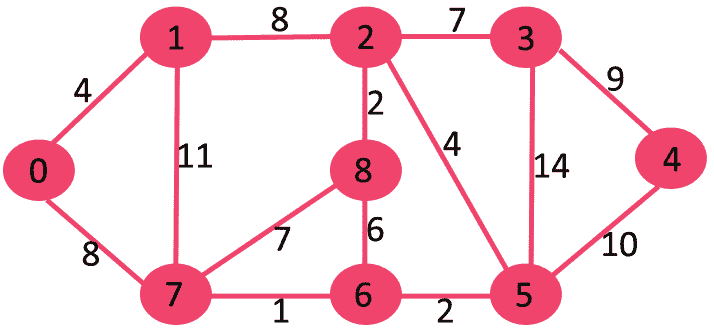
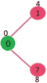
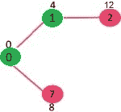
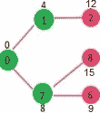
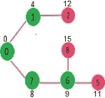
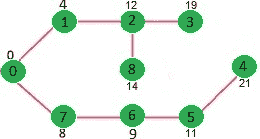

# Dijkstra 最短路径算法| Greedy Algo-7

> 原文:[https://www . geesforgeks . org/dijkstras-最短路径-算法-greedy-algo-7/](https://www.geeksforgeeks.org/dijkstras-shortest-path-algorithm-greedy-algo-7/)

给定一个图和图中的一个源顶点，找出从源到给定图中所有顶点的最短路径。
Dijkstra 的算法与 [Prim 的最小生成树](https://www.geeksforgeeks.org/prims-minimum-spanning-tree-mst-greedy-algo-5/)算法非常相似。像 Prim 的 MST 一样，我们用给定的源作为根来生成 *SPT(最短路径树)*。我们维护两个集合，一个集合包含包含在最短路径树中的顶点，另一个集合包含尚未包含在最短路径树中的顶点。在算法的每一步，我们都会找到一个在另一个集合(尚未包括的集合)中的顶点，并且该顶点与源的距离最小。
下面是 Dijkstra 算法中使用的详细步骤，用于找到从单个源顶点到给定图中所有其他顶点的最短路径。

算法
**1)** 创建一个集合 *sptSet* (最短路径树集合)，用于跟踪最短路径树中包含的顶点，即计算并最终确定其与源的最小距离。最初，这个集合是空的。
**2)** 为输入图形中的所有顶点指定一个距离值。将所有距离值初始化为无穷大。将源顶点的距离值指定为 0，以便首先拾取它。
**3)** 而 *sptSet* 不包括所有顶点
…。 **a)** 拾取不在 *sptSet* 中且具有最小距离值的顶点 u。
…。 **b)** 含 u 至 *sptSet* 。
…。 **c)** 更新 u 的所有相邻顶点的距离值要更新距离值，迭代所有相邻顶点。对于每个相邻顶点 v，如果距离值 u(来自源)和边 u-v 的权重之和小于距离值 v，则更新距离值 v。

让我们用下面的例子来理解:



集合 *sptSet* 最初为空，分配给顶点的距离为{0，INF，INF，INF，INF，INF，INF，INF，INF}，其中 INF 表示无限。现在拾取具有最小距离值的顶点。顶点 0 被拾取，包括在 *sptSet* 中。所以 *sptSet* 变成了{0}。包含 0 到 *sptSet* 后，更新其相邻顶点的距离值。0 的相邻顶点是 1 和 7。距离值 1 和 7 更新为 4 和 8。下面的子图显示了顶点及其距离值，只显示了具有有限距离值的顶点。包含在标准贯入试验中的顶点以绿色显示。



拾取具有最小距离值且尚未包含在标准贯入点中的顶点(不包含在标准贯入点中)。顶点 1 被拾取并添加到 sptSet。所以 sptSet 现在变成了{0，1}。更新相邻顶点的距离值为 1。顶点 2 的距离值变为 12。



拾取具有最小距离值且尚未包含在标准贯入点中的顶点(不包含在标准贯入点中)。顶点 7 被拾取。所以 sptSet 现在变成了{0，1，7}。更新相邻顶点的距离值为 7。顶点 6 和 8 的距离值变得有限(分别为 15 和 9)。



拾取具有最小距离值且尚未包含在标准贯入点中的顶点(不包含在标准贯入点中)。顶点 6 被拾取。所以 sptSet 现在变成了{0，1，7，6}。更新相邻顶点的距离值为 6。更新顶点 5 和 8 的距离值。



我们重复以上步骤，直到 *sptSet* 包括给定图形的所有顶点。最后，我们得到下面的最短路径树。



***如何实现上述算法？**T3】*

我们使用布尔数组 sptSet[]来表示包含在 SPT 中的顶点集。如果值 sptSet[v]为真，则顶点 v 包含在 SPT 中，否则不包含。Array dist[]用于存储所有顶点的最短距离值。

## C++

```
// A C++ program for Dijkstra's single source shortest path algorithm.
// The program is for adjacency matrix representation of the graph
#include <iostream>
using namespace std;
#include <limits.h>

// Number of vertices in the graph
#define V 9

// A utility function to find the vertex with minimum distance value, from
// the set of vertices not yet included in shortest path tree
int minDistance(int dist[], bool sptSet[])
{

    // Initialize min value
    int min = INT_MAX, min_index;

    for (int v = 0; v < V; v++)
        if (sptSet[v] == false && dist[v] <= min)
            min = dist[v], min_index = v;

    return min_index;
}

// A utility function to print the constructed distance array
void printSolution(int dist[])
{
    cout <<"Vertex \t Distance from Source" << endl;
    for (int i = 0; i < V; i++)
        cout  << i << " \t\t"<<dist[i]<< endl;
}

// Function that implements Dijkstra's single source shortest path algorithm
// for a graph represented using adjacency matrix representation
void dijkstra(int graph[V][V], int src)
{
    int dist[V]; // The output array.  dist[i] will hold the shortest
    // distance from src to i

    bool sptSet[V]; // sptSet[i] will be true if vertex i is included in shortest
    // path tree or shortest distance from src to i is finalized

    // Initialize all distances as INFINITE and stpSet[] as false
    for (int i = 0; i < V; i++)
        dist[i] = INT_MAX, sptSet[i] = false;

    // Distance of source vertex from itself is always 0
    dist[src] = 0;

    // Find shortest path for all vertices
    for (int count = 0; count < V - 1; count++) {
        // Pick the minimum distance vertex from the set of vertices not
        // yet processed. u is always equal to src in the first iteration.
        int u = minDistance(dist, sptSet);

        // Mark the picked vertex as processed
        sptSet[u] = true;

        // Update dist value of the adjacent vertices of the picked vertex.
        for (int v = 0; v < V; v++)

            // Update dist[v] only if is not in sptSet, there is an edge from
            // u to v, and total weight of path from src to  v through u is
            // smaller than current value of dist[v]
            if (!sptSet[v] && graph[u][v] && dist[u] != INT_MAX
                && dist[u] + graph[u][v] < dist[v])
                dist[v] = dist[u] + graph[u][v];
    }

    // print the constructed distance array
    printSolution(dist);
}

// driver program to test above function
int main()
{

    /* Let us create the example graph discussed above */
    int graph[V][V] = { { 0, 4, 0, 0, 0, 0, 0, 8, 0 },
                        { 4, 0, 8, 0, 0, 0, 0, 11, 0 },
                        { 0, 8, 0, 7, 0, 4, 0, 0, 2 },
                        { 0, 0, 7, 0, 9, 14, 0, 0, 0 },
                        { 0, 0, 0, 9, 0, 10, 0, 0, 0 },
                        { 0, 0, 4, 14, 10, 0, 2, 0, 0 },
                        { 0, 0, 0, 0, 0, 2, 0, 1, 6 },
                        { 8, 11, 0, 0, 0, 0, 1, 0, 7 },
                        { 0, 0, 2, 0, 0, 0, 6, 7, 0 } };

    dijkstra(graph, 0);

    return 0;
}

// This code is contributed by shivanisinghss2110
```

## C

```
// A C++ program for Dijkstra's single source shortest path algorithm.
// The program is for adjacency matrix representation of the graph

#include <limits.h>
#include <stdio.h>
#include <stdbool.h>

// Number of vertices in the graph
#define V 9

// A utility function to find the vertex with minimum distance value, from
// the set of vertices not yet included in shortest path tree
int minDistance(int dist[], bool sptSet[])
{
    // Initialize min value
    int min = INT_MAX, min_index;

    for (int v = 0; v < V; v++)
        if (sptSet[v] == false && dist[v] <= min)
            min = dist[v], min_index = v;

    return min_index;
}

// A utility function to print the constructed distance array
void printSolution(int dist[])
{
    printf("Vertex \t\t Distance from Source\n");
    for (int i = 0; i < V; i++)
        printf("%d \t\t %d\n", i, dist[i]);
}

// Function that implements Dijkstra's single source shortest path algorithm
// for a graph represented using adjacency matrix representation
void dijkstra(int graph[V][V], int src)
{
    int dist[V]; // The output array.  dist[i] will hold the shortest
    // distance from src to i

    bool sptSet[V]; // sptSet[i] will be true if vertex i is included in shortest
    // path tree or shortest distance from src to i is finalized

    // Initialize all distances as INFINITE and stpSet[] as false
    for (int i = 0; i < V; i++)
        dist[i] = INT_MAX, sptSet[i] = false;

    // Distance of source vertex from itself is always 0
    dist[src] = 0;

    // Find shortest path for all vertices
    for (int count = 0; count < V - 1; count++) {
        // Pick the minimum distance vertex from the set of vertices not
        // yet processed. u is always equal to src in the first iteration.
        int u = minDistance(dist, sptSet);

        // Mark the picked vertex as processed
        sptSet[u] = true;

        // Update dist value of the adjacent vertices of the picked vertex.
        for (int v = 0; v < V; v++)

            // Update dist[v] only if is not in sptSet, there is an edge from
            // u to v, and total weight of path from src to  v through u is
            // smaller than current value of dist[v]
            if (!sptSet[v] && graph[u][v] && dist[u] != INT_MAX
                && dist[u] + graph[u][v] < dist[v])
                dist[v] = dist[u] + graph[u][v];
    }

    // print the constructed distance array
    printSolution(dist);
}

// driver program to test above function
int main()
{
    /* Let us create the example graph discussed above */
    int graph[V][V] = { { 0, 4, 0, 0, 0, 0, 0, 8, 0 },
                        { 4, 0, 8, 0, 0, 0, 0, 11, 0 },
                        { 0, 8, 0, 7, 0, 4, 0, 0, 2 },
                        { 0, 0, 7, 0, 9, 14, 0, 0, 0 },
                        { 0, 0, 0, 9, 0, 10, 0, 0, 0 },
                        { 0, 0, 4, 14, 10, 0, 2, 0, 0 },
                        { 0, 0, 0, 0, 0, 2, 0, 1, 6 },
                        { 8, 11, 0, 0, 0, 0, 1, 0, 7 },
                        { 0, 0, 2, 0, 0, 0, 6, 7, 0 } };

    dijkstra(graph, 0);

    return 0;
}
```

## Java 语言(一种计算机语言，尤用于创建网站)

```
// A Java program for Dijkstra's single source shortest path algorithm.
// The program is for adjacency matrix representation of the graph
import java.util.*;
import java.lang.*;
import java.io.*;

class ShortestPath {
    // A utility function to find the vertex with minimum distance value,
    // from the set of vertices not yet included in shortest path tree
    static final int V = 9;
    int minDistance(int dist[], Boolean sptSet[])
    {
        // Initialize min value
        int min = Integer.MAX_VALUE, min_index = -1;

        for (int v = 0; v < V; v++)
            if (sptSet[v] == false && dist[v] <= min) {
                min = dist[v];
                min_index = v;
            }

        return min_index;
    }

    // A utility function to print the constructed distance array
    void printSolution(int dist[])
    {
        System.out.println("Vertex \t\t Distance from Source");
        for (int i = 0; i < V; i++)
            System.out.println(i + " \t\t " + dist[i]);
    }

    // Function that implements Dijkstra's single source shortest path
    // algorithm for a graph represented using adjacency matrix
    // representation
    void dijkstra(int graph[][], int src)
    {
        int dist[] = new int[V]; // The output array. dist[i] will hold
        // the shortest distance from src to i

        // sptSet[i] will true if vertex i is included in shortest
        // path tree or shortest distance from src to i is finalized
        Boolean sptSet[] = new Boolean[V];

        // Initialize all distances as INFINITE and stpSet[] as false
        for (int i = 0; i < V; i++) {
            dist[i] = Integer.MAX_VALUE;
            sptSet[i] = false;
        }

        // Distance of source vertex from itself is always 0
        dist[src] = 0;

        // Find shortest path for all vertices
        for (int count = 0; count < V - 1; count++) {
            // Pick the minimum distance vertex from the set of vertices
            // not yet processed. u is always equal to src in first
            // iteration.
            int u = minDistance(dist, sptSet);

            // Mark the picked vertex as processed
            sptSet[u] = true;

            // Update dist value of the adjacent vertices of the
            // picked vertex.
            for (int v = 0; v < V; v++)

                // Update dist[v] only if is not in sptSet, there is an
                // edge from u to v, and total weight of path from src to
                // v through u is smaller than current value of dist[v]
                if (!sptSet[v] && graph[u][v] != 0 && dist[u] != Integer.MAX_VALUE && dist[u] + graph[u][v] < dist[v])
                    dist[v] = dist[u] + graph[u][v];
        }

        // print the constructed distance array
        printSolution(dist);
    }

    // Driver method
    public static void main(String[] args)
    {
        /* Let us create the example graph discussed above */
        int graph[][] = new int[][] { { 0, 4, 0, 0, 0, 0, 0, 8, 0 },
                                      { 4, 0, 8, 0, 0, 0, 0, 11, 0 },
                                      { 0, 8, 0, 7, 0, 4, 0, 0, 2 },
                                      { 0, 0, 7, 0, 9, 14, 0, 0, 0 },
                                      { 0, 0, 0, 9, 0, 10, 0, 0, 0 },
                                      { 0, 0, 4, 14, 10, 0, 2, 0, 0 },
                                      { 0, 0, 0, 0, 0, 2, 0, 1, 6 },
                                      { 8, 11, 0, 0, 0, 0, 1, 0, 7 },
                                      { 0, 0, 2, 0, 0, 0, 6, 7, 0 } };
        ShortestPath t = new ShortestPath();
        t.dijkstra(graph, 0);
    }
}
// This code is contributed by Aakash Hasija
```

## 计算机编程语言

```
# Python program for Dijkstra's single
# source shortest path algorithm. The program is
# for adjacency matrix representation of the graph

# Library for INT_MAX
import sys

class Graph():

    def __init__(self, vertices):
        self.V = vertices
        self.graph = [[0 for column in range(vertices)]
                    for row in range(vertices)]

    def printSolution(self, dist):
        print "Vertex \tDistance from Source"
        for node in range(self.V):
            print node, "\t", dist[node]

    # A utility function to find the vertex with
    # minimum distance value, from the set of vertices
    # not yet included in shortest path tree
    def minDistance(self, dist, sptSet):

        # Initialize minimum distance for next node
        min = sys.maxint

        # Search not nearest vertex not in the
        # shortest path tree
        for u in range(self.V):
            if dist[u] < min and sptSet[u] == False:
                min = dist[u]
                min_index = u

        return min_index

    # Function that implements Dijkstra's single source
    # shortest path algorithm for a graph represented
    # using adjacency matrix representation
    def dijkstra(self, src):

        dist = [sys.maxint] * self.V
        dist[src] = 0
        sptSet = [False] * self.V

        for cout in range(self.V):

            # Pick the minimum distance vertex from
            # the set of vertices not yet processed.
            # x is always equal to src in first iteration
            x = self.minDistance(dist, sptSet)

            # Put the minimum distance vertex in the
            # shortest path tree
            sptSet[x] = True

            # Update dist value of the adjacent vertices
            # of the picked vertex only if the current
            # distance is greater than new distance and
            # the vertex in not in the shortest path tree
            for y in range(self.V):
                if self.graph[x][y] > 0 and sptSet[y] == False and \
                dist[y] > dist[x] + self.graph[x][y]:
                        dist[y] = dist[x] + self.graph[x][y]

        self.printSolution(dist)

# Driver program
g = Graph(9)
g.graph = [[0, 4, 0, 0, 0, 0, 0, 8, 0],
        [4, 0, 8, 0, 0, 0, 0, 11, 0],
        [0, 8, 0, 7, 0, 4, 0, 0, 2],
        [0, 0, 7, 0, 9, 14, 0, 0, 0],
        [0, 0, 0, 9, 0, 10, 0, 0, 0],
        [0, 0, 4, 14, 10, 0, 2, 0, 0],
        [0, 0, 0, 0, 0, 2, 0, 1, 6],
        [8, 11, 0, 0, 0, 0, 1, 0, 7],
        [0, 0, 2, 0, 0, 0, 6, 7, 0]
        ];

g.dijkstra(0);

# This code is contributed by Divyanshu Mehta
```

## C#

```
// A C# program for Dijkstra's single
// source shortest path algorithm.
// The program is for adjacency matrix
// representation of the graph
using System;

class GFG {
    // A utility function to find the
    // vertex with minimum distance
    // value, from the set of vertices
    // not yet included in shortest
    // path tree
    static int V = 9;
    int minDistance(int[] dist,
                    bool[] sptSet)
    {
        // Initialize min value
        int min = int.MaxValue, min_index = -1;

        for (int v = 0; v < V; v++)
            if (sptSet[v] == false && dist[v] <= min) {
                min = dist[v];
                min_index = v;
            }

        return min_index;
    }

    // A utility function to print
    // the constructed distance array
    void printSolution(int[] dist)
    {
        Console.Write("Vertex \t\t Distance "
                      + "from Source\n");
        for (int i = 0; i < V; i++)
            Console.Write(i + " \t\t " + dist[i] + "\n");
    }

    // Function that implements Dijkstra's
    // single source shortest path algorithm
    // for a graph represented using adjacency
    // matrix representation
    void dijkstra(int[, ] graph, int src)
    {
        int[] dist = new int[V]; // The output array. dist[i]
        // will hold the shortest
        // distance from src to i

        // sptSet[i] will true if vertex
        // i is included in shortest path
        // tree or shortest distance from
        // src to i is finalized
        bool[] sptSet = new bool[V];

        // Initialize all distances as
        // INFINITE and stpSet[] as false
        for (int i = 0; i < V; i++) {
            dist[i] = int.MaxValue;
            sptSet[i] = false;
        }

        // Distance of source vertex
        // from itself is always 0
        dist[src] = 0;

        // Find shortest path for all vertices
        for (int count = 0; count < V - 1; count++) {
            // Pick the minimum distance vertex
            // from the set of vertices not yet
            // processed. u is always equal to
            // src in first iteration.
            int u = minDistance(dist, sptSet);

            // Mark the picked vertex as processed
            sptSet[u] = true;

            // Update dist value of the adjacent
            // vertices of the picked vertex.
            for (int v = 0; v < V; v++)

                // Update dist[v] only if is not in
                // sptSet, there is an edge from u
                // to v, and total weight of path
                // from src to v through u is smaller
                // than current value of dist[v]
                if (!sptSet[v] && graph[u, v] != 0 && dist[u] != int.MaxValue && dist[u] + graph[u, v] < dist[v])
                    dist[v] = dist[u] + graph[u, v];
        }

        // print the constructed distance array
        printSolution(dist);
    }

    // Driver Code
    public static void Main()
    {
        /* Let us create the example
graph discussed above */
        int[, ] graph = new int[, ] { { 0, 4, 0, 0, 0, 0, 0, 8, 0 },
                                      { 4, 0, 8, 0, 0, 0, 0, 11, 0 },
                                      { 0, 8, 0, 7, 0, 4, 0, 0, 2 },
                                      { 0, 0, 7, 0, 9, 14, 0, 0, 0 },
                                      { 0, 0, 0, 9, 0, 10, 0, 0, 0 },
                                      { 0, 0, 4, 14, 10, 0, 2, 0, 0 },
                                      { 0, 0, 0, 0, 0, 2, 0, 1, 6 },
                                      { 8, 11, 0, 0, 0, 0, 1, 0, 7 },
                                      { 0, 0, 2, 0, 0, 0, 6, 7, 0 } };
        GFG t = new GFG();
        t.dijkstra(graph, 0);
    }
}

// This code is contributed by ChitraNayal
```

## java 描述语言

```
<script>

// A Javascript program for Dijkstra's single
// source shortest path algorithm.
// The program is for adjacency matrix
// representation of the graph    
let V = 9;

// A utility function to find the
// vertex with minimum distance
// value, from the set of vertices
// not yet included in shortest
// path tree
function minDistance(dist,sptSet)
{

    // Initialize min value
    let min = Number.MAX_VALUE;
    let min_index = -1;

    for(let v = 0; v < V; v++)
    {
        if (sptSet[v] == false && dist[v] <= min)
        {
            min = dist[v];
            min_index = v;
        }
    }
    return min_index;
}

// A utility function to print
// the constructed distance array
function printSolution(dist)
{
    document.write("Vertex \t\t Distance from Source<br>");
    for(let i = 0; i < V; i++)
    {
        document.write(i + " \t\t " +
                 dist[i] + "<br>");
    }
}

// Function that implements Dijkstra's
// single source shortest path algorithm
// for a graph represented using adjacency
// matrix representation
function dijkstra(graph, src)
{
    let dist = new Array(V);
    let sptSet = new Array(V);

    // Initialize all distances as
    // INFINITE and stpSet[] as false
    for(let i = 0; i < V; i++)
    {
        dist[i] = Number.MAX_VALUE;
        sptSet[i] = false;
    }

    // Distance of source vertex
    // from itself is always 0
    dist[src] = 0;

    // Find shortest path for all vertices
    for(let count = 0; count < V - 1; count++)
    {

        // Pick the minimum distance vertex
        // from the set of vertices not yet
        // processed. u is always equal to
        // src in first iteration.
        let u = minDistance(dist, sptSet);

        // Mark the picked vertex as processed
        sptSet[u] = true;

        // Update dist value of the adjacent
        // vertices of the picked vertex.
        for(let v = 0; v < V; v++)
        {

            // Update dist[v] only if is not in
            // sptSet, there is an edge from u
            // to v, and total weight of path
            // from src to v through u is smaller
            // than current value of dist[v]
            if (!sptSet[v] && graph[u][v] != 0 &&
                   dist[u] != Number.MAX_VALUE &&
                   dist[u] + graph[u][v] < dist[v])
            {
                dist[v] = dist[u] + graph[u][v];
            }
        }
    }

    // Print the constructed distance array
    printSolution(dist);
}

// Driver code
let graph = [ [ 0, 4, 0, 0, 0, 0, 0, 8, 0 ],
              [ 4, 0, 8, 0, 0, 0, 0, 11, 0 ],
              [ 0, 8, 0, 7, 0, 4, 0, 0, 2 ],
              [ 0, 0, 7, 0, 9, 14, 0, 0, 0],
              [ 0, 0, 0, 9, 0, 10, 0, 0, 0 ],
              [ 0, 0, 4, 14, 10, 0, 2, 0, 0],
              [ 0, 0, 0, 0, 0, 2, 0, 1, 6 ],
              [ 8, 11, 0, 0, 0, 0, 1, 0, 7 ],
              [ 0, 0, 2, 0, 0, 0, 6, 7, 0 ] ]
dijkstra(graph, 0);

// This code is contributed by rag2127

</script>
```

**输出:**

```
Vertex   Distance from Source
0                0
1                4
2                12
3                19
4                21
5                11
6                9
7                8
8                14
```

**注意:**
**1)** 代码计算最短距离但不计算路径信息。我们可以创建一个父数组，当距离更新时更新父数组(就像 [prim 的实现](https://www.geeksforgeeks.org/prims-minimum-spanning-tree-mst-greedy-algo-5/))并使用它来显示从源到不同顶点的最短路径。
**2)** 代码是针对无向图的，同样的 Dijkstra 函数也可以用于有向图。
**3)** 代码找到从源到所有顶点的最短距离。如果我们只对从源到单个目标的最短距离感兴趣，我们可以在拾取的最小距离顶点等于目标时中断 for 循环(算法的步骤 3.a)。
**4)** 实现的时间复杂度是 O(V^2).如果输入的[图使用邻接表](https://www.geeksforgeeks.org/graph-and-its-representations/)表示，则可以借助二进制堆将其简化为 O(E log V)。详见
[迪克斯特拉邻接表表示算法](https://www.geeksforgeeks.org/greedy-algorithms-set-7-dijkstras-algorithm-for-adjacency-list-representation/)。
**(5)**迪克斯特拉的算法不适用于负权重循环的图。对于一个有负边的图，它可能给出正确的结果，但是你必须允许一个顶点可以被访问多次，并且这个版本将失去它的快速时间复杂度。对于具有负权重边和圈的图，可以使用[贝尔曼-福特算法](http://en.wikipedia.org/wiki/Bellman-Ford_algorithm)，我们很快将作为单独的帖子讨论它。

[迪杰斯特拉的邻接表表示算法](https://www.geeksforgeeks.org/greedy-algorithms-set-7-dijkstras-algorithm-for-adjacency-list-representation/)
[在迪杰斯特拉的最短路径算法](https://www.geeksforgeeks.org/printing-paths-dijkstras-shortest-path-algorithm/)
[中打印路径迪杰斯特拉的最短路径算法使用 STL 中的集合](https://www.geeksforgeeks.org/dijkstras-shortest-path-algorithm-using-set-in-stl/)

如果你发现任何不正确的地方，或者你想分享更多关于上面讨论的话题的信息，请写评论。