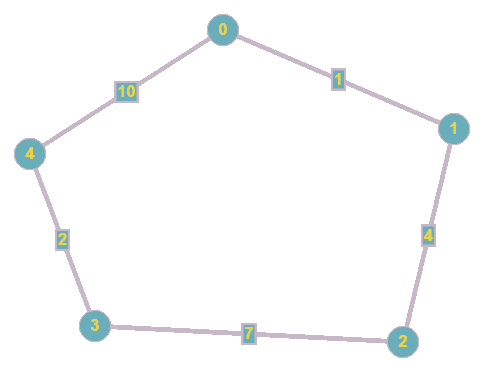
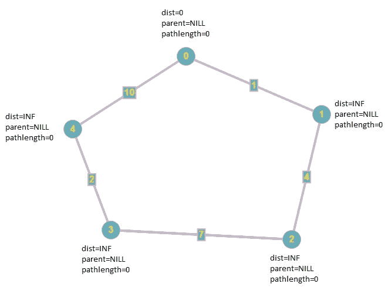
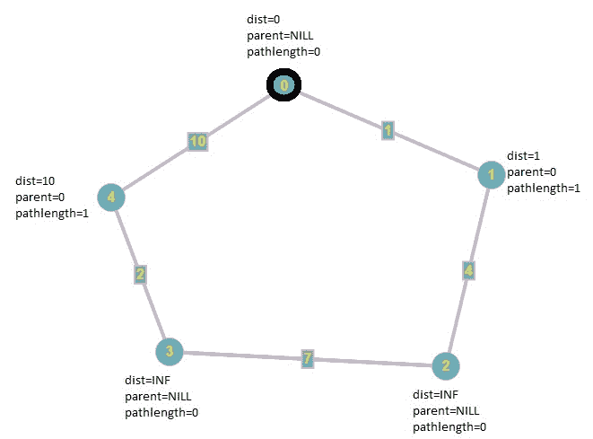
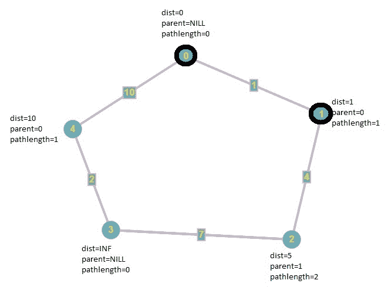
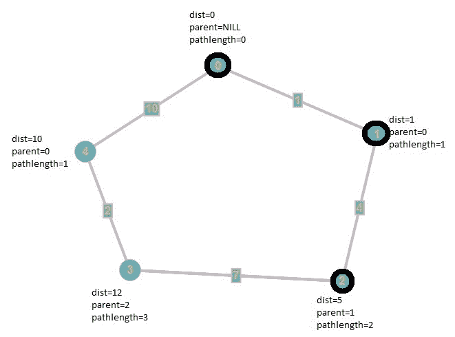
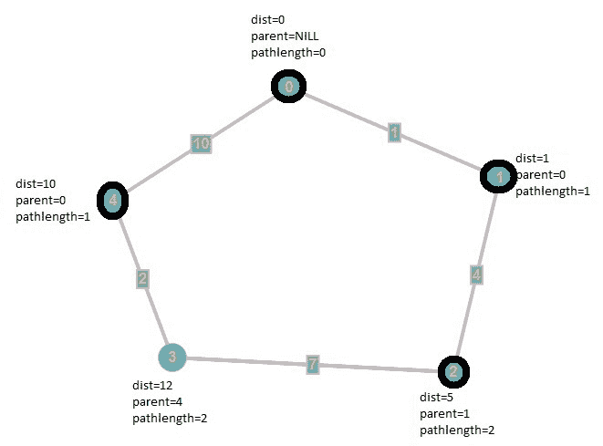

# 具有最小边的迪克斯特拉最短路径

> 原文:[https://www . geeksforgeeks . org/dijkstras-最小边最短路径/](https://www.geeksforgeeks.org/dijkstras-shortest-path-with-minimum-edges/)

**先决条件:** [迪克斯特拉最短路径算法](https://www.geeksforgeeks.org/dijkstras-shortest-path-algorithm-greedy-algo-7/)
给定一个邻接矩阵**图**表示给定图中节点之间的路径。任务是找到具有最小边的最短路径，即如果有多条具有相同成本的最短路径，则选择具有最小边数的路径。
考虑下面给出的图表:



顶点 **0** 到顶点 **3** 有两条路径，权重为 12:

1.  **0 - > 1 - > 2 - > 3**
2.  **0 - > 4 - > 3**

因为，[迪克斯特拉算法](https://www.geeksforgeeks.org/dijkstras-shortest-path-algorithm-greedy-algo-7/)是一个[贪婪算法](https://www.geeksforgeeks.org/greedy-algorithms/)在每次迭代中寻找最小加权顶点，所以原始的迪克斯特拉算法将输出第一条路径，但是结果应该是第二条路径，因为它包含最小数量的边。
**例:**

> **输入:**图形[][] = { {0，1，INFINITY，INFINITY，10}，
> {1，0，4，INFINITY，INFINITY}，
> {INFINITY，4，0，7，INFINITY}，
> {INFINITY，INFINITY，7，0，2}，
> {10，INFINITY，INFINITY，2，0 } }；
> **输出:** 0- > 4- > 3
> INFINITY 这里显示 u 和 v 不是邻居
> **输入:** graph[][] = { {0，5，INFINITY，INFINITY}，
> {5，0，5，10}，
> {INFINITY，5，0，5}，
> {INFINITY，10，5，0 } }；
> **输出:** 0- > 1- > 3

**方法:**该算法的思想是使用原始的 Dijkstra 算法，同时也通过一个数组来跟踪路径的长度，该数组存储了从源顶点开始的路径长度，所以如果我们找到了一个相同权重的较短路径，那么我们就会采用它。
我们按照上面的例子一次次迭代:
考虑我们要找到从顶点 0 到顶点 3 的最短路径
**初始状态:**所有顶点的距离和父节点分别为**无穷大**和 **NILL** 和往常一样。
但是现在，我们又多了一个名为 **pathlength[]** 的数组，它存储了从源顶点到所有顶点的路径长度。
最初，我们将**路径长度[]** 的所有元素设置为 **0** 。



**第一次迭代:**首先我们寻找包含最小距离的顶点，也就是顶点 **0** ，如上图所示。
然后，我们遍历它所有没有变黑的邻居，它们是 **1** 和 **4** 。既然顶点 **1** 和 **4** 的距离是无穷大，那么我们把它们的权重分别降低到 **1** 和 **10** 。更新父节点，将每个顶点( **1** 和 **4** )的**路径长度[]** 设置为 **1** ，因为它们可以从源顶点通过 1 条边到达。
之后，我们像最初的 Dijkstra 算法一样将顶点涂黑。



**第二次迭代:**我们继续寻找包含最小距离的非 blakened 顶点，也就是顶点 **1** ，之后我们将其邻居的权重降低到 **1 + 4 = 5** 并像原始 Dijkstra 的算法一样更新其父节点，并将其**路径长度【】**设置为 **2** ，因为它距离源顶点有两条边。
最后我们黑化顶点 **1** 。



**第三次迭代:**同样，包含最小距离的未变黑的顶点是顶点 **2** ，所以我们更新未变黑的邻居。它有一个未变黑的邻居，即顶点 **3** 。因此，我们将其权重从**无穷大**更新为 **5 + 7 = 12** ，然后将其父级设置为 **2** ，将其**路径长度【】**设置为 **3** ，因为它是从源顶点摇摆的 3 条边。
最后我们黑化顶点 **2** 。



**第四次迭代:**在本次迭代中，算法的行为与原 Dijkstra 的算法不同。我们寻找包含最小距离的非黑色顶点，即 **4** 。因为，到顶点 **3** 距离源顶点的距离是**12**(0->1->2->3)，顶点 **4** 加上边 **(4，3)** 的距离是 **12** ，这意味着我们刚刚找到了一条从相同权重的源顶点到顶点 **3** 的新路径。然后，我们检查新路径是否比现有路径短(在边上)，并选择边数最少的路径。
最后我们黑化顶点 **4** 。



由于 **V-1** 顶点变黑，算法结束。
以下是上述办法的实施情况:

## C++

```
// C++ program to find the shortest path
// with minimum edges in a graph
#include <iostream>
using namespace std;
#define INFINITY 9999
#define n 5
#define s 0
#define d 3
#define NILL -1
int MinDistance(int*, int*);
void PrintPath(int*, int);

// Function to find the shortest path
// with minimum edges in a graph
void Dijkstra(int Graph[n][n], int _n, int _s, int _d)
{

    int i, u, v, count;
    int dist[n];
    int Blackened[n] = { 0 };
    int pathlength[n] = { 0 };
    int parent[n];

    // The parent Of the source vertex is always equal to nill
    parent[_s] = NILL;

    // first, we initialize all distances to infinity.
    for (i = 0; i < n; i++)
        dist[i] = INFINITY;

    dist[_s] = 0;
    for (count = 0; count < n - 1; count++) {
        u = MinDistance(dist, Blackened);

        // if MinDistance() returns INFINITY, then the graph is not
        // connected and we have traversed all of the vertices in the
        // connected component of the source vertex, so it can reduce
        // the time complexity sometimes
        // In a directed graph, it means that the source vertex
        // is not a root
        if (u == INFINITY)
            break;
        else {

            // Mark the vertex as Blackened
            Blackened[u] = 1;
            for (v = 0; v < n; v++) {
                if (!Blackened[v] && Graph[u][v]
                    && dist[u] + Graph[u][v] < dist[v]) {
                    parent[v] = u;
                    pathlength[v] = pathlength[parent[v]] + 1;
                    dist[v] = dist[u] + Graph[u][v];
                }
                else if (!Blackened[v] && Graph[u][v]
                         && dist[u] + Graph[u][v] == dist[v]
                         && pathlength[u] + 1 < pathlength[v]) {
                    parent[v] = u;
                    pathlength[v] = pathlength[u] + 1;
                }
            }
        }
    }

    // Printing the path
    if (dist[_d] != INFINITY)
        PrintPath(parent, _d);
    else
        cout << "There is no path between vertex "
             << _s << "to vertex " << _d;
}

int MinDistance(int* dist, int* Blackened)
{
    int min = INFINITY, min_index, v;
    for (v = 0; v < n; v++)
        if (!Blackened[v] && dist[v] < min) {
            min = dist[v];
            min_index = v;
        }
    return min == INFINITY ? INFINITY : min_index;
}

// Function to print the path
void PrintPath(int* parent, int _d)
{
    if (parent[_d] == NILL) {
        cout << _d;
        return;
    }
    PrintPath(parent, parent[_d]);
    cout << "->" << _d;
}

// Driver code
int main()
{
    // INFINITY means that u and v are not neighbors.
    int Graph[n][n] = { { 0, 1, INFINITY, INFINITY, 10 },
                        { 1, 0, 4, INFINITY, INFINITY },
                        { INFINITY, 4, 0, 7, INFINITY },
                        { INFINITY, INFINITY, 7, 0, 2 },
                        { 10, INFINITY, INFINITY, 2, 0 } };
    Dijkstra(Graph, n, s, d);
    return 0;
}
```

## Java 语言(一种计算机语言，尤用于创建网站)

```
// Java program to find the shortest path
// with minimum edges in a graph
import java.io.*;
import java.util.*;

class GFG
{

    static int INFINITY = 9999, n = 5, s = 0, d = 3, NILL = -1;

    // Function to find the shortest path
    // with minimum edges in a graph
    static void Dijkstra(int[][] Graph, int _n, int _s, int _d)
    {

        int i, u, v, count;
        int[] dist = new int[n];
        int[] Blackened = new int[n];
        int[] pathlength = new int[n];
        int[] parent = new int[n];

        // The parent Of the source vertex is always equal to nill
        parent[_s] = NILL;

        // first, we initialize all distances to infinity.
        for (i = 0; i < n; i++)
            dist[i] = INFINITY;

        dist[_s] = 0;
        for (count = 0; count < n - 1; count++)
        {
            u = MinDistance(dist, Blackened);

            // if MinDistance() returns INFINITY, then the graph is not
            // connected and we have traversed all of the vertices in the
            // connected component of the source vertex, so it can reduce
            // the time complexity sometimes
            // In a directed graph, it means that the source vertex
            // is not a root
            if (u == INFINITY)
                break;
            else
            {

                // Mark the vertex as Blackened
                Blackened[u] = 1;
                for (v = 0; v < n; v++)
                {
                    if (Blackened[v] == 0 && Graph[u][v] != 0
                        && dist[u] + Graph[u][v] < dist[v])
                    {
                        parent[v] = u;
                        pathlength[v] = pathlength[parent[v]] + 1;
                        dist[v] = dist[u] + Graph[u][v];
                    }
                    else if (Blackened[v] == 0 && Graph[u][v] != 0
                            && dist[u] + Graph[u][v] == dist[v]
                            && pathlength[u] + 1 < pathlength[v])
                    {
                        parent[v] = u;
                        pathlength[v] = pathlength[u] + 1;
                    }
                }
            }
        }

        // Printing the path
        if (dist[_d] != INFINITY)
            PrintPath(parent, _d);
        else
            System.out.println("There is not path between vertex " +
                                _s + " to vertex " + _d);
    }

    static int MinDistance(int[] dist, int[] Blackened)
    {
        int min = INFINITY, min_index = -1, v;
        for (v = 0; v < n; v++)
            if (Blackened[v] == 0 && dist[v] < min)
            {
                min = dist[v];
                min_index = v;
            }
        return min == INFINITY ? INFINITY : min_index;
    }

    // Function to print the path
    static void PrintPath(int[] parent, int _d)
    {
        if (parent[_d] == NILL)
        {
            System.out.print(_d);
            return;
        }
        PrintPath(parent, parent[_d]);
        System.out.print("->" + _d);
    }

    // Driver Code
    public static void main(String[] args)
    {

        // INFINITY means that u and v are not neighbors.
        int[][] Graph = { { 0, 1, INFINITY, INFINITY, 10 },
                        { 1, 0, 4, INFINITY, INFINITY },
                        { INFINITY, 4, 0, 7, INFINITY },
                        { INFINITY, INFINITY, 7, 0, 2 },
                        { 10, INFINITY, INFINITY, 2, 0 } };
        Dijkstra(Graph, n, s, d);
    }
}

// This code is contributed by
// sanjeev2552
```

## 蟒蛇 3

```
# Python program to find the shortest path
# with minimum edges in a graph
def Dijkstra(Graph, _s, _d):
    row = len(Graph)
    col = len(Graph[0])
    dist = [float("Inf")] * row
    Blackened =[0] * row
    pathlength =[0] * row
    parent = [-1] * row
    dist[_s]= 0
    for count in range(row-1):
        u = MinDistance(dist, Blackened)

        # if MinDistance() returns INFINITY, then the graph is not
        # connected and we have traversed all of the vertices in the
        # connected component of the source vertex, so it can reduce
        # the time complexity sometimes
        # In a directed graph, it means that the source vertex
        # is not a root
        if u == float("Inf"):
            break
        else:

            # Mark the vertex as Blackened
            Blackened[u]= 1
        for v in range(row):
            if Blackened[v]== 0 and Graph[u][v] and dist[u]+Graph[u][v]<dist[v]:
                parent[v]= u
                pathlength[v]= pathlength[parent[v]]+1
                dist[v]= dist[u]+Graph[u][v]
            elif Blackened[v]== 0 and Graph[u][v] and dist[u]+Graph[u][v]== dist[v] and pathlength[u]+1<pathlength[v]:
                parent[v]= u
                pathlength[v] = pathlength[u] + 1
    if dist[_d]!= float("Inf"):

        # Printing the path
        PrintPath(parent, _d)
    else:
        print("There is no path between vertex ", _s, "to vertex ", _d)

# Function to print the path
def PrintPath(parent, _d):
    if parent[_d]==-1:
        print(_d,end='')
        return
    PrintPath(parent, parent[_d])
    print("->", _d,end='')
def MinDistance(dist, Blackened):
    min = float("Inf")
    for v in range(len(dist)):
        if not Blackened[v] and dist[v]<min:
            min = dist[v]
            Min_index = v
    return float("Inf") if min == float("Inf") else Min_index

# Driver code
# float("Inf") means that u and v are not neighbors
Graph =[[0, 1, float("Inf"), float("Inf"), 10],
       [1, 0, 4, float("Inf"), float("Inf")],
       [float("Inf"), 4, 0, 7, float("Inf")],
       [float("Inf"), float("Inf"), 7, 0, 2],
       [10, float("Inf"), float("Inf"), 2, 0]]
Dijkstra(Graph, 0, 3)
```

**Output:** 

```
0->4->3
```

**时间复杂度:** O(V^2)其中 v 是顶点数，e 是边数。
**辅助空间:** O(V + E)