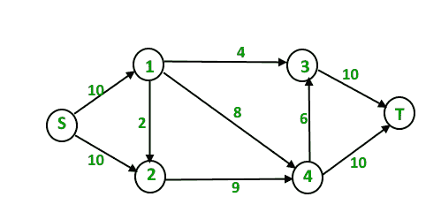
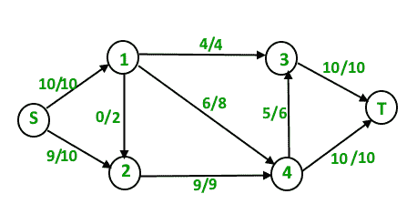
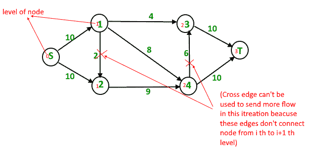
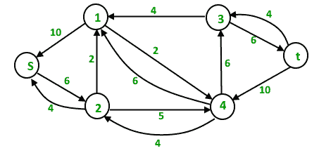
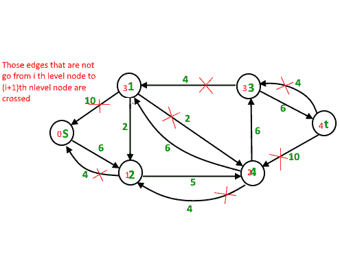
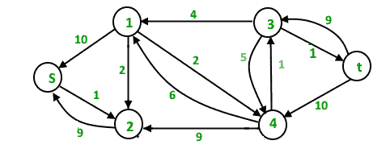

# 迪尼奇最大流量算法

> 原文:[https://www . geesforgeks . org/dinics-algorithm-maximum-flow/](https://www.geeksforgeeks.org/dinics-algorithm-maximum-flow/)

**问题陈述:**
给定一个图，该图表示每个边都有容量的流网络。同样，给定图中的两个顶点“源”和“汇”,找到从 s 到 t 的最大可能流量，并满足以下约束:

1.  边上的流量不会超过给定的边容量。
2.  除了 s 和 t，每个顶点的来流都等于出流。

例如，在以下输入图形中，



最大 s-t 流量为 19，如下所示。



**背景:**

1.  [最大流问题介绍](https://www.geeksforgeeks.org/max-flow-problem-introduction/):我们介绍了最大流问题，讨论了贪婪算法，介绍了剩余图。
2.  [福特-富尔克森算法与爱德蒙·卡普实现](https://www.geeksforgeeks.org/ford-fulkerson-algorithm-for-maximum-flow-problem/):我们讨论了福特-富尔克森算法及其实现。我们还详细讨论了剩余图。

[爱德蒙·卡普实现](https://www.geeksforgeeks.org/ford-fulkerson-algorithm-for-maximum-flow-problem/)的时间复杂度为 O(VE <sup>2</sup> )。在这篇文章中，讨论了一种新的迪尼奇算法，这是一种更快的算法，取 0(EV<sup>2</sup>)。

像爱德蒙·卡普的算法一样，迪尼奇的算法使用了以下概念:

1.  如果剩余图中没有 **s** 到 **t** 的路径，则流量最大。
2.  BFS 是循环使用的。尽管我们在两种算法中使用 BFS 的方式有所不同。

在爱德蒙的卡普算法中，我们使用 BFS 来寻找一条扩充路径，并通过这条路径发送流。在迪尼奇的算法中，我们使用 BFS 来检查是否有更多的流是可能的，并构造水平图。在**级别图**中，我们给所有节点分配级别，一个节点的级别是该节点到源的最短距离(以边数表示)。一旦构建了层次图，我们就使用这个层次图发送多个流。这就是它比爱德蒙·卡普好用的原因。在爱德蒙·卡普那里，我们只发送穿过 BFS 发现的路径的流量。

**迪尼奇算法概述:**

```
1) Initialize residual graph G as given graph.
1) Do BFS of G to construct a level graph (or
   assign levels to vertices) and also check if 
   more flow is possible.
    a) If more flow is not possible, then return.
    b) Send multiple flows in G using level graph 
       until blocking flow is reached. Here using 
 level graph means, in every flow,
       levels of path nodes should be 0, 1, 2...
       (in order) from s to t.
```

如果使用级别图不能发送更多的流，即不存在更多的 s-t 路径，使得路径顶点依次具有当前级别 0、1、2…时，流为**阻塞流**。阻塞流可以看作是在这里[讨论的贪婪算法](https://www.geeksforgeeks.org/max-flow-problem-introduction/)中的最大流径。

**图解:**
初始残差图(与给定图相同)


总流量= 0

**第一次迭代:**我们使用 BFS 为所有节点分配等级。我们还检查是否可能有更多的流(或者剩余图中是否有 s-t 路径)。



现在，我们使用级别找到阻塞流(意味着每个流路径都应该有 0、1、2、3 级别)。我们一起发送三个流。与我们一次发送一个流的埃德蒙·卡普相比，这是它被优化的地方。
路径 s–1–3–t 上的 4 个单位流量。
路径 s–1–4–t 上的 6 个单位流量。
路径 s–2–4–t 上的 4 个单位流量。
总流量=总流量+ 4 + 6 + 4 = 14
一次迭代后，残差图变为如下。



**第二次迭代:**我们使用上面修改的残差图的 BFS 向所有节点分配新的级别。我们还检查是否可能有更多的流(或者剩余图中是否有 s-t 路径)。



现在，我们使用级别找到阻塞流(意味着每个流路径都应该有 0、1、2、3、4 级别)。这次我们只能发送一个流。
路径 s–2–4–3–t 上的 5 个单位流量
总流量=总流量+ 5 = 19
新的残差图是



**第三次迭代:**我们运行 BFS 并创建一个级别图。我们还会检查是否可能有更多的流量，只有在可能的情况下才会继续。这次残差图中没有 s-t 路径，所以我们终止算法。

**实现:**
下面是 Dinic 算法的 c++实现:

## 卡片打印处理机（Card Print Processor 的缩写）

```
// C++ implementation of Dinic's Algorithm
#include<bits/stdc++.h>
using namespace std;

// A structure to represent a edge between
// two vertex
struct Edge
{
    int v ;  // Vertex v (or "to" vertex)
             // of a directed edge u-v. "From"
             // vertex u can be obtained using
             // index in adjacent array.

    int flow ; // flow of data in edge

    int C;    // capacity

    int rev ; // To store index of reverse
              // edge in adjacency list so that
              // we can quickly find it.
};

// Residual Graph
class Graph
{
    int V; // number of vertex
    int *level ; // stores level of a node
    vector< Edge > *adj;
public :
    Graph(int V)
    {
        adj = new vector<Edge>[V];
        this->V = V;
        level = new int[V];
    }

    // add edge to the graph
    void addEdge(int u, int v, int C)
    {
        // Forward edge : 0 flow and C capacity
        Edge a{v, 0, C, adj[v].size()};

        // Back edge : 0 flow and 0 capacity
        Edge b{u, 0, 0, adj[u].size()};

        adj[u].push_back(a);
        adj[v].push_back(b); // reverse edge
    }

    bool BFS(int s, int t);
    int sendFlow(int s, int flow, int t, int ptr[]);
    int DinicMaxflow(int s, int t);
};

// Finds if more flow can be sent from s to t.
// Also assigns levels to nodes.
bool Graph::BFS(int s, int t)
{
    for (int i = 0 ; i < V ; i++)
        level[i] = -1;

    level[s] = 0;  // Level of source vertex

    // Create a queue, enqueue source vertex
    // and mark source vertex as visited here
    // level[] array works as visited array also.
    list< int > q;
    q.push_back(s);

    vector<Edge>::iterator i ;
    while (!q.empty())
    {
        int u = q.front();
        q.pop_front();
        for (i = adj[u].begin(); i != adj[u].end(); i++)
        {
            Edge &e = *i;
            if (level[e.v] < 0  && e.flow < e.C)
            {
                // Level of current vertex is,
                // level of parent + 1
                level[e.v] = level[u] + 1;

                q.push_back(e.v);
            }
        }
    }

    // IF we can not reach to the sink we
    // return false else true
    return level[t] < 0 ? false : true ;
}

// A DFS based function to send flow after BFS has
// figured out that there is a possible flow and
// constructed levels. This function called multiple
// times for a single call of BFS.
// flow : Current flow send by parent function call
// start[] : To keep track of next edge to be explored.
//           start[i] stores  count of edges explored
//           from i.
//  u : Current vertex
//  t : Sink
int Graph::sendFlow(int u, int flow, int t, int start[])
{
    // Sink reached
    if (u == t)
        return flow;

    // Traverse all adjacent edges one -by - one.
    for (  ; start[u] < adj[u].size(); start[u]++)
    {
        // Pick next edge from adjacency list of u
        Edge &e = adj[u][start[u]]; 

        if (level[e.v] == level[u]+1 && e.flow < e.C)
        {
            // find minimum flow from u to t
            int curr_flow = min(flow, e.C - e.flow);

            int temp_flow = sendFlow(e.v, curr_flow, t, start);

            // flow is greater than zero
            if (temp_flow > 0)
            {
                // add flow  to current edge
                e.flow += temp_flow;

                // subtract flow from reverse edge
                // of current edge
                adj[e.v][e.rev].flow -= temp_flow;
                return temp_flow;
            }
        }
    }

    return 0;
}

// Returns maximum flow in graph
int Graph::DinicMaxflow(int s, int t)
{
    // Corner case
    if (s == t)
        return -1;

    int total = 0;  // Initialize result

    // Augment the flow while there is path
    // from source to sink
    while (BFS(s, t) == true)
    {
        // store how many edges are visited
        // from V { 0 to V }
        int *start = new int[V+1] {0};

        // while flow is not zero in graph from S to D
        while (int flow = sendFlow(s, INT_MAX, t, start))

            // Add path flow to overall flow
            total += flow;
    }

    // return maximum flow
    return total;
}

// Driver Code
int main()
{
    Graph g(6);
    g.addEdge(0, 1, 16 );
    g.addEdge(0, 2, 13 );
    g.addEdge(1, 2, 10 );
    g.addEdge(1, 3, 12 );
    g.addEdge(2, 1, 4 );
    g.addEdge(2, 4, 14);
    g.addEdge(3, 2, 9 );
    g.addEdge(3, 5, 20 );
    g.addEdge(4, 3, 7 );
    g.addEdge(4, 5, 4);

    // next exmp
    /*g.addEdge(0, 1, 3 );
      g.addEdge(0, 2, 7 ) ;
      g.addEdge(1, 3, 9);
      g.addEdge(1, 4, 9 );
      g.addEdge(2, 1, 9 );
      g.addEdge(2, 4, 9);
      g.addEdge(2, 5, 4);
      g.addEdge(3, 5, 3);
      g.addEdge(4, 5, 7 );
      g.addEdge(0, 4, 10);

     // next exp
     g.addEdge(0, 1, 10);
     g.addEdge(0, 2, 10);
     g.addEdge(1, 3, 4 );
     g.addEdge(1, 4, 8 );
     g.addEdge(1, 2, 2 );
     g.addEdge(2, 4, 9 );
     g.addEdge(3, 5, 10 );
     g.addEdge(4, 3, 6 );
     g.addEdge(4, 5, 10 ); */

    cout << "Maximum flow " << g.DinicMaxflow(0, 5);
    return 0;
}
```

**输出:**

```
Maximum flow 23
```

**时间复杂度:** O(EV <sup>2</sup> )。做一个 BFS 来构造水平图需要时间。发送多个更多的流，直到达到阻塞流需要 O(VE)时间。外环最多运行 0(伏)次。在每次迭代中，我们构造新的层次图并寻找阻塞流。可以证明每一次迭代的层数至少增加一层(证明请参考下面的参考视频)。所以外环最多运行 0(V)次。因此整体时间复杂度为 0(EV<sup>2</sup>)。

**参考文献:**
[【https://en.wikipedia.org/wiki/Dinic's_algorithm】](https://en.wikipedia.org/wiki/Dinic's_algorithm)
[【https://www.youtube.com/watch?v=uM06jHdIC70】](https://www.youtube.com/watch?v=uM06jHdIC70)
本文由 [**尼尚辛格**](https://practice.geeksforgeeks.org/user-profile.php?user=_code) 供稿。如果你喜欢 GeeksforGeeks 并想投稿，你也可以使用[write.geeksforgeeks.org](http://www.write.geeksforgeeks.org)写一篇文章或者把你的文章邮寄到 review-team@geeksforgeeks.org。看到你的文章出现在极客博客主页上，帮助其他极客。
如果发现有不正确的地方，或者想分享更多关于上述话题的信息，请写评论。