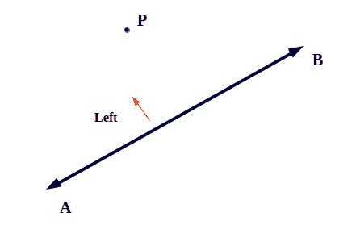
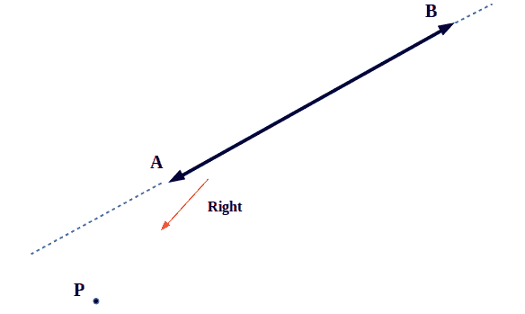
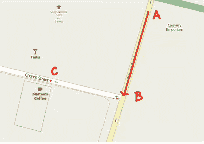
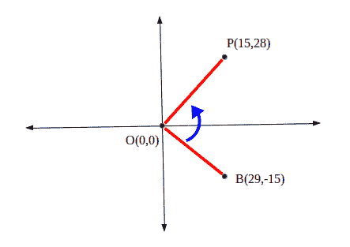
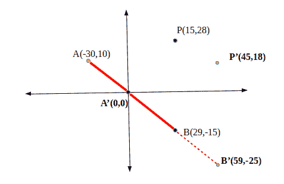

# 线段上一点的方向

> 原文:[https://www.geeksforgeeks.org/direction-point-line-segment/](https://www.geeksforgeeks.org/direction-point-line-segment/)

**给定点 P 的方向**从一条线段简单来说就是给定点 P 和线段(比如 AB)的坐标，我们要确定点 P 从线段的方向。也就是说，该点位于线段的右侧还是线段的左侧。



该点可能位于线段的后面，在这种情况下，我们通过延伸线段来假设假想线，并确定点的方向。



*只有三种情况，要么点在左侧，要么在右侧，要么在线段本身。
这是一个非常基础的问题，在**在线地图**、
**示例**中对于方向经常遇到:假设用户 A 要去下面地图中的 C 点，用户首先到达 B 点，但是之后用户 A 如何知道他是要右转还是左转。



从线段知道点的方向也是解决更复杂问题的基础，例如:

*   **线段相交**:判断两条线段是否相交
*   **一组点的凸包**。

我们将使用的坐标系是笛卡尔平面，因为大多数二维问题使用笛卡尔平面，并且因为这是二维问题。
这个问题可以用向量代数
的**叉积**来解决，两点 A 和 B 的叉积是:**A<sub>x</sub>* B<sub>y</sub>–A<sub>y</sub>* B<sub>x</sub>**
，其中 A <sub>x</sub> 和 A <sub>y</sub> 分别是 A 的 x 和 y 坐标。同样的 B <sub>x</sub> 和 B <sub>y</sub> 分别是 B 的 x 和 y 坐标。
**叉积**具有一个有趣的属性，该属性将用于从线段确定点的方向。也就是说，当且仅当原点(0，0)上的点的角度为逆时针时，两点的叉积为正。相反，当且仅当原点的角度为顺时针方向时，叉积为负。
**举个例子肯定能澄清一下**，
下图中，角度 BOP 为逆时针，B X P = 29 * 28–15 *(15)= 1037 的叉积为正。



这有助于我们得出一个结论:右边的一个点必须有正的叉积，左边的一个点必须有负的叉积。还要注意，我们假设线段的一个点是原点，因此我们需要转换任何三点系统，使得线段的一个点是原点。

**以下举例说明概念** :
将 A、B、P 三点转换为**A’、【B’**、**P’**从而使 A 为原点(这可以简单地通过从 P 点和 B 点减去 A 的坐标来完成)，然后计算出叉积:59 * 18 –(-25)* 18 = 2187
由于这是正的，P 点在线段 AB 的右侧。



## C++

```
// C++ Program to Determine Direction of Point
// from line segment
#include <iostream>
using namespace std;

// structure for point in cartesian plane.
struct point {
    int x, y;
};

// constant integers for directions
const int RIGHT = 1, LEFT = -1, ZERO = 0;

int directionOfPoint(point A, point B, point P)
{
    // subtracting co-ordinates of point A from
    // B and P, to make A as origin
    B.x -= A.x;
    B.y -= A.y;
    P.x -= A.x;
    P.y -= A.y;

    // Determining cross Product
    int cross_product = B.x * P.y - B.y * P.x;

    // return RIGHT if cross product is positive
    if (cross_product > 0)
        return RIGHT;

    // return LEFT if cross product is negative
    if (cross_product < 0)
        return LEFT;

    // return ZERO if cross product is zero. 
    return ZERO; 
}

// Driver code
int main()
{
    point A, B, P;
    A.x = -30;
    A.y = 10; // A(-30, 10)
    B.x = 29;
    B.y = -15; // B(29, -15)
    P.x = 15;
    P.y = 28; // P(15, 28)

    int direction = directionOfPoint(A, B, P);
    if (direction == 1)
        cout << "Right Direction" << endl;
    else if (direction == -1)
        cout << "Left Direction" << endl;
    else
        cout << "Point is on the Line" << endl;
    return 0;
}
```

## Java 语言(一种计算机语言，尤用于创建网站)

```
// Java Program to Determine Direction of Point
// from line segment
class GFG 
{

// structure for point in cartesian plane.
static class point 
{
    int x, y;
};

// constant integers for directions
static int RIGHT = 1, LEFT = -1, ZERO = 0;

static int directionOfPoint(point A, 
                            point B, point P)
{
    // subtracting co-ordinates of point A 
    // from B and P, to make A as origin
    B.x -= A.x;
    B.y -= A.y;
    P.x -= A.x;
    P.y -= A.y;

    // Determining cross Product
    int cross_product = B.x * P.y - B.y * P.x;

    // return RIGHT if cross product is positive
    if (cross_product > 0)
        return RIGHT;

    // return LEFT if cross product is negative
    if (cross_product < 0)
        return LEFT;

    // return ZERO if cross product is zero. 
    return ZERO; 
}

// Driver code
public static void main(String[] args) 
{
    point A = new point(), 
          B = new point(), P = new point();
    A.x = -30;
    A.y = 10; // A(-30, 10)
    B.x = 29;
    B.y = -15; // B(29, -15)
    P.x = 15;
    P.y = 28; // P(15, 28)

    int direction = directionOfPoint(A, B, P);
    if (direction == 1)
        System.out.println("Right Direction");
    else if (direction == -1)
        System.out.println("Left Direction");
    else
        System.out.println("Point is on the Line");
    }
}

// This code is contributed
// by Princi Singh
```

## 蟒蛇 3

```
# Python3 program to determine direction 
# of point from line segment

# Structure for point in cartesian plane.
class point:

    def __init__(self):

        self.x = 0
        self.y = 0

# Constant integers for directions
RIGHT = 1
LEFT = -1
ZERO = 0

def directionOfPoint(A, B, P):

    global RIGHT, LEFT, ZERO

    # Subtracting co-ordinates of 
    # point A from B and P, to 
    # make A as origin
    B.x -= A.x
    B.y -= A.y
    P.x -= A.x
    P.y -= A.y

    # Determining cross Product
    cross_product = B.x * P.y - B.y * P.x

    # Return RIGHT if cross product is positive
    if (cross_product > 0):
        return RIGHT

    # Return LEFT if cross product is negative
    if (cross_product < 0):
        return LEFT

    # Return ZERO if cross product is zero
    return ZERO

# Driver code 
if __name__=="__main__":

    A = point()
    B = point()
    P = point()

    A.x = -30
    A.y = 10 # A(-30, 10)
    B.x = 29
    B.y = -15 # B(29, -15)
    P.x = 15
    P.y = 28 # P(15, 28)

    direction = directionOfPoint(A, B, P)

    if (direction == 1):
        print("Right Direction")
    elif (direction == -1):
        print("Left Direction")
    else:
        print("Point is on the Line")

# This code is contributed by rutvik_56
```

## C#

```
// C# Program to Determine Direction of Point
// from line segment
using System;
using System.Collections.Generic;

class GFG 
{

// structure for point in cartesian plane.
public class point 
{
    public int x, y;
};

// constant integers for directions
static int RIGHT = 1, LEFT = -1, ZERO = 0;

static int directionOfPoint(point A, 
                            point B, point P)
{
    // subtracting co-ordinates of point A 
    // from B and P, to make A as origin
    B.x -= A.x;
    B.y -= A.y;
    P.x -= A.x;
    P.y -= A.y;

    // Determining cross Product
    int cross_product = B.x * P.y - B.y * P.x;

    // return RIGHT if cross product is positive
    if (cross_product > 0)
        return RIGHT;

    // return LEFT if cross product is negative
    if (cross_product < 0)
        return LEFT;

    // return ZERO if cross product is zero. 
    return ZERO; 
}

// Driver code
public static void Main(String[] args) 
{
    point A = new point(), 
          B = new point(),
          P = new point();
    A.x = -30;
    A.y = 10; // A(-30, 10)
    B.x = 29;
    B.y = -15; // B(29, -15)
    P.x = 15;
    P.y = 28; // P(15, 28)

    int direction = directionOfPoint(A, B, P);
    if (direction == 1)
        Console.WriteLine("Right Direction");
    else if (direction == -1)
        Console.WriteLine("Left Direction");
    else
        Console.WriteLine("Point is on the Line");
    }
}

// This code is contributed by 29AjayKumar
```

## java 描述语言

```
<script>

// JavaScript Program to Determine Direction of Point
// from line segment

// structure for point in cartesian plane.
class point
{
    constructor()
    {
        this.x=0;
        this.y=0;
    }
}

// constant integers for directions
let RIGHT = 1, LEFT = -1, ZERO = 0;

function directionOfPoint(A,B,P)
{
    // subtracting co-ordinates of point A
    // from B and P, to make A as origin
    B.x -= A.x;
    B.y -= A.y;
    P.x -= A.x;
    P.y -= A.y;

    // Determining cross Product
    let cross_product = B.x * P.y - B.y * P.x;

    // return RIGHT if cross product is positive
    if (cross_product > 0)
        return RIGHT;

    // return LEFT if cross product is negative
    if (cross_product < 0)
        return LEFT;

    // return ZERO if cross product is zero.
    return ZERO;
}

// Driver code
let A = new point(),
          B = new point(), P = new point();
    A.x = -30;
    A.y = 10; // A(-30, 10)
    B.x = 29;
    B.y = -15; // B(29, -15)
    P.x = 15;
    P.y = 28; // P(15, 28)

    let direction = directionOfPoint(A, B, P);
    if (direction == 1)
        document.write("Right Direction<br>");
    else if (direction == -1)
        document.write("Left Direction");
    else
        document.write("Point is on the Line");

// This code is contributed by rag2127

</script>
```

**输出:**

```
Right Direction
```

本文由 [**舒巴姆拉纳**](https://auth.geeksforgeeks.org/profile.php?user=shubham_rana_77&list=practice) 供稿。如果你喜欢 GeeksforGeeks 并想投稿，你也可以使用[write.geeksforgeeks.org](http://www.write.geeksforgeeks.org)写一篇文章或者把你的文章邮寄到 review-team@geeksforgeeks.org。看到你的文章出现在极客博客主页上，帮助其他极客。
如果发现有不正确的地方，或者想分享更多关于上述话题的信息，请写评论。