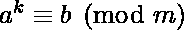
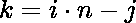
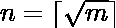
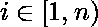
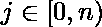
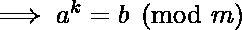
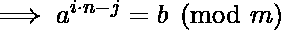
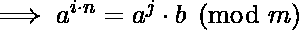
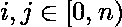

# 离散对数(求一个整数 k，使得 a^k 全等模 b)

> 原文:[https://www . geesforgeks . org/离散对数-查找-整数-k-AK-全等-模-b/](https://www.geeksforgeeks.org/discrete-logarithm-find-integer-k-ak-congruent-modulo-b/)

给定三个整数 a、b 和 m，求一个整数 **k** ，使得中的 a 和 m 是相对素数。如果任何 k 都不可能满足这个关系，打印-1。
**示例:**

```
Input: 2 3 5
Output: 3
Explanation:
a = 2, b = 3, m = 5
The value which satisfies the above equation
is 3, because 
=> 23 = 2 * 2 * 2 = 8
=> 23 (mod 5) = 8 (mod 5) 
=> 3
which is equal to b i.e., 3.

Input: 3 7 11
Output: -1
```

一种**天真的方法**是运行一个从 0 到 m 的循环，以覆盖 k 的所有可能值，并检查上述关系满足哪个 k 值。如果 k 的值都用完了，打印-1。这个方法的时间复杂度是 O(m)
一个**高效的**方法是使用[单步，巨步算法](https://en.wikipedia.org/wiki/Baby-step_giant-step)通过使用[在中间相遇的技巧](https://www.geeksforgeeks.org/meet-in-the-middle/)。

**小步巨步算法**

给定一个序为‘m’的循环群 G，该群的生成器‘a’和群元素‘b’，问题是找到一个整数‘k’，使得
*所以我们要做的(根据中间技巧中的 Meet)是将问题分成两部分*  *分别求解，然后找到碰撞。*

```
Now according to the baby-step giant-step 
algorithm, we can write 'k' as 
 with  
and  and .
Therefore, we have:

Therefore in order to solve, we precompute 
 for different values of 'i'. 
Then fix 'b' and tries values of 'j' 
In RHS of the congruence relation above. It 
tests to see if congruence is satisfied for 
any value of 'j', using precomputed 
values of LHS.  
```

我们来看看如何用上面的算法求解我们的问题:-
首先我们要写，其中显然，区间**【0，m】**中 **k** 的任意值都可以用这种形式表示，其中和
代替上面等式中的‘k’，我们得到:-




1.  术语“左”和“右”只能取 n 个不同的值作为。因此，我们需要为等式的左边或右边部分生成所有这些项，并将它们存储在数组或数据结构中，如 C/C++中的 map/无序 _map 或 java 中的 Hashmap。
2.  假设我们已经存储了 LHS 的所有价值。现在，对于 j 的不同值，迭代 RHS 上所有可能的项，并检查哪个值满足 LHS 等式。
3.  如果 j 的任何候选项都不满足上述步骤中的值，则打印-1。

## C++

```
// C++ program to calculate discrete logarithm
#include<bits/stdc++.h>
using namespace std;

/* Iterative Function to calculate (x ^ y)%p in
   O(log y) */
int powmod(int x, int y, int p)
{
    int res = 1;  // Initialize result

    x = x % p;  // Update x if it is more than or
                // equal to p

    while (y > 0)
    {
        // If y is odd, multiply x with result
        if (y & 1)
            res = (res*x) % p;

        // y must be even now
        y = y>>1; // y = y/2
        x = (x*x) % p;
    }
    return res;
}

// Function to calculate k for given a, b, m
int discreteLogarithm(int a, int b, int m) {

    int n = (int) sqrt (m) + 1;

    unordered_map<int, int> value;

    // Store all values of a^(n*i) of LHS
    for (int i = n; i >= 1; --i)
        value[ powmod (a, i * n, m) ] = i;

    for (int j = 0; j < n; ++j)
    {
        // Calculate (a ^ j) * b and check
        // for collision
        int cur = (powmod (a, j, m) * b) % m;

        // If collision occurs i.e., LHS = RHS
        if (value[cur])
        {
            int ans = value[cur] * n - j;
            // Check whether ans lies below m or not
            if (ans < m)
                return ans;
        }
    }
    return -1;
}

// Driver code
int main()
{
    int a = 2, b = 3, m = 5;
    cout << discreteLogarithm(a, b, m) << endl;

    a = 3, b = 7, m = 11;
    cout << discreteLogarithm(a, b, m);
}
```

## Java 语言(一种计算机语言，尤用于创建网站)

```
// Java program to calculate discrete logarithm

class GFG{
/* Iterative Function to calculate (x ^ y)%p in
O(log y) */
static int powmod(int x, int y, int p)
{
    int res = 1; // Initialize result

    x = x % p; // Update x if it is more than or
                // equal to p

    while (y > 0)
    {
        // If y is odd, multiply x with result
        if ((y & 1)>0)
            res = (res*x) % p;

        // y must be even now
        y = y>>1; // y = y/2
        x = (x*x) % p;
    }
    return res;
}

// Function to calculate k for given a, b, m
static int discreteLogarithm(int a, int b, int m) {

    int n = (int) (Math.sqrt (m) + 1);

    int[] value=new int[m];

    // Store all values of a^(n*i) of LHS
    for (int i = n; i >= 1; --i)
        value[ powmod (a, i * n, m) ] = i;

    for (int j = 0; j < n; ++j)
    {
        // Calculate (a ^ j) * b and check
        // for collision
        int cur = (powmod (a, j, m) * b) % m;

        // If collision occurs i.e., LHS = RHS
        if (value[cur]>0)
        {
            int ans = value[cur] * n - j;
            // Check whether ans lies below m or not
            if (ans < m)
                return ans;
        }
    }
    return -1;
}

// Driver code
public static void main(String[] args)
{
    int a = 2, b = 3, m = 5;
    System.out.println(discreteLogarithm(a, b, m));

    a = 3;
    b = 7;
    m = 11;
    System.out.println(discreteLogarithm(a, b, m));
}
}
// This code is contributed by mits
```

## 蟒蛇 3

```
# Python3 program to calculate
# discrete logarithm
import math;

# Iterative Function to calculate
# (x ^ y)%p in O(log y)
def powmod(x, y, p):

    res = 1; # Initialize result

    x = x % p; # Update x if it is more
               # than or equal to p

    while (y > 0):

        # If y is odd, multiply x with result
        if (y & 1):
            res = (res * x) % p;

        # y must be even now
        y = y >> 1; # y = y/2
        x = (x * x) % p;
    return res;

# Function to calculate k for given a, b, m
def discreteLogarithm(a, b, m):
    n = int(math.sqrt(m) + 1);

    value = [0] * m;

    # Store all values of a^(n*i) of LHS
    for i in range(n, 0, -1):
        value[ powmod (a, i * n, m) ] = i;

    for j in range(n):

        # Calculate (a ^ j) * b and check
        # for collision
        cur = (powmod (a, j, m) * b) % m;

        # If collision occurs i.e., LHS = RHS
        if (value[cur]):
            ans = value[cur] * n - j;

            # Check whether ans lies below m or not
            if (ans < m):
                return ans;

    return -1;

# Driver code
a = 2;
b = 3;
m = 5;
print(discreteLogarithm(a, b, m));

a = 3;
b = 7;
m = 11;
print(discreteLogarithm(a, b, m));

# This code is contributed by mits
```

## C#

```
// C# program to calculate discrete logarithm
using System;
class GFG{
/* Iterative Function to calculate (x ^ y)%p in
O(log y) */
static int powmod(int x, int y, int p)
{
    int res = 1; // Initialize result

    x = x % p; // Update x if it is more than or
                // equal to p

    while (y > 0)
    {
        // If y is odd, multiply x with result
        if ((y & 1)>0)
            res = (res*x) % p;

        // y must be even now
        y = y>>1; // y = y/2
        x = (x*x) % p;
    }
    return res;
}

// Function to calculate k for given a, b, m
static int discreteLogarithm(int a, int b, int m) {

    int n = (int) (Math.Sqrt (m) + 1);

    int[] value=new int[m];

    // Store all values of a^(n*i) of LHS
    for (int i = n; i >= 1; --i)
        value[ powmod (a, i * n, m) ] = i;

    for (int j = 0; j < n; ++j)
    {
        // Calculate (a ^ j) * b and check
        // for collision
        int cur = (powmod (a, j, m) * b) % m;

        // If collision occurs i.e., LHS = RHS
        if (value[cur]>0)
        {
            int ans = value[cur] * n - j;
            // Check whether ans lies below m or not
            if (ans < m)
                return ans;
        }
    }
    return -1;
}

// Driver code
static void Main()
{
    int a = 2, b = 3, m = 5;
    Console.WriteLine(discreteLogarithm(a, b, m));

    a = 3;
    b = 7;
    m = 11;
    Console.WriteLine(discreteLogarithm(a, b, m));
}
}
// This code is contributed by mits
```

## 服务器端编程语言（Professional Hypertext Preprocessor 的缩写）

```
<?php
// PHP program to calculate
// discrete logarithm

// Iterative Function to calculate
// (x ^ y)%p in O(log y)
function powmod($x, $y, $p)
{
    $res = 1; // Initialize result

    $x = $x % $p; // Update x if it is more
                  // than or equal to p

    while ($y > 0)
    {
        // If y is odd, multiply x with result
        if ($y & 1)
            $res = ($res * $x) % $p;

        // y must be even now
        $y = $y >> 1; // y = y/2
        $x = ($x * $x) % $p;
    }
    return $res;
}

// Function to calculate k for given a, b, m
function discreteLogarithm($a, $b, $m)
{
    $n = (int)sqrt($m) + 1;

    $value = array_fill(0, $m, NULL);

    // Store all values of a^(n*i) of LHS
    for ($i = $n; $i >= 1; --$i)
        $value[ powmod ($a, $i * $n, $m) ] = $i;

    for ($j = 0; $j < $n; ++$j)
    {
        // Calculate (a ^ j) * b and check
        // for collision
        $cur = (powmod ($a, $j, $m) * $b) % $m;

        // If collision occurs i.e., LHS = RHS
        if ($value[$cur])
        {
            $ans = $value[$cur] * $n - $j;

            // Check whether ans lies below m or not
            if ($ans < $m)
                return $ans;
        }
    }
    return -1;
}

// Driver code
$a = 2;
$b = 3;
$m = 5;
echo discreteLogarithm($a, $b, $m), "\n";

$a = 3;
$b = 7;
$m = 11;
echo discreteLogarithm($a, $b, $m), "\n";

// This code is contributed by ajit.
?>
```

## java 描述语言

```
<script>

    // Javascript program to calculate
    // discrete logarithm

    /* Iterative Function to
    calculate (x ^ y)%p in
    O(log y) */
    function powmod(x, y, p)
    {
        // Initialize result
        let res = 1;

        // Update x if it is more
        // than or
        // equal to p
        x = x % p;

        while (y > 0)
        {
            // If y is odd, multiply x
            // with result
            if ((y & 1)>0)
                res = (res*x) % p;

            // y must be even now
            y = y>>1; // y = y/2
            x = (x*x) % p;
        }
        return res;
    }

    // Function to calculate
    // k for given a, b, m
    function discreteLogarithm(a, b, m) {

        let n = (parseInt(Math.sqrt(m), 10) + 1);

        let value = new Array(m);
        value.fill(0);

        // Store all values of a^(n*i) of LHS
        for (let i = n; i >= 1; --i)
            value[ powmod (a, i * n, m) ] = i;

        for (let j = 0; j < n; ++j)
        {
            // Calculate (a ^ j) * b and check
            // for collision
            let cur = (powmod (a, j, m) * b) % m;

            // If collision occurs
            // i.e., LHS = RHS
            if (value[cur]>0)
            {
                let ans = value[cur] * n - j;
                // Check whether ans lies
                // below m or not
                if (ans < m)
                    return ans;
            }
        }
        return -1;
    }

    let a = 2, b = 3, m = 5;
    document.write(
    discreteLogarithm(a, b, m) + "</br>"
    );

    a = 3;
    b = 7;
    m = 11;
    document.write(
    discreteLogarithm(a, b, m) + "</br>"
    );

</script>
```

**输出:**

```
3
-1
```

**时间复杂度:** O(sqrt(m)*log(b))
**辅助空间:** O(sqrt(m))
一种可能的改进是在算法的第二阶段去掉二进制幂或 log(b)因子。这可以通过保留一个每次乘以“a”的变量作为“an”来实现。让我们看节目了解更多。

## C++

```
// C++ program to calculate discrete logarithm
#include<bits/stdc++.h>
using namespace std;

int discreteLogarithm(int a, int b, int m)
{
    int n = (int) sqrt (m) + 1;

    // Calculate a ^ n
    int an = 1;
    for (int i = 0; i<n; ++i)
        an = (an * a) % m;

    unordered_map<int, int> value;

    // Store all values of a^(n*i) of LHS
    for (int i = 1, cur = an; i<= n; ++i)
    {
        if (! value[ cur ])
            value[ cur ] = i;
        cur = (cur * an) % m;
    }

    for (int i = 0, cur = b; i<= n; ++i)
    {
        // Calculate (a ^ j) * b and check
        // for collision
        if (value[cur])
        {
            int ans = value[cur] * n - i;
            if (ans < m)
                return ans;
        }
        cur = (cur * a) % m;
    }
    return -1;
}

// Driver code
int main()
{
    int a = 2, b = 3, m = 5;
    cout << discreteLogarithm(a, b, m) << endl;

    a = 3, b = 7, m = 11;
    cout << discreteLogarithm(a, b, m);
}
```

## Java 语言(一种计算机语言，尤用于创建网站)

```
// Java program to calculate discrete logarithm

class GFG
{

    static int discreteLogarithm(int a, int b, int m)
    {
        int n = (int) (Math.sqrt (m) + 1);

        // Calculate a ^ n
        int an = 1;
        for (int i = 0; i < n; ++i)
            an = (an * a) % m;

        int[] value=new int[m];

        // Store all values of a^(n*i) of LHS
        for (int i = 1, cur = an; i <= n; ++i)
        {
            if (value[ cur ] == 0)
                value[ cur ] = i;
            cur = (cur * an) % m;
        }

        for (int i = 0, cur = b; i <= n; ++i)
        {
            // Calculate (a ^ j) * b and check
            // for collision
            if (value[cur] > 0)
            {
                int ans = value[cur] * n - i;
                if (ans < m)
                    return ans;
            }
            cur = (cur * a) % m;
        }
        return -1;
    }

    // Driver code
    public static void main(String[] args)
    {
        int a = 2, b = 3, m = 5;
        System.out.println(discreteLogarithm(a, b, m));
        a = 3;
        b = 7;
        m = 11;
        System.out.println(discreteLogarithm(a, b, m));
    }
}

// This code is contributed by mits
```

## 蟒蛇 3

```
# Python3 program to calculate
# discrete logarithm
import math;

def discreteLogarithm(a, b, m):

    n = int(math.sqrt (m) + 1);

    # Calculate a ^ n
    an = 1;
    for i in range(n):
        an = (an * a) % m;

    value = [0] * m;

    # Store all values of a^(n*i) of LHS
    cur = an;
    for i in range(1, n + 1):
        if (value[ cur ] == 0):
            value[ cur ] = i;
        cur = (cur * an) % m;

    cur = b;
    for i in range(n + 1):

        # Calculate (a ^ j) * b and check
        # for collision
        if (value[cur] > 0):
            ans = value[cur] * n - i;
            if (ans < m):
                return ans;
        cur = (cur * a) % m;

    return -1;

# Driver code
a = 2;
b = 3;
m = 5;
print(discreteLogarithm(a, b, m));

a = 3;
b = 7;
m = 11;
print(discreteLogarithm(a, b, m));

# This code is contributed by mits
```

## C#

```
// C# program to calculate discrete logarithm
using System;

class GFG
{

static int discreteLogarithm(int a, int b, int m)
{
    int n = (int) (Math.Sqrt (m) + 1);

    // Calculate a ^ n
    int an = 1;
    for (int i = 0; i < n; ++i)
        an = (an * a) % m;

    int[] value = new int[m];

    // Store all values of a^(n*i) of LHS
    for (int i = 1, cur = an; i<= n; ++i)
    {
        if (value[ cur ] == 0)
            value[ cur ] = i;
        cur = (cur * an) % m;
    }

    for (int i = 0, cur = b; i<= n; ++i)
    {
        // Calculate (a ^ j) * b and check
        // for collision
        if (value[cur] > 0)
        {
            int ans = value[cur] * n - i;
            if (ans < m)
                return ans;
        }
        cur = (cur * a) % m;
    }
    return -1;
}

// Driver code
static void Main()
{
    int a = 2, b = 3, m = 5;
    Console.WriteLine(discreteLogarithm(a, b, m));

    a = 3;
    b = 7;
    m = 11;
    Console.WriteLine(discreteLogarithm(a, b, m));
}
}

// This code is contributed by mits
```

## 服务器端编程语言（Professional Hypertext Preprocessor 的缩写）

```
<?php
// PHP program to calculate discrete logarithm

function discreteLogarithm($a, $b, $m)
{
    $n = (int)sqrt ($m) + 1;

    // Calculate a ^ n
    $an = 1;
    for ($i = 0; $i < $n; ++$i)
        $an = ($an * $a) % $m;

    $value = array_fill(0, $m, NULL);

    // Store all values of a^(n*i) of LHS
    for ($i = 1, $cur = $an; $i<= $n; ++$i)
    {
        if (! $value[ $cur ])
            $value[ $cur ] = $i;
        $cur = ($cur * $an) % $m;
    }

    for ($i = 0, $cur = $b; $i<= $n; ++$i)
    {
        // Calculate (a ^ j) * b and check
        // for collision
        if ($value[$cur])
        {
            $ans = $value[$cur] * $n - $i;
            if ($ans < $m)
                return $ans;
        }
        $cur = ($cur * $a) % $m;
    }
    return -1;
}

// Driver code
$a = 2;
$b = 3;
$m = 5;
echo discreteLogarithm($a, $b, $m), "\n";

$a = 3;
$b = 7;
$m = 11;
echo discreteLogarithm($a, $b, $m);

// This code is contributed by ajit.
?>
```

## java 描述语言

```
<script>

    // Javascript program to calculate
    // discrete logarithm

    function discreteLogarithm(a, b, m)
    {
        let n = parseInt(Math.sqrt(m), 10) + 1;

        // Calculate a ^ n
        let an = 1;
        for (let i = 0; i < n; ++i)
            an = (an * a) % m;

        let value = new Array(m);
        value.fill(0);

        // Store all values of a^(n*i) of LHS
        for (let i = 1, cur = an; i<= n; ++i)
        {
            if (value[ cur ] == 0)
                value[ cur ] = i;
            cur = (cur * an) % m;
        }

        for (let i = 0, cur = b; i<= n; ++i)
        {
            // Calculate (a ^ j) * b and check
            // for collision
            if (value[cur] > 0)
            {
                let ans = value[cur] * n - i;
                if (ans < m)
                    return ans;
            }
            cur = (cur * a) % m;
        }
        return -1;
    }

    let a = 2, b = 3, m = 5;

document.write(discreteLogarithm(a, b, m) + "</br>");

    a = 3;
    b = 7;
    m = 11;

document.write(discreteLogarithm(a, b, m));

</script>
```

**输出:**

```
3
-1
```

**时间复杂度:** O(sqrt(m))
**辅助空间:** O(sqrt(m))
**参考文献:**
[http://e-maxx-eng.appspot.com/algebra/discrete-log.html](http://e-maxx-eng.appspot.com/algebra/discrete-log.html)
[https://en.wikipedia.org/wiki/Baby-step_giant-step](https://en.wikipedia.org/wiki/Baby-step_giant-step)
本文由 [Shubham Bansal](https://www.quora.com/profile/Shubham-Bansal-209) 供稿。如果你喜欢 GeeksforGeeks 并想投稿，你也可以使用[write.geeksforgeeks.org](http://www.write.geeksforgeeks.org)写一篇文章或者把你的文章邮寄到 review-team@geeksforgeeks.org。看到你的文章出现在极客博客主页上，帮助其他极客。