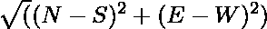

# 在指定方向上移动给定距离后从原点的位移

> 原文:[https://www . geeksforgeeks . org/指定方向上给定距离 n 次移动后的原点位移/](https://www.geeksforgeeks.org/displacement-from-origin-after-n-moves-of-given-distances-in-specified-directions/)

给定由字符**【U】****【D】****【L】****【R】**组成的[数组**A【】**，代表方向**向上****向下****向左**和**向右**，以及由 **N【组成的另一个数组**B【】** 0)** 面向**北**，在 **N 移动**后，在 **i <sup>th</sup> 移动**的地方，机器人沿**A【I】**方向移动一段距离**B【I】**。](https://www.geeksforgeeks.org/introduction-to-arrays/)

**示例:**

> **输入:** A[] = {U，R，R，R，R}，B[] = {1，1，1，0}
> **输出:** 0 北
> T6】解释:
> 最初，机器人处于(0，0)朝北。
> 第一次移动后，位置(0，1)朝北。
> 第二次移动后，位置是(1，1)朝东。
> 第三次移动后，位置(1，0)朝南。
> 第 4 次移动后，位置为(0，0)朝西。
> 第 5 次移动后，位置(0，0)朝北。
> 
> 因此，位移为 0，最终方向为北。
> 
> **输入:** A[] = {U，L，R，D，R}，B[] = {5，5，5，5，5 }
> T3】输出: 11 西

**进场:**给定问题可通过[穿越给定阵](https://www.geeksforgeeks.org/c-program-to-traverse-an-array/)并保持方向的轨迹和行进的距离在**北(N)** 、**南(S)** 、**东(E)** 、**西(W)** 方向进行求解。按照以下步骤解决问题:

*   初始化变量，比如 **N** 、 **S** 、 **E** 和 **W** ，分别存储给定一组动作后**北**、**南**、**东**和**西**方向经过的距离。
*   初始化一个变量，比如说 **P** 为**北**，它存储了执行给定的一组动作后的最终方向。
*   [同时遍历给定数组](https://www.geeksforgeeks.org/c-program-to-traverse-an-array/) **A[]** 和 **B[]** ，用当前方向更新所有方向的距离遍历值。
*   现在，垂直位移由**(N–S)**给出，水平位移由**(E–S)**给出。
*   完成上述步骤后，将最终位移打印为，最终方向存储在 **P** 中。

下面是上述方法的实现:

## C++

```
// C++ program for the above approach

#include <bits/stdc++.h>
using namespace std;

// Function to find the displacement
// from the origin and direction after
// performing the given set of moves
void finalPosition(char a[], int b[],
                   int M)
{
    // Stores the distances travelled
    // in the directions North, South,
    // East, and West respectively
    int n = 0, s = 0, e = 0, w = 0;

    // Store the initial
    // position of robot
    char p = 'N';

    // Traverse the array B[]
    for (int i = 0; i < M; i++) {

        // If the current
        // direction is North
        if (p == 'N') {

            if (a[i] == 'U') {
                p = 'N';
                n = n + b[i];
            }
            else if (a[i] == 'D') {
                p = 'S';
                s = s + b[i];
            }
            else if (a[i] == 'R') {
                p = 'E';
                e = e + b[i];
            }
            else if (a[i] == 'L') {
                p = 'W';
                w = w + b[i];
            }
        }

        // If the current
        // direction is South
        else if (p == 'S') {
            if (a[i] == 'U') {
                p = 'S';
                s = s + b[i];
            }
            else if (a[i] == 'D') {
                p = 'N';
                n = n + b[i];
            }
            else if (a[i] == 'R') {
                p = 'W';
                w = w + b[i];
            }
            else if (a[i] == 'L') {
                p = 'E';
                e = e + b[i];
            }
        }

        // If the current
        // direction is East
        else if (p == 'E') {
            if (a[i] == 'U') {
                p = 'E';
                e = e + b[i];
            }
            else if (a[i] == 'D') {
                p = 'W';
                w = w + b[i];
            }
            else if (a[i] == 'R') {
                p = 'S';
                s = s + b[i];
            }
            else if (a[i] == 'L') {
                p = 'N';
                n = n + b[i];
            }
        }

        // If the current
        // direction is West
        else if (p == 'W') {
            if (a[i] == 'U') {
                p = 'W';
                w = w + b[i];
            }
            else if (a[i] == 'D') {
                p = 'E';
                e = e + b[i];
            }
            else if (a[i] == 'R') {
                p = 'N';
                n = n + b[i];
            }
            else if (a[i] == 'L') {
                p = 'S';
                s = s + b[i];
            }
        }
    }

    // Stores the total
    // vertical displacement
    int ver_disp = n - s;

    // Stores the total
    // horizontal displacement
    int hor_disp = e - w;

    // Find the displacement
    int displacement = floor(
        sqrt((ver_disp * ver_disp)
             + (hor_disp * hor_disp)));

    // Print the displacement and
    // direction after N moves
    cout << displacement << " " << p;
}

// Driver Code
int main()
{
    char A[] = { 'U', 'R', 'R', 'R', 'R' };
    int B[] = { 1, 1, 1, 1, 0 };

    int N = sizeof(A) / sizeof(B[0]);

    finalPosition(A, B, N);

    return 0;
}
```

## Java 语言(一种计算机语言，尤用于创建网站)

```
// Java program for the above approach
class GFG{

// Function to find the displacement
// from the origin and direction after
// performing the given set of moves
static void finalPosition(char[] a, int[] b, int M)
{

    // Stores the distances travelled
    // in the directions North, South,
    // East, and West respectively
    int n = 0, s = 0, e = 0, w = 0;

    // Store the initial
    // position of robot
    char p = 'N';

    // Traverse the array B[]
    for(int i = 0; i < M; i++)
    {

        // If the current
        // direction is North
        if (p == 'N')
        {
            if (a[i] == 'U')
            {
                p = 'N';
                n = n + b[i];
            }
            else if (a[i] == 'D')
            {
                p = 'S';
                s = s + b[i];
            }
            else if (a[i] == 'R')
            {
                p = 'E';
                e = e + b[i];
            }
            else if (a[i] == 'L')
            {
                p = 'W';
                w = w + b[i];
            }
        }

        // If the current
        // direction is South
        else if (p == 'S')
        {
            if (a[i] == 'U')
            {
                p = 'S';
                s = s + b[i];
            }
            else if (a[i] == 'D')
            {
                p = 'N';
                n = n + b[i];
            }
            else if (a[i] == 'R')
            {
                p = 'W';
                w = w + b[i];
            }
            else if (a[i] == 'L')
            {
                p = 'E';
                e = e + b[i];
            }
        }

        // If the current
        // direction is East
        else if (p == 'E')
        {
            if (a[i] == 'U')
            {
                p = 'E';
                e = e + b[i];
            }
            else if (a[i] == 'D')
            {
                p = 'W';
                w = w + b[i];
            }
            else if (a[i] == 'R')
            {
                p = 'S';
                s = s + b[i];
            }
            else if (a[i] == 'L')
            {
                p = 'N';
                n = n + b[i];
            }
        }

        // If the current
        // direction is West
        else if (p == 'W')
        {
            if (a[i] == 'U')
            {
                p = 'W';
                w = w + b[i];
            }
            else if (a[i] == 'D')
            {
                p = 'E';
                e = e + b[i];
            }
            else if (a[i] == 'R')
            {
                p = 'N';
                n = n + b[i];
            }
            else if (a[i] == 'L')
            {
                p = 'S';
                s = s + b[i];
            }
        }
    }

    // Stores the total
    // vertical displacement
    int ver_disp = n - s;

    // Stores the total
    // horizontal displacement
    int hor_disp = e - w;

    // Find the displacement
    int displacement = (int)Math.ceil(Math.sqrt(
        (ver_disp * ver_disp) + (hor_disp * hor_disp)));

    // Print the displacement and
    // direction after N moves
    System.out.print(displacement + " " + p);
}

// Driver Code
public static void main(String args[])
{
    char[] A = { 'U', 'R', 'R', 'R', 'R' };
    int[] B = { 1, 1, 1, 1, 0 };
    int N = 1;

    finalPosition(A, B, N);
}
}

// This code is contributed by abhinavjain194
```

## 蟒蛇 3

```
# Python3 program for the above approach
from math import sqrt, floor

# Function to find the displacement
# from the origin and direction after
# performing the given set of moves
def finalPosition(a, b, M):

    # Stores the distances travelled
    # in the directions North, South,
    # East, and West respectively
    n = 0
    s = 0
    e = 0
    w = 0

    # Store the initial
    # position of robot
    p = 'N'

    # Traverse the array B[]
    for i in range(M):

        # If the current
        # direction is North
        if (p == 'N'):
            if (a[i] == 'U'):
                p = 'N'
                n = n + b[i]
            elif (a[i] == 'D'):
                p = 'S'
                s = s + b[i]
            elif (a[i] == 'R'):
                p = 'E'
                e = e + b[i]
            elif (a[i] == 'L'):
                p = 'W'
                w = w + b[i]

        # If the current
        # direction is South
        elif (p == 'S'):
            if (a[i] == 'U'):
                p = 'S'
                s = s + b[i]
            elif(a[i] == 'D'):
                p = 'N'
                n = n + b[i]
            elif(a[i] == 'R'):
                p = 'W'
                w = w + b[i]
            elif(a[i] == 'L'):
                p = 'E'
                e = e + b[i]

        # If the current
        # direction is East
        elif(p == 'E'):
            if (a[i] == 'U'):
                p = 'E'
                e = e + b[i]
            elif (a[i] == 'D'):
                p = 'W'
                w = w + b[i]
            elif (a[i] == 'R'):
                p = 'S'
                s = s + b[i]
            elif (a[i] == 'L'):
                p = 'N'
                n = n + b[i]

        # If the current
        # direction is West
        elif (p == 'W'):
            if (a[i] == 'U'):
                p = 'W'
                w = w + b[i]
            elif (a[i] == 'D'):
                p = 'E'
                e = e + b[i]
            elif (a[i] == 'R'):
                p = 'N'
                n = n + b[i]
            elif (a[i] == 'L'):
                p = 'S'
                s = s + b[i]

    # Stores the total
    # vertical displacement
    ver_disp = n - s

    # Stores the total
    # horizontal displacement
    hor_disp = e - w

    # Find the displacement
    displacement = floor(sqrt((ver_disp * ver_disp) +
                              (hor_disp * hor_disp)) + 1)

    # Print the displacement and
    # direction after N moves
    print(displacement,p)

# Driver Code
if __name__ == '__main__':

    A = [ 'U', 'R', 'R', 'R', 'R' ]
    B = [ 1, 1, 1, 1, 0 ]
    N = len(A)

    finalPosition(A, B, N)

# This code is contributed by ipg2016107
```

## C#

```
// C# program for the above approach
using System;

class GFG{

// Function to find the displacement
// from the origin and direction after
// performing the given set of moves
static void finalPosition(char[] a, int[] b, int M)
{

    // Stores the distances travelled
    // in the directions North, South,
    // East, and West respectively
    int n = 0, s = 0, e = 0, w = 0;

    // Store the initial
    // position of robot
    char p = 'N';

    // Traverse the array B[]
    for(int i = 0; i < M; i++)
    {

        // If the current
        // direction is North
        if (p == 'N')
        {
            if (a[i] == 'U')
            {
                p = 'N';
                n = n + b[i];
            }
            else if (a[i] == 'D')
            {
                p = 'S';
                s = s + b[i];
            }
            else if (a[i] == 'R')
            {
                p = 'E';
                e = e + b[i];
            }
            else if (a[i] == 'L')
            {
                p = 'W';
                w = w + b[i];
            }
        }

        // If the current
        // direction is South
        else if (p == 'S')
        {
            if (a[i] == 'U')
            {
                p = 'S';
                s = s + b[i];
            }
            else if (a[i] == 'D')
            {
                p = 'N';
                n = n + b[i];
            }
            else if (a[i] == 'R')
            {
                p = 'W';
                w = w + b[i];
            }
            else if (a[i] == 'L')
            {
                p = 'E';
                e = e + b[i];
            }
        }

        // If the current
        // direction is East
        else if (p == 'E')
        {
            if (a[i] == 'U')
            {
                p = 'E';
                e = e + b[i];
            }
            else if (a[i] == 'D')
            {
                p = 'W';
                w = w + b[i];
            }
            else if (a[i] == 'R')
            {
                p = 'S';
                s = s + b[i];
            }
            else if (a[i] == 'L')
            {
                p = 'N';
                n = n + b[i];
            }
        }

        // If the current
        // direction is West
        else if (p == 'W')
        {
            if (a[i] == 'U')
            {
                p = 'W';
                w = w + b[i];
            }
            else if (a[i] == 'D')
            {
                p = 'E';
                e = e + b[i];
            }
            else if (a[i] == 'R')
            {
                p = 'N';
                n = n + b[i];
            }
            else if (a[i] == 'L')
            {
                p = 'S';
                s = s + b[i];
            }
        }
    }

    // Stores the total
    // vertical displacement
    int ver_disp = n - s;

    // Stores the total
    // horizontal displacement
    int hor_disp = e - w;

    // Find the displacement
    int displacement = (int)Math.Ceiling(Math.Sqrt(
        (ver_disp * ver_disp) + (hor_disp * hor_disp)));

    // Print the displacement and
    // direction after N moves
    Console.WriteLine(displacement + " " + p);
}

// Driver Code
public static void Main()
{
    char[] A = { 'U', 'R', 'R', 'R', 'R' };
    int[] B = { 1, 1, 1, 1, 0 };
    int N = 1;

    finalPosition(A, B, N);
}
}

// This code is contributed by ukasp
```

## java 描述语言

```
<script>
    // Javascript program for the above approach

    // Function to find the displacement
    // from the origin and direction after
    // performing the given set of moves
    function finalPosition(a, b, M)
    {

        // Stores the distances travelled
        // in the directions North, South,
        // East, and West respectively
        let n = 0, s = 0, e = 0, w = 0;

        // Store the initial
        // position of robot
        let p = 'N';

        // Traverse the array B[]
        for(let i = 0; i < M; i++)
        {

            // If the current
            // direction is North
            if (p == 'N')
            {
                if (a[i] == 'U')
                {
                    p = 'N';
                    n = n + b[i];
                }
                else if (a[i] == 'D')
                {
                    p = 'S';
                    s = s + b[i];
                }
                else if (a[i] == 'R')
                {
                    p = 'E';
                    e = e + b[i];
                }
                else if (a[i] == 'L')
                {
                    p = 'W';
                    w = w + b[i];
                }
            }

            // If the current
            // direction is South
            else if (p == 'S')
            {
                if (a[i] == 'U')
                {
                    p = 'S';
                    s = s + b[i];
                }
                else if (a[i] == 'D')
                {
                    p = 'N';
                    n = n + b[i];
                }
                else if (a[i] == 'R')
                {
                    p = 'W';
                    w = w + b[i];
                }
                else if (a[i] == 'L')
                {
                    p = 'E';
                    e = e + b[i];
                }
            }

            // If the current
            // direction is East
            else if (p == 'E')
            {
                if (a[i] == 'U')
                {
                    p = 'E';
                    e = e + b[i];
                }
                else if (a[i] == 'D')
                {
                    p = 'W';
                    w = w + b[i];
                }
                else if (a[i] == 'R')
                {
                    p = 'S';
                    s = s + b[i];
                }
                else if (a[i] == 'L')
                {
                    p = 'N';
                    n = n + b[i];
                }
            }

            // If the current
            // direction is West
            else if (p == 'W')
            {
                if (a[i] == 'U')
                {
                    p = 'W';
                    w = w + b[i];
                }
                else if (a[i] == 'D')
                {
                    p = 'E';
                    e = e + b[i];
                }
                else if (a[i] == 'R')
                {
                    p = 'N';
                    n = n + b[i];
                }
                else if (a[i] == 'L')
                {
                    p = 'S';
                    s = s + b[i];
                }
            }
        }

        // Stores the total
        // vertical displacement
        let ver_disp = n - s;

        // Stores the total
        // horizontal displacement
        let hor_disp = e - w;

        // Find the displacement
        let displacement = Math.ceil(Math.sqrt(
            (ver_disp * ver_disp) + (hor_disp * hor_disp)));

        // Print the displacement and
        // direction after N moves
        document.write(displacement + " " + p);
    }

    let A = [ 'U', 'R', 'R', 'R', 'R' ];
    let B = [ 1, 1, 1, 1, 0 ];
    let N = 1;

    finalPosition(A, B, N);

// This code is contributed by suresh07.
</script>
```

**Output:** 

```
1 N
```

***时间复杂度:**O(N)*
T5**辅助空间:** O(1)