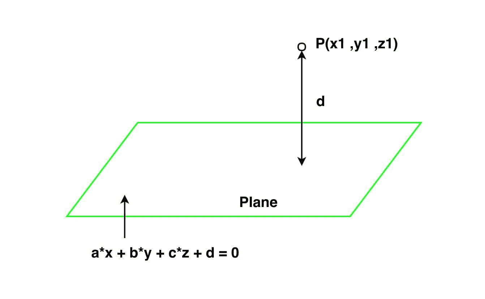

# 三维中点与平面的距离

> 原文:[https://www . geesforgeks . org/三维点面距离/](https://www.geeksforgeeks.org/distance-between-a-point-and-a-plane-in-3-d/)

给你一个点(x1，y1，z1)和一个平面 a * x + b * y + c * z + d = 0。任务是找到该点和给定平面之间的垂直(最短)距离。



**例:**

> **输入:** x1 = 4，y1 = -4，z1 = 3，a = 2，b = -2，c = 5，d = 8
> **输出:**垂直距离为 6.78902858227
> **输入:** x1 = 2，y1 = 8，z1 = 5，a = 1，b = -2，c = -2，d = -1
> **输出:**垂直距离为 8.3333333

**方法:**从给定点到平面的垂直距离(即最短距离)是从该点到给定平面的垂直距离。设给定点的坐标为(x1，y1，z1)
，平面方程由方程 a * x + b * y + c * z + d = 0 给出，其中 a，b，c 为实常数。
三维中点与平面的距离公式如下:

```
Distance = (| a*x1 + b*y1 + c*z1 + d |) / (sqrt( a*a + b*b + c*c))
```

以下是上述公式的实现:

## C++

```
// C++ program to find the
// Perpendicular(shortest)
// distance between a point
// and a Plane in 3 D.
#include<bits/stdc++.h>
#include<math.h>

using namespace std;

// Function to find distance
void shortest_distance(float x1, float y1,
                       float z1, float a,
                       float b, float c,
                       float d)
{
    d = fabs((a * x1 + b * y1 +
              c * z1 + d));
    float e = sqrt(a * a + b *
                   b + c * c);
    cout << "Perpendicular distance is "
         << (d / e);
        return;
}

// Driver Code
int main()
{
    float x1 = 4;
    float y1 = -4;
    float z1 = 3;
    float a = 2;
    float b = -2;
    float c = 5;
    float d = 8;

    // Function call
    shortest_distance(x1, y1, z1,
                      a, b, c, d);
}

// This code is contributed
// by Akanksha Rai(Abby_akku)
```

## C

```
// C program to find the Perpendicular(shortest)
// distance between a point and a Plane in 3 D.

#include<stdio.h>
#include<math.h>

// Function to find distance
void shortest_distance(float x1, float y1, float z1,
                    float a, float b, float c, float d)
{
    d = fabs((a * x1 + b * y1 + c * z1 + d));
    float e = sqrt(a * a + b * b + c * c);
    printf("Perpendicular distance is %f", d/e);
        return;
}

// Driver Code
int main()
{
    float x1 = 4;
    float y1 = -4;
    float z1 = 3;
    float a = 2;
    float b = -2;
    float c = 5;
    float d = 8;

    // Function call
    shortest_distance(x1, y1, z1, a, b, c, d);
}
// This code is contributed
// by Amber_Saxena.
```

## Java 语言(一种计算机语言，尤用于创建网站)

```
// Java program to find the
// Perpendicular(shortest)
// distance between a point
// and a Plane in 3 D.
import java .io.*;

class GFG
{

// Function to find distance
static void shortest_distance(float x1, float y1,
                              float z1, float a,
                              float b, float c,
                              float d)
{
    d = Math.abs((a * x1 + b *
                 y1 + c * z1 + d));
    float e = (float)Math.sqrt(a * a + b *
                               b + c * c);
    System.out.println("Perpendicular distance " +
                                   "is " + d / e);
}

// Driver code
public static void main(String[] args)
{
    float x1 = 4;
    float y1 = -4;
    float z1 = 3;
    float a = 2;
    float b = -2;
    float c = 5;
    float d = 8;

    // Function call
    shortest_distance(x1, y1, z1,
                      a, b, c, d);
}
}

// This code is contributed
// by Amber_Saxena.
```

## 计算机编程语言

```
# Python program to find the Perpendicular(shortest)
# distance between a point and a Plane in 3 D.

import math

# Function to find distance
def shortest_distance(x1, y1, z1, a, b, c, d):

    d = abs((a * x1 + b * y1 + c * z1 + d))
    e = (math.sqrt(a * a + b * b + c * c))
    print("Perpendicular distance is", d/e)

# Driver Code
x1 = 4
y1 = -4
z1 = 3
a = 2
b = -2
c = 5
d = 8

# Function call
shortest_distance(x1, y1, z1, a, b, c, d)     
```

## C#

```
// C# program to find the
// Perpendicular(shortest)
// distance between a point
// and a Plane in 3 D.
using System;

class GFG
{

// Function to find distance
static void shortest_distance(float x1, float y1,
                              float z1, float a,
                              float b, float c,
                              float d)
{
    d = Math.Abs((a * x1 + b *
                   y1 + c * z1 + d));
    float e = (float)Math.Sqrt(a * a + b *
                               b + c * c);
    Console.Write("Perpendicular distance " +
                              "is " + d / e);
}

// Driver code
public static void Main()
{
    float x1 = 4;
    float y1 = -4;
    float z1 = 3;
    float a = 2;
    float b = -2;
    float c = 5;
    float d = 8;

    // Function call
    shortest_distance(x1, y1, z1,
                      a, b, c, d);
}
}

// This code is contributed
// by ChitraNayal
```

## 服务器端编程语言（Professional Hypertext Preprocessor 的缩写）

```
<?php
// PHP program to find the
// Perpendicular(shortest)
// distance between a point
// and a Plane in 3 D.

// Function to find distance
function shortest_distance($x1, $y1, $z1,
                           $a, $b, $c, $d)
{
    $d = abs(($a * $x1 + $b * $y1 +
              $c * $z1 + $d));
    $e = sqrt($a * $a + $b *
              $b + $c * $c);
    echo "Perpendicular distance is ". $d / $e;
}

// Driver Code
$x1 = 4;
$y1 = -4;
$z1 = 3;
$a = 2;
$b = -2;
$c = 5;
$d = 8;

// function call
shortest_distance($x1, $y1, $z1,
                  $a, $b, $c, $d);

// This code is contributed
// by Amber_Saxena.
?>
```

## java 描述语言

```
<script>

// Javascript program to find the
// Perpendicular(shortest)
// distance between a point
// and a Plane in 3 D.

// Function to find distance
function shortest_distance( x1,  y1, z1,  a,
                        b,  c, d)
{
    d = Math.abs((a * x1 + b * y1 +
              c * z1 + d));
    let e = Math.sqrt(a * a + b *
                   b + c * c);
    document.write("Perpendicular distance is "
         + (d / e));
        return;
}

    // driver code    
    let x1 = 4;
    let y1 = -4;
    let z1 = 3;
    let a = 2;
    let b = -2;
    let c = 5;
    let d = 8;

    // Function call
    shortest_distance(x1, y1, z1,
                      a, b, c, d);

 // This code is contributed by jana_sayantan.  
</script>
```

**Output:** 

```
Perpendicular distance is 6.78902858227
```