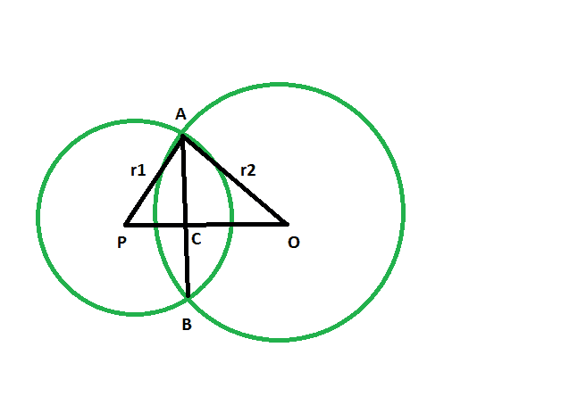

# 给定半径和公共弦长时，两个相交圆中心之间的距离

> 原文:[https://www . geeksforgeeks . org/两个相交圆的圆心之间的距离-如果给定半径和公共弦长/](https://www.geeksforgeeks.org/distance-between-centers-of-two-intersecting-circles-if-the-radii-and-common-chord-length-is-given/)

给定有给定半径的两个圆，这两个圆相交并有一个共同的弦。给出了公共弦的长度。任务是找到两个圆的中心之间的距离。

**示例:**

```
Input:  r1 = 24, r2 = 37, x = 40
Output: 44

Input: r1 = 14, r2 = 7, x = 10
Output: 17

```

[](https://media.geeksforgeeks.org/wp-content/uploads/20190525145943/Untitled134.png)

**接近**:

*   让普通和弦的长度 **AB** = **x**
*   让圆心为 **O 的圆的半径为 **OA** = **r2****
*   圆心为 **P** 的圆半径为 **AP** = **r1**
*   从图上看， **OP** 是垂直的**AB**T4**AC = CB**T7**AC = x/2**(自 AB = x)
*   在三角形中**ACP**
    **ap^2 = pc^2+ ac^2**【通过勾股定理】
    **r1^2 = pc^2+(x/2)^2**
    **pc^2 = r1^2–x^2/4**
*   考虑三角形**ACO**
    **r2^2 = oc^2+ ac^2**【通过勾股定理】
    **r2^2 = oc^2+(x/2)^2**
    **oc^2 = r2^2–x^2/4**
*   From the figure, **OP = OC + PC**
    **OP = √( r1^2 – x^2/4 ) + √(r2^2 – x^2/4)**

    > **中心之间的距离= sqrt ((一个 circle)^2 的半径–(公共弦)^2 长度的一半)+ sqrt ((第二个 circle)^2 的半径–(公共弦)^2 长度的一半)**)

    以下是上述方法的实现:

    ## C++

    ```
    // C++ program to find
    // the distance between centers
    // of two intersecting circles
    // if the radii and common chord length is given

    #include <bits/stdc++.h>
    using namespace std;

    void distcenter(int r1, int r2, int x)
    {
        int z = sqrt((r1 * r1)
                     - (x / 2 * x / 2))
                + sqrt((r2 * r2)
                       - (x / 2 * x / 2));

        cout << "distance between the"
             << " centers is "
             << z << endl;
    }

    // Driver code
    int main()
    {
        int r1 = 24, r2 = 37, x = 40;
        distcenter(r1, r2, x);
        return 0;
    }
    ```

    ## Java 语言(一种计算机语言，尤用于创建网站)

    ```
    // Java program to find
    // the distance between centers
    // of two intersecting circles
    // if the radii and common chord length is given
    import java.lang.Math; 
    import java.io.*;

    class GFG {

    static double distcenter(int r1, int r2, int x)
    {
        double z = (Math.sqrt((r1 * r1)
                    - (x / 2 * x / 2)))
                + (Math.sqrt((r2 * r2)
                    - (x / 2 * x / 2)));

        System.out.println ("distance between the" +
                            " centers is "+ (int)z );
        return 0;
    }

    // Driver code
    public static void main (String[] args) 
    {
        int r1 = 24, r2 = 37, x = 40;
        distcenter(r1, r2, x);
    }
    }

    // This code is contributed by jit_t.
    ```

    ## 蟒蛇 3

    ```

    # Python program to find
    # the distance between centers
    # of two intersecting circles
    # if the radii and common chord length is given

    def distcenter(r1, r2, x):
        z = (((r1 * r1) - (x / 2 * x / 2))**(1/2)) +\
        (((r2 * r2)- (x / 2 * x / 2))**(1/2));

        print("distance between thecenters is ",end="");
        print(int(z));

    # Driver code
    r1 = 24; r2 = 37; x = 40;
    distcenter(r1, r2, x);

    # This code has been contributed by 29AjayKumar
    ```

    ## C#

    ```
    // C# program to find
    // the distance between centers
    // of two intersecting circles
    // if the radii and common chord length is given
    using System;

    class GFG
    {

    static double distcenter(int r1, int r2, int x)
    {
        double z = (Math.Sqrt((r1 * r1)
                    - (x / 2 * x / 2)))
                + (Math.Sqrt((r2 * r2)
                    - (x / 2 * x / 2)));

        Console.WriteLine("distance between the" +
                            " centers is "+ (int)z );
        return 0;
    }

    // Driver code
    static public void Main ()
    {
        int r1 = 24, r2 = 37, x = 40;
        distcenter(r1, r2, x);
    }
    }

    // This code is contributed by jit_t
    ```

    **Output:**

    ```
    distance between the centers is 44

    ```