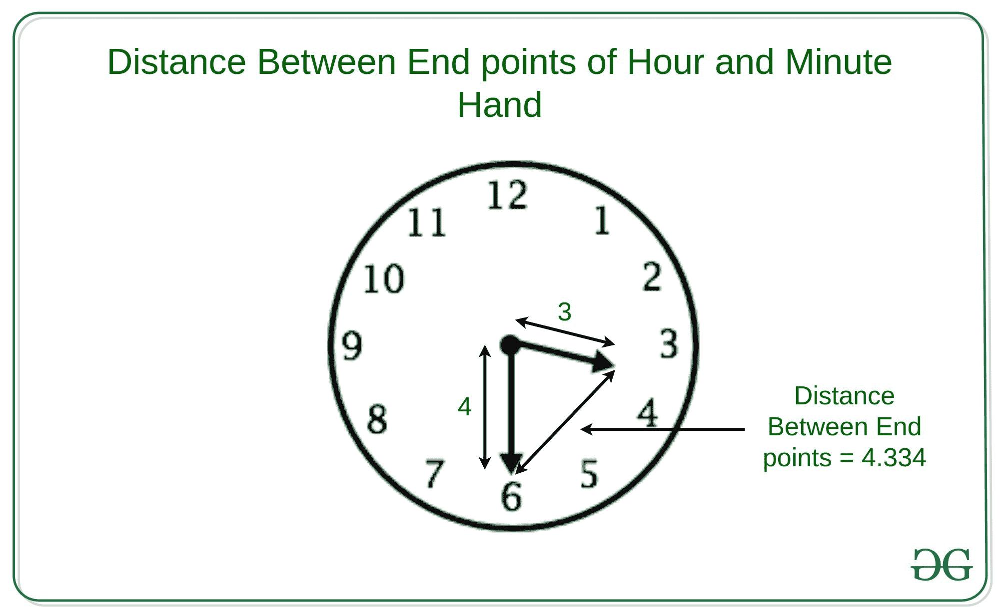

# 给定时间时针和分针端点之间的距离

> 原文:[https://www . geeksforgeeks . org/给定时间的小时和分钟结束点之间的距离/](https://www.geeksforgeeks.org/distance-between-end-points-of-hour-and-minute-hand-at-given-time/)

给定四个整数 **H** 、 **M** 、 **L1** 和 **L2** ，在 12 小时制的时钟中表示时间为小时和分钟，L1 和 L2 分别表示时针和分针的长度。任务是找出时针和分针端点之间的距离。
**举例:**

> **输入:** H = 3，M = 30，L1 = 3，L2 = 4
> **输出:** 4.33499
> **说明:**
> 3:30 时针终点与分针的距离为 4.33499
> 
> 
> 
> **输入:** H = 10，M = 30，L1 = 3，L2 = 4
> **输出:** 6.47898
> **说明:**
> 10:30 时针终点与分针的距离为 6.47898

**方法:**思路是在给定时间找到时针和分针之间的[角](https://www.geeksforgeeks.org/calculate-angle-hour-hand-minute-hand/)，然后借助[余弦公式](https://www.geeksforgeeks.org/program-find-third-side-triangle-using-law-cosines/)–
计算时针和分针端点之间的距离

> 时针和分针端点之间的距离=
> 
> 

以下是上述方法的实现:

## C++

```
// C++ implementation to find the
// distance between the end points
// of the hour and minute hand

#include <bits/stdc++.h>
using namespace std;

// Function to find the angle between
// Hour hand and minute hand
int calcAngle(double h, double m)
{
    // Validate the input
    if (h < 0 || m < 0
        || h > 12 || m > 60)
        printf("Wrong input");

    if (h == 12)
        h = 0;
    if (m == 60)
        m = 0;

    // Calculate the angles moved
    // by hour and minute hands
    // with reference to 12:00
    int hour_angle = 0.5 * (h * 60 + m);
    int minute_angle = 6 * m;

    // Find the difference
    // between two angles
    int angle = abs(hour_angle - minute_angle);

    // Return the smaller angle
    // of two possible angles
    angle = min(360 - angle, angle);

    return angle;
}

// Function to calculate
// cos value of angle c
float cal_cos(float n)
{
    float accuracy = 0.0001, x1,
          denominator, cosx, cosval;

    // Converting degrees to radian
    n = n * (3.142 / 180.0);

    x1 = 1;

    // Maps the sum
    // along the series
    cosx = x1;

    // Holds the actual
    // value of sin(n)
    cosval = cos(n);
    int i = 1;
    do {
        denominator = 2 * i * (2 * i - 1);
        x1 = -x1 * n * n / denominator;
        cosx = cosx + x1;
        i = i + 1;
    } while (accuracy <= fabs(cosval - cosx));

    return cosx;
}

// Function to distance between the
// endpoints of the hour and minute hand
float distanceEndpoints(
    int a, int b, float c)
{
    float angle = cal_cos(c);
    return sqrt((a * a)
                + (b * b)
                - 2 * a * b * angle);
}

// Driver Code
int main()
{
    // Time
    int hour = 3;
    int min = 30;

    // Length of
    // hour hand
    int hourHand = 3;

    // Length of
    // minute hand
    int minHand = 4;

    // calling Function for
    // finding angle
    // between hour hand
    // and minute hand
    double angle = calcAngle(hour, min);

    // Function for finding
    // distance between
    // end points of minute
    // hand and hour hand
    float distance = distanceEndpoints(
        minHand, hourHand, angle);
    cout << distance;
    return 0;
}
```

## Java 语言(一种计算机语言，尤用于创建网站)

```
// Java implementation to find the
// distance between the end points
// of the hour and minute hand
class GFG{

// Function to find the angle between
// Hour hand and minute hand
static int calcAngle(double h, double m)
{

    // Validate the input
    if (h < 0 || m < 0 ||
        h > 12 || m > 60)
        System.out.printf("Wrong input");

    if (h == 12)
        h = 0;
    if (m == 60)
        m = 0;

    // Calculate the angles moved
    // by hour and minute hands
    // with reference to 12:00
    int hour_angle = (int)(0.5 * (h * 60 + m));
    int minute_angle = (int)(6 * m);

    // Find the difference
    // between two angles
    int angle = Math.abs(hour_angle -
                         minute_angle);

    // Return the smaller angle
    // of two possible angles
    angle = Math.min(360 - angle, angle);

    return angle;
}

// Function to calculate
// cos value of angle c
static float cal_cos(float n)
{
    float accuracy = (float) 0.0001, x1,
                            denominator,
                           cosx, cosval;

    // Converting degrees to radian
    n = (float)(n * (3.142 / 180.0));

    x1 = 1;

    // Maps the sum along
    // the series
    cosx = x1;

    // Holds the actual
    // value of sin(n)
    cosval = (float)Math.cos(n);
    int i = 1;

    do
    {
        denominator = 2 * i * (2 * i - 1);
        x1 = -x1 * n * n / denominator;
        cosx = cosx + x1;
        i = i + 1;
    } while (accuracy <= Math.abs(cosval - cosx));

    return cosx;
}

// Function to distance between the
// endpoints of the hour and minute hand
static float distanceEndpoints(int a, int b,
                                    float c)
{
    float angle = cal_cos(c);
    return (float) Math.sqrt((a * a) +
                             (b * b) -
                              2 * a * b * angle);
}

// Driver code
public static void main(String[] args)
{

    // Time
    int hour = 3;
    int min = 30;

    // Length of
    // hour hand
    int hourHand = 3;

    // Length of
    // minute hand
    int minHand = 4;

    // Calling Function
    // for finding angle
    // between hour hand
    // and minute hand
    double angle = calcAngle(hour, min);

    // Function for finding
    // distance between
    // end points of minute
    // hand and hour hand
    float distance = distanceEndpoints(minHand,
                                       hourHand,
                                       (long)angle);
    System.out.printf("%.5f", distance);
}
}

// This code is contributed by 29AjayKumar
```

## 蟒蛇 3

```
# Python3 implementation to find the
# distance between the end points
# of the hour and minute hand
import math

# Function to find the angle
# between Hour hand and minute
# hand
def calcAngle(h, m):

    # Validate the input
    if (h < 0 or m < 0 or
        h > 12 or m > 60):
        print("Wrong input")

    if (h == 12):
        h = 0
    if (m == 60):
        m = 0

    # Calculate the angles moved
    # by hour and minute hands
    # with reference to 12:00
    hour_angle = 0.5 * (h * 60 + m)
    minute_angle = 6 * m

    # Find the difference
    # between two angles
    angle = abs(hour_angle -
                minute_angle)

    # Return the smaller angle
    # of two possible angles
    angle = min(360 -
                angle, angle)

    return angle

# Function to calculate
# cos value of angle c
def cal_cos(n):

    accuracy = 0.0001

    # Converting degrees to
    # radian
    n = n * (3.142 / 180.0)

    x1 = 1

    # Maps the sum
    # along the series
    cosx = x1

    # Holds the actual
    # value of sin(n)
    cosval = math.cos(n)
    i = 1

    while True:
        denominator = 2 * i * (2 * i - 1)
        x1 = -x1 * n * n / denominator
        cosx = cosx + x1
        i = i + 1

        if accuracy > math.fabs(cosval -
                                cosx):
            break

    return cosx

# Function to distance between
# the endpoints of the hour
# and minute hand
def distanceEndpoints(a, b, c):

    angle = cal_cos(c)
    return math.sqrt((a * a) +
                     (b * b) -
                     2 * a * b * angle)

# Driver code

# Time
hour = 3
Min = 30

# Length of
# hour hand
hourHand = 3

# Length of
# minute hand
minHand = 4

# calling Function for
# finding angle
# between hour hand
# and minute hand
angle = calcAngle(hour,
                  Min)

# Function for finding
# distance between
# end points of minute
# hand and hour hand
distance = distanceEndpoints(minHand,
                             hourHand,
                             angle)
print ('%.5f' % distance)

# This code is contributed by divyeshrabadiya07
```

## C#

```
// C# implementation to find the
// distance between the end points
// of the hour and minute hand
using System;
class GFG{

// Function to find the angle between
// Hour hand and minute hand
static int calcAngle(double h, double m)
{

    // Validate the input
    if (h < 0 || m < 0 ||
        h > 12 || m > 60)
        Console.Write("Wrong input");

    if (h == 12)
        h = 0;
    if (m == 60)
        m = 0;

    // Calculate the angles moved
    // by hour and minute hands
    // with reference to 12:00
    int hour_angle = (int)(0.5 * (h * 60 + m));
    int minute_angle = (int)(6 * m);

    // Find the difference
    // between two angles
    int angle = Math.Abs(hour_angle -
                       minute_angle);

    // Return the smaller angle
    // of two possible angles
    angle = Math.Min(360 - angle, angle);

    return angle;
}

// Function to calculate
// cos value of angle c
static float cal_cos(float n)
{
    float accuracy = (float) 0.0001, x1,
                            denominator,
                           cosx, cosval;

    // Converting degrees to radian
    n = (float)(n * (3.142 / 180.0));

    x1 = 1;

    // Maps the sum along
    // the series
    cosx = x1;

    // Holds the actual
    // value of sin(n)
    cosval = (float)Math.Cos(n);
    int i = 1;

    do
    {
        denominator = 2 * i * (2 * i - 1);
        x1 = -x1 * n * n / denominator;
        cosx = cosx + x1;
        i = i + 1;
    } while (accuracy <= Math.Abs(cosval - cosx));

    return cosx;
}

// Function to distance between the
// endpoints of the hour and minute hand
static float distanceEndpoints(int a, int b,
                                    float c)
{
    float angle = cal_cos(c);
    return (float) Math.Sqrt((a * a) +
                             (b * b) -
                          2 * a * b * angle);
}

// Driver code
public static void Main()
{

    // Time
    int hour = 3;
    int min = 30;

    // Length of
    // hour hand
    int hourHand = 3;

    // Length of
    // minute hand
    int minHand = 4;

    // Calling Function
    // for finding angle
    // between hour hand
    // and minute hand
    double angle = calcAngle(hour, min);

    // Function for finding
    // distance between
    // end points of minute
    // hand and hour hand
    float distance = distanceEndpoints(minHand,
                                      hourHand,
                                  (long)angle);
    Console.Write(distance);
}
}

// This code is contributed by Code_Mech
```

## java 描述语言

```
<script>

// Javascript implementation to find the
// distance between the end points
// of the hour and minute hand

// Function to find the angle between
// Hour hand and minute hand
function calcAngle(h, m)
{
    // Validate the input
    if (h < 0 || m < 0
        || h > 12 || m > 60)
        document.write("Wrong input");

    if (h == 12)
        h = 0;
    if (m == 60)
        m = 0;

    // Calculate the angles moved
    // by hour and minute hands
    // with reference to 12:00
    var hour_angle = 0.5 * (h * 60 + m);
    var minute_angle = 6 * m;

    // Find the difference
    // between two angles
    var angle = Math.abs(hour_angle - minute_angle);

    // Return the smaller angle
    // of two possible angles
    angle = Math.min(360 - angle, angle);

    return angle;
}

// Function to calculate
// cos value of angle c
function cal_cos(n)
{
    var accuracy = 0.0001, x1,
          denominator, cosx, cosval;

    // Converting degrees to radian
    n = n * (3.142 / 180.0);

    x1 = 1;

    // Maps the sum
    // along the series
    cosx = x1;

    // Holds the actual
    // value of sin(n)
    cosval = Math.cos(n);
    var i = 1;
    do {
        denominator = 2 * i * (2 * i - 1);
        x1 = -x1 * n * n / denominator;
        cosx = cosx + x1;
        i = i + 1;
    } while (accuracy <= Math.abs(cosval - cosx));

    return cosx;
}

// Function to distance between the
// endpoints of the hour and minute hand
function distanceEndpoints( a, b, c)
{
    var angle = cal_cos(c);
    return Math.sqrt((a * a)
                + (b * b)
                - 2 * a * b * angle);
}

// Driver Code
// Time
var hour = 3;
var min = 30;
// Length of
// hour hand
var hourHand = 3;
// Length of
// minute hand
var minHand = 4;
// calling Function for
// finding angle
// between hour hand
// and minute hand
var angle = calcAngle(hour, min);
// Function for finding
// distance between
// end points of minute
// hand and hour hand
var distance = distanceEndpoints(
    minHand, hourHand, angle);
document.write( distance.toFixed(5));

</script>
```

**Output:** 

```
4.33499
```