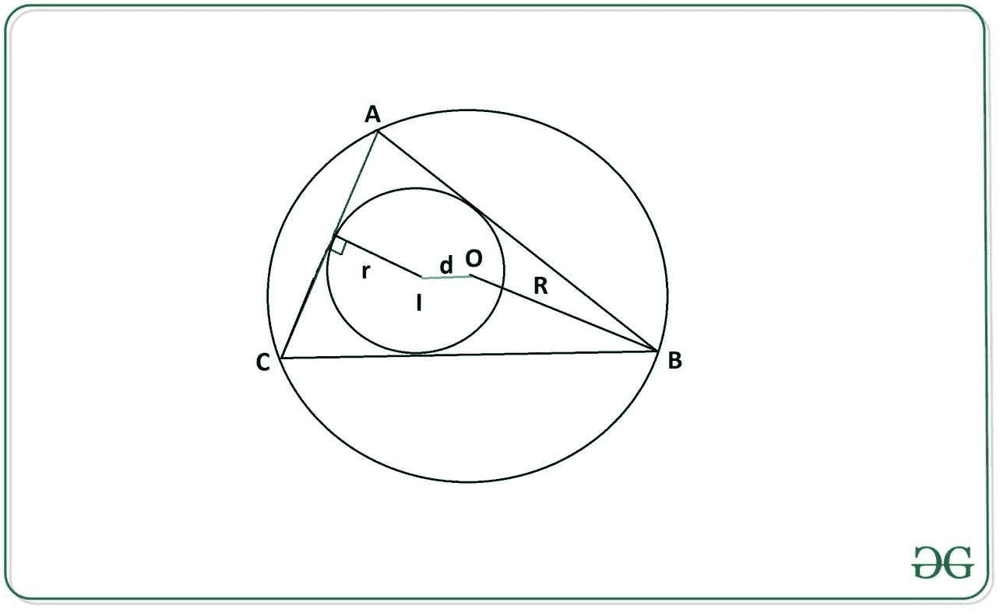

# 使用内半径和外半径

计算三角形的中心点和外中心点之间的距离

> 原文:[https://www . geeksforgeeks . org/使用内半径和外半径的燃烧物和三角形圆心之间的距离/](https://www.geeksforgeeks.org/distance-between-incenter-and-circumcenter-of-a-triangle-using-inradius-and-circumradius/)

给定两个整数 **r** 和 **R** 分别代表**内半径**和**外半径**的长度，任务是计算燃烧机和外中心之间的距离 **d** 。

[](https://media.geeksforgeeks.org/wp-content/uploads/20200722135732/circle.JPG)

**Inradius** 正三角形(ABC)的 inradius( r)是内圆(以 l 为中心)的半径，这是适合三角形内部的最大圆。
**外接圆半径:**三角形的外接圆半径(R)是该三角形外接圆(圆心为 O)的半径。

**示例:**

> **输入:** r = 2，R = 5
> T3】输出: 2.24
> 
> **输入:** r = 5，R = 12
> T3】输出: 4.9

**方法:**
利用几何学中的 [**欧拉定理**](https://en.wikipedia.org/wiki/Euler's_theorem_in_geometry) 可以解决这个问题，该定理指出，燃烧物与三角形外接圆中心之间的距离可以通过下式计算:

> 

下面是上述方法的实现:

## C++14

```
// C++14 program for the above approach
#include <bits/stdc++.h> 
using namespace std;

// Function returns the required distance
double distance(int r, int R) 
{ 
    double d = sqrt(pow(R, 2) - 
                       (2 * r * R)); 

    return d; 
} 

// Driver code 
int main() 
{ 

    // Length of Inradius 
    int r = 2; 

    // Length of Circumradius 
    int R = 5; 

    cout << (round(distance(r, R) * 100.0) / 100.0); 
} 

// This code is contributed by sanjoy_62
```

## Java 语言(一种计算机语言，尤用于创建网站)

```
// Java program for the above approach 
import java.util.*;

class GFG{

// Function returns the required distance
static double distance(int r,int R)
{
    double d = Math.sqrt(Math.pow(R, 2) -
                         (2 * r * R));

    return d;
}

// Driver code
public static void main(String[] args)
{

    // Length of Inradius
    int r = 2;

    // Length of Circumradius
    int R = 5;

    System.out.println(Math.round(
        distance(r, R) * 100.0) / 100.0);
}
}

// This code is contributed by offbeat
```

## 蟒蛇 3

```
# Python3 program for the above approach
import math

# Function returns the required distance
def distance(r,R):

    d = math.sqrt( (R**2) - (2 * r * R))

    return d

# Driver Code

# Length of Inradius
r = 2

# Length of Circumradius
R = 5 

print(round(distance(r,R),2))
```

## C#

```
// C# program for the above approach 
using System;

class GFG{

// Function returns the required distance
static double distance(int r, int R)
{
    double d = Math.Sqrt(Math.Pow(R, 2) -
                         (2 * r * R));

    return d;
}

// Driver code
public static void Main(string[] args)
{

    // Length of Inradius
    int r = 2;

    // Length of Circumradius
    int R = 5;

    Console.Write(Math.Round(
        distance(r, R) * 100.0) / 100.0);
}
}

// This code is contributed by rutvik_56
```

## java 描述语言

```
<script>

// Javascript program for
// the above approach

// Function returns the required distance
function distance(r, R)
{
    let d = Math.sqrt(Math.pow(R, 2) -
                         (2 * r * R));

    return d;
}

// Driver code

    // Length of Inradius
    let r = 2;

    // Length of Circumradius
    let R = 5;

    document.write(Math.round(
        distance(r, R) * 100.0) / 100.0);

     // This code is contributed by susmitakundugoaldanga.
</script>
```

**Output:** 

```
2.24
```

***时间复杂度:** O(1)*
***辅助空间:** O(1)*