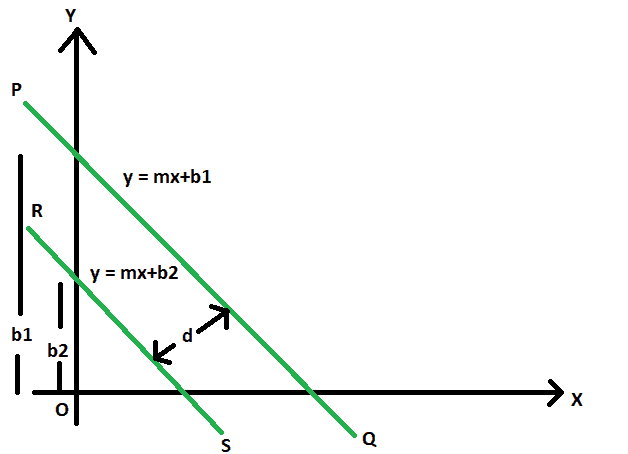
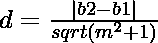

# 两条平行线之间的距离

> 原文:[https://www . geesforgeks . org/双线平行线间距离/](https://www.geeksforgeeks.org/distance-between-two-parallel-lines/)

给出两条斜率为 **m** 的平行直线，以及不同的 y 截距 **b1** & **b2** 。任务是找出这两条平行线之间的距离。
**举例:**

```
Input: m = 2, b1 = 4, b2 = 3
Output: 0.333333

Input: m = -4, b1 = 11, b2 = 23
Output: 0.8
```



**接近** :

1.  设 **PQ** 和 **RS** 为平行线，方程
    **y = MX+B1**
    y = MX+B2

2.  这两条线之间的距离是这些线与垂直线的两个交点之间的距离。让这个距离为 **d** 。

3.  所以，垂直于**PQ****RS**的直线方程可以是
    **y = -x/m**

4.  现在分别用 PQ 和 RS 求解垂线得到交点 **(x1，y1)** & **(x2，y2)** ，我们得到，

5.  从 **PQ** 、
    **y = MX+B1****y =-x/m****(x1，y1) = ( -b1*m/(m^2 + 1)，b1/(m^2**
6.  从 **RS** 、
    **y = MX+B2****y =-x/m****(x2，y2) = ( -b2*m/(m^2 + 1)，b2/(m^2 + 1)**
7.  所以， **d =距离(x1，y1)和(x2，y2)**
    

**以下是上述方式的实施** :

## C++

```
// C++ program find the distance
// between two parallel lines

#include <bits/stdc++.h>
using namespace std;

// Function to find the distance
// between parallel lines
double dist(double m, double b1, double b2)
{
    double d = fabs(b2 - b1) / ((m * m) - 1);
    return d;
}

// Driver Code
int main()
{
    double m = 2, b1 = 4, b2 = 3;
    cout << dist(m, b1, b2);
    return 0;
}
```

## Java 语言(一种计算机语言，尤用于创建网站)

```
// Java program find the distance
// between two parallel lines
class GFG
{

// Function to find the distance
// between parallel lines
static double dist(double m,
                double b1, double b2)
{
    double d = Math.abs(b2 - b1) /
                    ((m * m) - 1);
    return d;
}

// Driver Code
public static void main(String[] args)
{
    double m = 2, b1 = 4, b2 = 3;
     System.out.println(dist(m, b1, b2));
}
}

// This code is contributed by Code_Mech.
```

## 蟒蛇 3

```
# Python3 program find the distance
# between two parallel lines

# Function to find the distance
# between parallel lines
def dist(m, b1, b2):
    d = abs(b2 - b1) / ((m * m) - 1);
    return d;

# Driver Code
def main():
    m, b1, b2 =2,4, 3;
    print(dist(m, b1, b2));
if __name__ == '__main__':
    main()

# This code contributed by PrinciRaj1992
```

## C#

```
// C# program find the distance
// between two parallel lines
using System;

class GFG
{

// Function to find the distance
// between parallel lines
static double dist(double m,
                   double b1, double b2)
{
    double d = Math.Abs(b2 - b1) /
                      ((m * m) - 1);
    return d;
}

// Driver Code
public static void Main()
{
    double m = 2, b1 = 4, b2 = 3;
    Console.Write(dist(m, b1, b2));
}
}

// This code is contributed by Akanksha Rai
```

## 服务器端编程语言（Professional Hypertext Preprocessor 的缩写）

```
<?php
// PHP program find the distance
// between two parallel lines

// Function to find the distance
// between parallel lines
function dist($m, $b1, $b2)
{
    $d = abs($b2 - $b1) / (($m * $m) - 1);
    return $d;
}

// Driver Code
$m = 2;
$b1 = 4;
$b2 = 3;

echo dist($m, $b1, $b2);

// This code is contributed by Ryuga
?>
```

## java 描述语言

```
<script>

// javascript program find the distance
// between two parallel lines

// Function to find the distance
// between parallel lines
function dist(m, b1 , b2)
{
    var d = Math.abs(b2 - b1) /
                    ((m * m) - 1);
    return d;
}

// Driver Code
var m = 2, b1 = 4, b2 = 3;
document.write(dist(m, b1, b2).toFixed(5));

// This code contributed by Princi Singh

</script>
```

**Output:** 

```
0.333333
```