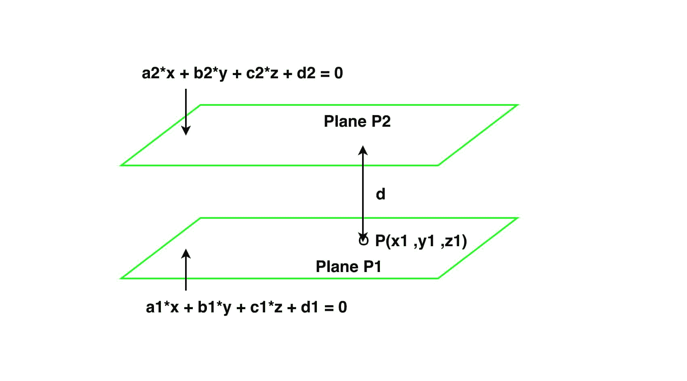

# 三维中两个平行平面之间的距离

> 原文:[https://www . geeksforgeeks . org/两个平行三维平面之间的距离/](https://www.geeksforgeeks.org/distance-between-two-parallel-planes-in-3-d/)

给你两个平面**P1**:*a1 * x+B1 * y+C1 * z+D1 = 0*和**P2**:*a2 * x+B2 * y+C2 * z+D2 = 0*。任务是编写一个程序来找出这两个平面之间的距离。



**例:**

```
Input: a1 = 1, b1 = 2, c1 = -1, d1 = 1, a2 = 3, b2 = 6, c2 = -3, d2 = -4
Output: Distance is 0.952579344416

Input: a1 = 1, b1 = 2, c1 = -1, d1 = 1, a2 = 1, b2 = 6, c2 = -3, d2 = -4
Output: Planes are not parallel 
```

**方法:**考虑两个平面由以下方程给出:-

> P1 : a1 * x + b1 * y + c1 * z + d1 = 0，其中 a1、b1 和 c1、d1 为实常数，
> P2 : a2 * x + b2 * y + c2 * z + d2 = 0，其中 a2、b2 和 c2、d2 为实常数。

两个平面平行的条件是:-

```
=> a1 / a2 = b1 / b2 = c1 / c2
```

在任一平面上找到一个点，使该点到另一平面的距离等于这两个平面之间的距离。距离可以通过以下公式计算:

```
Distance = (| a*x1 + b*y1 + c*z1 + d |) / (sqrt( a*a + b*b + c*c))
```

假设 P1 平面上的一个点是 P(x1，y1，z1)，
在方程 a1 * x + b1 * y + c1 * z + d1 = 0 中放入 x = y = 0，求 z.
= > z = -d1 / c1
现在我们有了 P(0，0，z) = P(x1，y1，z1)的坐标。
点 P 到 P2 飞机的距离为:-

> 距离=(| a2 * x1+B2 * y1+C2 * Z1+D2 |)/(sqrt(a2 * a2+B2 * B2+C2 * C2))
> =(| a2 * 0+B2 * 0+C2 * Z1+D2 |)/(sqrt(a2 * a2+B2 * B2+C2 * C2))
> =(| C2 * Z1+D2 |)/(sqrt(a2 * a2+B2 * B2+C2 * C2))

以下是上述公式的实现:

## C++

```
// C++ program to find the Distance
// between two parallel Planes in 3 D.
#include <bits/stdc++.h>
#include<math.h>

using namespace std;

// Function to find distance
void distance(float a1, float b1,
              float c1, float d1,
              float a2, float b2,
              float c2, float d2)
{
    float x1, y1, z1, d;
    if (a1 / a2 == b1 / b2 &&
        b1 / b2 == c1 / c2)
    {
        x1 = y1 = 0;
        z1 = -d1 / c1;
        d = fabs(( c2 * z1 + d2)) /
           (sqrt(a2 * a2 + b2 *
                 b2 + c2 * c2));
        cout << "Perpendicular distance is "
             << d << endl;
    }
    else
        cout << "Planes are not parallel";
    return;
}

// Driver Code
int main()
{
    float a1 = 1;
    float b1 = 2;
    float c1 = -1;
    float d1 = 1;
    float a2 = 3;
    float b2 = 6;
    float c2 = -3;
    float d2 = -4;
    distance(a1, b1, c1, d1,
             a2, b2, c2, d2); // Fxn cal
    return 0;
}

// This code is contributed
// by Akanksha Rai(Abby_akku)
```

## C

```
// C program to find the Distance between
// two parallel Planes in 3 D.

#include <stdio.h>
#include<math.h>

// Function to find distance
void distance(float a1, float b1, float c1,
            float d1, float a2, float b2,
            float c2, float d2)
{
    float x1,y1,z1,d;
    if (a1 / a2 == b1 / b2 && b1 / b2 == c1 / c2)
    {
        x1 = y1 = 0;
        z1 =-d1 / c1;
        d = fabs(( c2 * z1 + d2)) / (sqrt(a2 * a2 + b2 * b2 + c2 * c2));
        printf("Perpendicular distance is %f\n", d);
    }
    else
        printf("Planes are not parallel");
    return;
}

// Driver Code
int main()
{
    float a1 = 1;
    float b1 = 2;
    float c1 = -1;
    float d1 = 1;
    float a2 = 3;
    float b2 = 6;
    float c2 = -3;
    float d2 = -4;
    distance(a1, b1, c1, d1, a2, b2, c2, d2);     // Fxn cal
    return 0;
}

// This code is contributed 
// by Amber_Saxena.
```

## Java 语言(一种计算机语言，尤用于创建网站)

```
// Java program to find the Distance
// between two parallel Planes in 3 D.
import java .io.*;
import java.lang.Math;

class GFG
{

// Function to find distance
static void distance(float a1, float b1, float c1,
                     float d1, float a2, float b2,
                     float c2, float d2)
{

    float x1,y1,z1,d;
    if (a1 / a2 == b1 / b2 &&
        b1 / b2 == c1 / c2)
    {
        x1 = y1 = 0;
        z1 =-d1 / c1;
        d = Math.abs(( c2 * z1 + d2)) /
            (float)(Math.sqrt(a2 * a2 + b2 *
                              b2 + c2 * c2));
        System.out.println("Perpendicular distance is "+ d);
    }
    else
        System.out.println("Planes are not parallel");
}

// Driver code
public static void main(String[] args)
{
    float a1 = 1;
    float b1 = 2;
    float c1 = -1;
    float d1 = 1;
    float a2 = 3;
    float b2 = 6;
    float c2 = -3;
    float d2 = -4;
    distance(a1, b1, c1, d1,
             a2, b2, c2, d2);// Fxn cal
}
}

// This code is contributed
// by Amber_Saxena.
```

## 计算机编程语言

```
# Python program to find the Distance between
# two parallel Planes in 3 D.

import math

# Function to find distance
def distance(a1, b1, c1, d1, a2, b2, c2, d2):

    if (a1 / a2 == b1 / b2 and b1 / b2 == c1 / c2):
        x1 = y1 = 0
        z1 =-d1 / c1
        d = abs(( c2 * z1 + d2)) / (math.sqrt(a2 * a2 + b2 * b2 + c2 * c2))
        print("Perpendicular distance is"), d
    else:
        print("Planes are not parallel")

# Driver Code
a1 = 1
b1 = 2
c1 = -1
d1 = 1
a2 = 3
b2 = 6
c2 = -3
d2 = -4
distance(a1, b1, c1, d1, a2, b2, c2, d2)     # Fxn cal
```

## C#

```
// C# program to find the Distance
// between two parallel Planes in 3 D.
using System;

class GFG
{

// Function to find distance
static void distance(float a1, float b1,
                     float c1, float d1,
                     float a2, float b2,
                     float c2, float d2)
{
    float z1, d;
    if (a1 / a2 == b1 / b2 &&
        b1 / b2 == c1 / c2)
    {

        z1 =-d1 / c1;
        d = Math.Abs((c2 * z1 + d2)) /
            (float)(Math.Sqrt(a2 * a2 + b2 *
                              b2 + c2 * c2));
        Console.Write("Perpendicular distance is " + d);
    }
    else
        Console.Write("Planes are not parallel");
}

// Driver code
public static void Main()
{
    float a1 = 1;
    float b1 = 2;
    float c1 = -1;
    float d1 = 1;
    float a2 = 3;
    float b2 = 6;
    float c2 = -3;
    float d2 = -4;
    distance(a1, b1, c1, d1,
             a2, b2, c2, d2);// Fxn cal
}
}

// This code is contributed
// by ChitraNayal
```

## 服务器端编程语言（Professional Hypertext Preprocessor 的缩写）

```
<?php
// PHP program to find the Distance
// between two parallel Planes in 3 D

// Function to find distance
function distance($a1, $b1, $c1,
                  $d1, $a2, $b2,
                  $c2, $d2)
{
    if ($a1 / $a2 == $b1 / $b2 &&
        $b1 / $b2 == $c1 / $c2)
    {
        $x1 = $y1 = 0;
        $z1 =- $d1 / $c1;
        $d = abs(($c2 * $z1 + $d2)) /
            (sqrt($a2 * $a2 + $b2 *
                  $b2 + $c2 * $c2));
        echo "Perpendicular distance is ", $d;
    }
    else
        echo "Planes are not parallel";
}

// Driver Code
$a1 = 1;
$b1 = 2;
$c1 = -1;
$d1 = 1;
$a2 = 3;
$b2 = 6;
$c2 = -3;
$d2 = -4;
distance($a1, $b1, $c1, $d1,
         $a2, $b2, $c2, $d2);    

// This code is contributed
// by Amber_Saxena.
?>
```

## java 描述语言

```
<script>

// Javascript program to find the Distance
// between two parallel Planes in 3 D.

// Function to find distance
function distance(a1, b1, c1,
                     d1,  a2, b2,
                     c2, d2)
{

    let x1,y1,z1,d;
    if (a1 / a2 == b1 / b2 &&
        b1 / b2 == c1 / c2)
    {
        x1 = y1 = 0;
        z1 =-d1 / c1;
        d = Math.abs(( c2 * z1 + d2)) /
            (Math.sqrt(a2 * a2 + b2 *
                              b2 + c2 * c2));
        document.write("Perpendicular distance is "+ d);
    }
    else
        document.write("Planes are not parallel");
}

// Driver Code

     let a1 = 1;
    let b1 = 2;
    let c1 = -1;
    let d1 = 1;
    let a2 = 3;
    let b2 = 6;
    let c2 = -3;
    let d2 = -4;
    distance(a1, b1, c1, d1,
             a2, b2, c2, d2);// Fxn cal

</script>
```

**Output:** 

```
Perpendicular distance is 0.952579344416
```