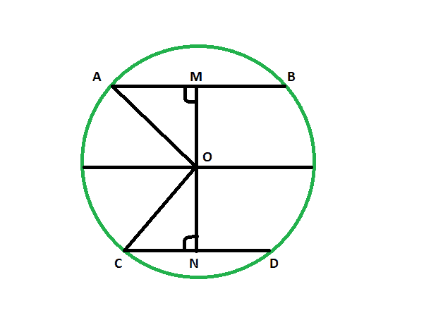

# 给定中心与另一等长弦之间的距离时，弦距中心的距离

> 原文:[https://www . geeksforgeeks . org/当给定中心与另一个等长弦长弦长之间的距离时，弦距中心的距离/](https://www.geeksforgeeks.org/distance-of-chord-from-center-when-distance-between-center-and-another-equal-length-chord-is-given/)

给定一个圆的两个相等长度的弦以及中心和一个弦之间的距离。这里的任务是找到中心和另一个和弦之间的距离。
**例:**

```
Input: 48
Output: 48

Input: 82
Output: 82
```



以下是上述方法的实现:
**方法** :
让 **AB** & **CD** 为圆心在 **O** 的圆的两个相等弦。 **OM** 是弦 **AB** 到中心的给定距离。
现在在三角形中 **AOM** 和 **CON** 、
T20】OA=**OC**(同圆半径)
**MA** = **CN** (因为 OM 和 ON 是弦的垂线，它将弦一分为二，AM = MB & CN = CD)
角 **AMO** =角 **ONC**

> **一个圆的等弦与圆心等距。**

以下是上述方法的实现:

## C++

```
// C++ program to find the distance of chord
// from center when distance between center
// and another equal length chord is given

#include <bits/stdc++.h>
using namespace std;

void lengequichord(int z)
{
    cout << "The distance between the "
         << "chord and the center is "
         << z << endl;
}

// Driver code
int main()
{
    int z = 48;
    lengequichord(z);
    return 0;
}
```

## Java 语言(一种计算机语言，尤用于创建网站)

```
// Java program to find the distance of chord
// from center when distance between center
// and another equal length chord is given/

import java.io.*;

class GFG
{

static void lengequichord(int z)
{
    System.out.println ("The distance between the "+
    "chord and the center is "+ z );
}

// Driver code
public static void main (String[] args)
{

    int z = 48;
    lengequichord(z);
}
}

// This code is contributed by jit_t.
```

## 蟒蛇 3

```
# Python 3 program to find the distance of chord
# from center when distance between center
# and another equal length chord is given

def lengequichord(z):
    print("The distance between the" ,
          "chord and the center is" , z )

# Driver code
if __name__ == "__main__":
    z = 48
    lengequichord(z)

# This code is contributed
# by ChitraNayal
```

## C#

```
// C# program to find the distance of chord
// from center when distance between center
// and another equal length chord is given
using System;

class GFG
{

    static void lengequichord(int z)
    {
        Console.WriteLine("The distance between the "+
        "chord and the center is "+ z );
    }

    // Driver code
    public static void Main ()
    {

        int z = 48;
        lengequichord(z);
    }
}

// This code is contributed by AnkitRai01
```

## java 描述语言

```
<script>

// JavaScript program to find the distance of chord
// from center when distance between center
// and another equal length chord is given

function lengequichord(z)
{
    document.write("The distance between the "
        + "chord and the center is "
        + z + "<br>");
}

// Driver code
    let z = 48;
    lengequichord(z);

// This code is contributed by Surbhi Tyagi.

</script>
```

**Output:** 

```
The distance between the chord and the center is 48
```