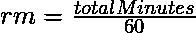

# 时针和分针在给定时间间隔内行进的距离

> 原文:[https://www . geesforgeks . org/按给定时间间隔按小时和分钟划分的行驶距离/](https://www.geeksforgeeks.org/distance-traveled-by-hour-and-minute-hand-in-given-time-interval/)

给定表示时针和分针长度的两个数字 **H** 和 **M** 以及以 **HH:MM** 形式表示的两个时间间隔(比如说 **T1 & T2** ，任务是找出时针和分针在时间 **T1 和 T2** 之间所经过的距离。

**示例:**

> **输入:** H = 5，M = 7，T1 =“1:30”，T2 =“10:50”
> **输出:**
> 分针行驶的距离:410.50144006906635
> 时针行驶的距离:24.434644440614
> 
> **输入:** H = 4，M = 5，T1 =“1:30”，T2 =“10:50”
> **输出:**
> 分针行驶的距离:293.21531433504737
> 时针行驶的距离:19.54766233649

**进场:**

*   使用[这篇](https://www.geeksforgeeks.org/difference-two-given-times/)文章中讨论的方法，找出两个时间间隔 T1 和 T2 之间的[差异。](https://www.geeksforgeeks.org/time-difference-between-expected-time-and-given-time/)
*   将上面获得的持续时间更改为分钟，如下所示:

```
Total Minutes = hours * 60 + minutes
```

*   由于分针在 60 分钟内覆盖一圈，因此分针覆盖的圈数(说 **rm** )由给出
*   由于时针在 60*12 = 720 分钟内旋转一圈，因此，时针(比如 **rh** )旋转的圈数由给出
*   时针穿越的总距离由给出
*   分针移动的总距离由给出

下面是上述方法的实现:

## 计算机编程语言

```
# Python program for the above approach

import math

# Function to remove ':' and convert
# it into an integer
def removeColon(s):
    if (len(s) == 4):
        s = s[:1]+s[2:]

    if (len(s) == 5):
        s = s[:2]+s[3:]

    return int(s)

# function which find the difference
# between time interval
def diff(s1, s2):

    # Change string as 2:21 to 221
    time1 = removeColon(s1)
    time2 = removeColon(s2)

    # Difference between hours
    hourDiff = time2 // 100 - time1 // 100 - 1;

    # Difference between minutes
    minDiff = time2 % 100 + (60 - time1 % 100)

    if (minDiff >= 60):
        hourDiff+= 1
        minDiff = minDiff - 60

    # Convert answer again in string
    # with ':'
    res = str(hourDiff) + ':' + str(minDiff)
    return res

# Function for finding the distance travelled
# by minute hand and hour hand
def disTravel(T1, T2, M, H):

    # Find the duration between these time
    dur = diff(T1, T2)

    # Remove colon from the dur and
    # convert in int
    s = removeColon(dur)

    # Convert the time in to minute
    # hour * 60 + min
    totalMinute =(s//100)*60 + s % 100

    # Count min hand rotation
    rm = totalMinute / 60;

    # Count hour hand rotation
    rh = totalMinute / 720;

    # Compute distance traveled by min hand
    minuteDistance = rm * 2* math.pi * M;

    # Compute distance traveled by hour hand
    hourDistance = rh * 2* math.pi * H;

    return minuteDistance, hourDistance

# Driver Code

# Given Time Intervals
T1 ="1:30"
T2 ="10:50"

# Given hour and minute hand length
H = 5
M = 7

# Function Call
minuteDistance, hourDistance = disTravel(T1, T2, M, H)

# Print the distance traveled by minute
# and hour hand
print("Distance traveled by minute hand: "
      ,minuteDistance)
print("Distance traveled by hour hand: "
      ,hourDistance )
```

**Output:** 

```
Distance traveled by minute hand:  410.50144006906635
Distance traveled by hour hand:  24.434609527920614
```