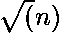

# 使用莫算法的子阵列中的不同元素

> 原文:[https://www . geesforgeks . org/distinct-elements-subarray-using-mos-algorithm/](https://www.geeksforgeeks.org/distinct-elements-subarray-using-mos-algorithm/)

给定大小为 n 的数组“a[]”和查询数 q。每个查询可以用两个整数 l 和 r 来表示。您的任务是打印子数组 l 到 r 中不同整数的数目。
给定一个[i] < = 
示例:

```
Input : a[] = {1, 1, 2, 1, 2, 3}
        q = 3
        0 4
        1 3
        2 5
Output : 2
         2
         3
In query 1, number of distinct integers
in a[0...4] is 2 (1, 2)
In query 2, number of distinct integers 
in a[1..3] is 2 (1, 2)
In query 3, number of distinct integers 
in a[2..5] is 3 (1, 2, 3)

Input : a[] = {7, 3, 5, 9, 7, 6, 4, 3, 2}
        q = 4
        1 5
        0 4
        0 7
        1 8
output : 5
         4
         6
         7

```

设 a[0…n-1]为输入数组，q[0..m-1]是查询数组。
**进场:**

1.  对所有查询进行排序，L 值从 0 到的查询放在一起，然后是从到的所有查询，以此类推。一个块中的所有查询都按照 R 值的递增顺序进行排序。
2.  用 0 初始化大小为的数组 freq[]。freq[]数组记录给定范围内所有元素的频率。
3.  一个接一个地处理所有查询，每一个查询使用在前一个查询中计算的不同元素的数量和频率数组，并将结果存储在结构中。
    *   让“curr_Diff_element”是先前查询的不同元素的数目。
    *   移除先前查询的额外元素。例如，如果前一个查询是[0，8]，而当前查询是[3，9]，则删除一个[0]、一个[1]和一个[2]
    *   添加当前查询的新元素。在与上面相同的示例中，添加一个[9]。
4.  按照之前提供的顺序对查询进行排序，并打印存储的结果

**添加元素()**

*   将要添加的元素的频率(freq[a[i]]增加 1。
*   如果元素 a[i]的频率为 1。将 curr_diff_element 增加 1，因为范围内增加了 1 个新元素。

**去除元素()**

*   将待移除元素(a[i])的频率降低 1。
*   如果元素 a[i]的频率为 0。只需将 curr_diff_element 减少 1，因为 1 元素已从范围中完全移除。

**注意:**在该算法中，在步骤 2 中，R 的索引变量在整个运行中最多改变 O(n * )次，L 的索引变量最多改变 O(m * )次。所有这些界限都是可能的，只是因为排序的查询首先出现在大小的块中。

预处理部分需要 0(m ^ Log m)时间。

处理所有查询需要 O(n *)+O(m *)= O((m+n)*)时间。
**以下是上述方法的实施:**

```
// Program to compute no. of different elements
// of ranges for different range queries
#include <bits/stdc++.h>
using namespace std;

// Used in frequency array (maximum value of an
// array element).
const int MAX = 1000000;

// Variable to represent block size. This is made
// global so compare() of sort can use it.
int block;

// Structure to represent a query range and to store
// index and result of a particular query range
struct Query {
    int L, R, index, result;
};

// Function used to sort all queries so that all queries
// of same block are arranged together and within a block,
// queries are sorted in increasing order of R values.
bool compare(Query x, Query y)
{
    // Different blocks, sort by block.
    if (x.L / block != y.L / block)
        return x.L / block < y.L / block;

    // Same block, sort by R value
    return x.R < y.R;
}

// Function used to sort all queries in order of their
// index value so that results of queries can be printed
// in same order as of input
bool compare1(Query x, Query y)
{
    return x.index < y.index;
}

// calculate distinct elements of all query ranges.
// m is number of queries n is size of array a[].
void queryResults(int a[], int n, Query q[], int m)
{
    // Find block size
    block = (int)sqrt(n);

    // Sort all queries so that queries of same
    // blocks are arranged together.
    sort(q, q + m, compare);

    // Initialize current L, current R and current
    // different elements
    int currL = 0, currR = 0;
    int curr_Diff_elements = 0;

    // Initialize frequency array with 0
    int freq[MAX] = { 0 };

    // Traverse through all queries
    for (int i = 0; i < m; i++) {

        // L and R values of current range
        int L = q[i].L, R = q[i].R;

        // Remove extra elements of previous range.
        // For example if previous range is [0, 3]
        // and current range is [2, 5], then a[0] 
        // and a[1] are subtracted
        while (currL < L) {

            // element a[currL] is removed
            freq[a[currL]]--;
            if (freq[a[currL]] == 0) 
                curr_Diff_elements--;

            currL++;
        }

        // Add Elements of current Range
        // Note:- during addition of the left
        // side elements we have to add currL-1
        // because currL is already in range
        while (currL > L) {
            freq[a[currL - 1]]++;

            // include a element if it occurs first time
            if (freq[a[currL - 1]] == 1) 
                curr_Diff_elements++;

            currL--;
        }
        while (currR <= R) {
            freq[a[currR]]++;

            // include a element if it occurs first time
            if (freq[a[currR]] == 1) 
                curr_Diff_elements++;

            currR++;
        }

        // Remove elements of previous range. For example
        // when previous range is [0, 10] and current range
        // is [3, 8], then a[9] and a[10] are subtracted
        // Note:- Basically for a previous query L to R
        // currL is L and currR is R+1\. So during removal
        // of currR remove currR-1 because currR was
        // never included
        while (currR > R + 1) {

            // element a[currL] is removed
            freq[a[currR - 1]]--;

            // if occurrence of a number is reduced
            // to zero remove it from list of 
            // different elements
            if (freq[a[currR - 1]] == 0) 
                curr_Diff_elements--;

            currR--;
        }
        q[i].result = curr_Diff_elements;
    }
}

// print the result of all range queries in
// initial order of queries
void printResults(Query q[], int m)
{
    sort(q, q + m, compare1);
    for (int i = 0; i < m; i++) {
        cout << "Number of different elements" << 
               " in range " << q[i].L << " to " 
             << q[i].R << " are " << q[i].result << endl;
    }
}

// Driver program
int main()
{
    int a[] = { 1, 1, 2, 1, 3, 4, 5, 2, 8 };
    int n = sizeof(a) / sizeof(a[0]);
    Query q[] = { { 0, 4, 0, 0 }, { 1, 3, 1, 0 },
                  { 2, 4, 2, 0 } };
    int m = sizeof(q) / sizeof(q[0]);
    queryResults(a, n, q, m);
    printResults(q, m);
    return 0;
}
```

**Output:**

```
Number of different elements in range 0 to 4 are 3
Number of different elements in range 1 to 3 are 2
Number of different elements in range 2 to 4 are 3

```